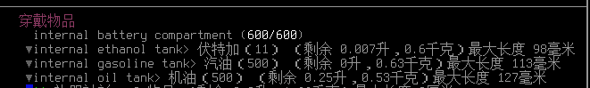
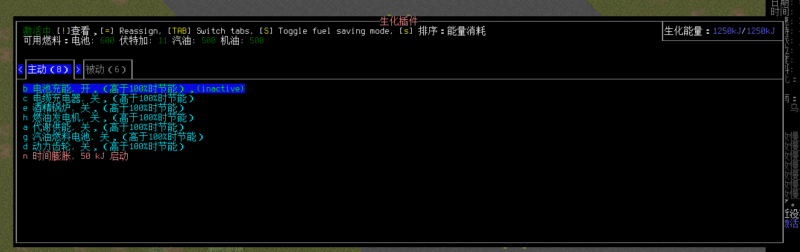

# CBM体系与功能详解

- [CBM体系与功能详解](#cbm体系与功能详解)
  - [体系解释](#体系解释)
    - [获取](#如何获取cbm)
    - [处理](#如何处理故障的cbm肮脏)
    - [安装](#如何安装cbm)
    - [失败](#安装失败)
    - [移除](#移除cbm)
  - [功能详解](#功能详解)
    - [能量]
      - [储能类CBM](#储能类cbm)
      - [供能类CBM](#供能类cbm)
    - [被动]
      - [被动类CBM](#被动类cbm)
      - [强化类CBM](#强化类cbm)
      - [功能类CBM](#功能类cbm)
    - [主动]
      - [主动进攻类](#主动进攻类cbm)
      - [主动防御类](#主动防御类cbm)
      - [主动功能类](#主动功能类cbm)
    - [故障类CBM](#故障类cbm) 

## 体系解释

生化插件，又称之为CBM。系与变异同级，但与变异基本不冲突的后期体系（一部分部位变异与对应部位CBM无法共存），和变异一样可以给予各种各样的被动增益与主动技能，其个别CBM甚至拥有如瞬间移动与时间停止的强大能力，不过其所消耗的能源与附加代价也十分显著；大部分CBM都需要消耗储能，储能的多少取决于储能CBM的数量，而储能的恢复则主要取决于供能CBM。你可以通过「p」开启生化插件菜单以检阅或管理已经安装在你身上的CBM，也可以查看供能与储能的具体情况；

### 如何获取CBM

你通常可以在实验室、军事设施等地方找到CBM，也可以跟HUB阵营贸易换取，如果运气够好，一些城市内的医院、金库等地方也可以找到CBM，不要给予太多期待就好；

除上述地点以外，你也可以通过解剖一些变种人尸体（稳定版则包括放电类丧尸、研究员丧尸等）来获取插件，这通常需求大量时间进行解刨，其成功率取决于你所使用的「精细切割」工具等级、医疗技能及电子学技能，尸体的完整水平也会影响成功率，所以尽量别砸碎那些你要解刨的尸体；如果解剖失败，你将会得到烧毁的CBM，此类CBM基本没有什么作用；如果解刨成功，你将得到「故障的xxxxCBM（肮脏）」；

### 如何处理故障的CBM(肮脏)

如果你是直接从各个地方拿到了干净无菌的CBM，那倒没什么太大所谓，从尸体中解剖出来的CBM需要经过十分详尽的处理才能变的安全可用，总而言之你需要如下操作；

1、采用海绵、抹布、洗涤工具箱等工具清洗CBM，别忘了水和洗涤剂；

2、按「i」打开背包，选中CBM并按下回车，选择修复以重置其数据；

3、激活高压灭菌袋，以将CBM包装在高压灭菌袋中；

4、将包装好的CBM放入高压灭菌釜中，等待消毒完成；

高压灭菌釜分实验室及个别地点限定的家具版本和能在实验室、医院等地点找到的物品版本，物品版本运行需要消耗极为离谱的电量（约8200单位，仅有钚燃料电池扛得住），基本只有改造成车载灭菌釜并安装在车体上，采用车载发电机供能才勉强吃得住，灭菌流程通常需要一小时三十分钟，读会书做点晚餐都很适合打发时间；

### 如何安装CBM

安装CBM需要找到全自动医疗仪XI型，且该医疗仪相邻的手术台不得被破坏；该医疗仪可以对玩家及NPC进行各种各样的治疗，也可以帮助你固定断肢，不过我们现在只需要它最为主要的用途，安装或拆除CBM。

玩家在安装CBM前需要与操作台互动以执行手术，手术的成功几率与消耗的麻醉剂数量都会直接显示在面板之中，如果你拥有「痛觉抑制CBM」或「疼痛麻木」变异，你完全可以在不麻醉的情况下进行手术，否则你需要为其提供麻醉工具箱及麻醉剂；注意一点，当你被麻醉时对于外界没有任何感知能力与反应能力，即便你被攻击也不一定会苏醒，千万确保手术环境的安全；

安装CBM的成功率主要取决于智力及急救、计算机学、电子学技能；

安装CBM消耗的时间主要取决于CBM本身；

### 安装失败

安装总归是存在有失败可能的，安装失败将有可能导致以下风险：

-   无意外事故的故障；
-   出现意外事故并导致严重疼痛；
-   出现意外事故并导致严重的伤害；
-   出现意外事故并导致出现故障的CBM；

如果没有出现最糟糕的结果，则你还能得到安装失败的CBM，只是需要重新修理和消毒；如果出现了糟的情况……你有可能还得设法把故障CBM从身上移除，建议缓一缓再继续；如果你具备「实习医生」或「全自动医疗仪专家」的职业特性，则不会出现安装故障CBM的失败结果；

失败将有可能导致80点左右的严重伤害，请尽量处于健康状态下安装；

### 移除CBM

移除CBM同样需要全自动医疗仪XI型，但一些外科医生NPC也可以帮助你移除CBM；移除CBM比安装更为困难且更容易造成几近于致命的损害；如若移除成功则不受伤害；

## 功能详解

### 储能类CBM

**电池类别，储存供能类CBM提供的生化能量用以各类CBM的消耗，所有耗能的CBM都需要储能CBM作为支撑，与供能类CBM同属于CBM体系的核心。**

#### 储能模块\\储能模块Mk.II：

-   **储能模块增加100kJ能量上限，Mk.II则增加250kJ，可无限堆叠；**

### 供能类CBM

**供能类别，以各种方式为储能CBM提供能源，与储能类CBM同属于CBM体系的核心所在。**

-   2022-09-21-1254号实验版本重构了「供能类CBM」燃料机制。

    原先需要在CBM界面填充燃料的「电池供能」、「酒精锅炉」、「汽油燃料电池」、「燃油发电机」如今作为一种「自体光环」或者说虚拟装备存在于装备栏中，现在需要打开背包填充燃料了；

    「电池供能」采用弹匣机制，需要「装填」轻型、中型电池；

    其余三项采用容器机制，需要「装填」或「放入」对应的燃料；

    燃料装填完毕后，回到CBM界面启用供能即可；

    

    

#### 涓流充能：

*「一个低功率、持久的的生化供能装置,由小型核衰变供能。能量输出低,但不需要燃料源,此模块可以同时安装多个。」*

-   **每秒供能2J生化能量，估约八分钟1kJ；**

取代了以前消耗钚电池供能的「核反应堆供能」；真正意义上的零成本，连核辐射都没有；

#### 电池供能：

*「这套电池系统可以利用普通电池来恢复生化能量。」*

-   **消耗电池燃料舱内的电能，每秒供能1kJ生化能量；**

此CBM在你身体内部增加了一个可装填「轻型电池」和「中型电池」的电池燃料舱，以装备形式存在，按「r」可以将电池装填至电池燃料舱内；

按「p」并在CBM菜单中启用后即可开始充能；

该CBM仅消耗电池电能，不消耗电池本体，考虑到电池还能再充电这事儿，性价比颇高；

#### 酒精锅炉：

*「一个生化酒精反应炉。燃烧效率极高。可以储存500毫升乙醇、甲醇或者改性酒精作为燃料。」*

-   **消耗酒精燃料舱内的酒精等燃料；**
-   **正常情况下，每秒供能2\~8kJ生化能量；**

此CBM在你身体内部增加了一个可装填「酒类」的酒精燃料舱，以装备形式存在，按「r」可以装填酒水至燃料舱内；

按「p」并在CBM菜单中启用后即可开始充能；

该CBM启动时会导致保暖升高并向四周辐射热度；

#### 汽油燃料电池：

*「一个装在肩胛骨上的小型汽油燃料电池。尽管它的能量输出相比其他燃料电池要少，但它仍然会产生大量热量，这些热量仅能通过从你背部伸出的散热系统耗散。一套生物塑胶制成的液囊扩散网络沿着循环系统放置，用以存放燃料；」*

-   **消耗汽油燃料舱内的汽油等燃料，每秒供能2\~8kJ生化能量；**

此CBM在你身体内部增加了一个可装填「汽油」的汽油燃料舱，以装备形式存在，按「r」可以装填汽油燃料；

按「p」并在CBM菜单中启用后即可开始充能；

该CBM启动时会导致保暖升高并向四周辐射热度；

#### 燃油发电机：

*「燃烧煤油或机油的供能CBM。它的转换率相当高,可以储存最多750ml的燃油,但能量恢复速度较慢；」*

-   **消耗燃油燃料舱内的机油等燃料，每5秒供能8\~12kJ生化能量；**

此CBM在你身体内部增加了一个可装填「燃油」的燃油燃料舱，按「r」可以装填机油或煤油；

按「p」并在CBM菜单中启用后即可开始充能；

#### 代谢供能：

*「这个模组将受体的消化系统和电源连接起来,使其能够通过消耗卡路里恢复生化能量；」*

-   **消耗体内的卡路里供能，1千卡大约等于1KJ；**

此CBM在你体重下降到一定程度时自动停止工作，基本来说不会过于影响你的体重健康水平，停止工作的意思就是你再这样下去就要瘦的不正常了；

#### 动力齿轮：

*「你的关节处被植入了齿轮发电机,当你移动时可以缓慢的产生能量。当开启该模块时，移动需要花费更多时间，但能产生更多生化能量；」*

-   **开启时步行1格恢复约130J，关闭时步行1格恢复约10J；**
-   **启动此CBM供能时，移动将会消耗更多耐力；**

#### 电缆充电器：

*「受体臀部上方安装了一个复杂的接口,启动后可以通过跨接电缆与电池连接并恢复生化能量。；」*

-   **用电缆与载具链接后，每秒供能1kJ，用电缆与太阳能背包链接后，在有阳光的环境下每秒供能约50J，**

### 被动类CBM

**此类CBM借助各种体内植入物为你提供被动增益；一般不需要主动开启，通常不消耗能量或耗能极低；**

#### 空气过滤系统：

*「受体器官中被植入了一个先进的空气过滤系统。不管进入气管的是毒气还是空气传播的病菌,这个过滤器都会尝试过滤它们。」*

-   **大幅提高嘴部的环境保护、免疫烟雾及催泪瓦斯的影响；**
-   **实验版可免疫毒气；**

#### 合金装甲系列：

*「先进的防护网状合金，以少许累赘为代价换来了少许防护。」*

-   **提高3点对应部位的钝、斩、射抗性，提高1点对应部位的累赘；**

与所有改变体型类的变异冲突，安装后将无法触发体型类别变异；

某个致敬机械战警的职业自带一套；

#### 皮下碳纤维层：

*「一层薄层碳纳米管植入到皮肤下方。」*

-   **提高全部位2点钝抗，4点斩、射抗；**

碳纳米管装甲，小子！

#### 热能汲取 / 电击装置：

*「百般武术，此乃CBM格斗术」*

**热能汲取效果**：

**启用时近战造成额外1点伤害；**

-   **造成伤害时50%概率恢复约3kJ的生化能量；**

**电击装置效果**：

-   **启用并握持金属武器或徒手时，近战攻击额外造成2\~15伤害；**
-   **造成伤害时有30%概率导致目标陷入「被电击」状态，随机损耗200\~350的行动点，可视为其2\~3回合内无法行动，此效应对电系敌人无效，效果触发时消耗2KJ；**

这两个CBM造成的伤害属于寒冷伤害和电击伤害，基本可以认为是不吃抗性的额外伤害；

### 强化类CBM

**此类CBM安装后即可强化你的身体机能，进而带来各种便利；**

#### 人工肌肉纤维：力量+2；

#### 线性反射弧：敏捷+2；

#### 生物处理芯片：智力+2；

#### 钻石角膜：感知+2；

#### 听力增强：

-   **提高3.5倍的你所听到的声音强度；**
-   **不再因一些巨大噪音失聪；**
-   **可以让你用听诊器打开保险箱（耗时极长）；**
-   **额外附赠一个关闭听力的功能，效果如同耳塞；**

基本就是让声音信息更加精确，并且附赠了一个射击护耳的功能；

#### 记忆增强：

**主动开启**：

-   **当技能经验增长时，专注视作当前值+10；**
-   **从书籍获取经验速率增加；**
-   **记忆地图能力更强；**
-   **增加在「近身格斗强化」CBM中学习武术的概率；**
-   **当开启技能遗忘时，降低技能下降速率；**

基本可以视为「快速学习」+「出色记忆」特性，可以和「快速学习」、「出色记忆」特性叠加，开了技能遗忘机制时效果显著；

#### 多重消化系统：

-   **降低食用腐烂食物的影响，大幅下降食物中毒概率；**
-   **过敏/厌恶食物还是没法吃**
- 从食物中吸取1.5倍维生素

#### 人工瞬膜：

-   **为眼睛提供潮湿保护，消除水下视野惩罚；**

#### 神经突触加速器：

-   **同「迅捷」特性且可与「迅捷」叠加，增加10%速度；**

#### 瞄准系统：

-   **减少25%武器散布；通常会使射击更精准；**

#### 后坐力补偿：

-   **减少0.35的武器后坐力；通常会使连续射击更精准；**

### 功能类CBM

**此类CBM安装后即可提供颇为显著的辅助功能，绝大部分激活后也都可以作为某项工具使用；**

#### 指尖黑客仪：

-   **等同于电子黑客仪器，但成功率要高一些；**

#### 指端开锁器：

-   **启动耗能：50J；**
-   **等同于撬锁器，但是比撬锁器成功率高一些；**

#### 变脸系统：

-   **对NPC说谎成功率提高20%、恐吓成功率提高10%；**

#### 防眩光补偿器：

-   **给予「遮挡刺眼阳光」能力，免疫大晴天的炫光影响；**
-   **给予1级「强光保护」以用于各类焊接工作；**
-   **较为显著的减少闪光弹带来的影响；**
-   **额外附赠一个关闭视野的功能，如同带上眼罩；**

#### 全自动外科手术刀：

-   **激活即可获得2级「切割」、5级「精细切割」、14级「屠宰」能力；**
-   **手术刀本身为+2命中、8刺的武器；**

#### 指尖剃刀：

-   **当你手指不受阻碍时（即为绝对徒手且不装备手套，无指手套例外）为徒手攻击额外增加2刺、2切伤害，可以和其他近战附伤CBM叠加；**
-   **8级「屠宰」能力；**
-   **装备视为徒手的武器也不能让它给你附伤；**

#### 瑞士军手 ：

-   **激活即可获得：-55级屠宰、2级切割、1级撬棍、1级撬钉、1级金属锯切、1级精工金属锯切、1级木材锯切、1级拧动螺丝、1级精工拧动螺丝、1级扳动螺栓、1级精工扳动螺栓；基本涵盖了大部分常用工具；**
-   **可通过消耗能量起到「电炉」、「电烙铁」、「焊炬」, 净水器, 轻便电炉, 烟熏等作用；**

尽管被削弱了一些功能，但依然是那么的璀璨夺目；

TODO: 仍然需要带钢锯, 锤子, 大型可调扳手...(?)

#### 整合供能 / 外骨骼供能接口 / 外骨骼能源转换接口Mk.II：

-   **让UPS电源供能物品可以使用你的能量；**
-   **外骨骼类的就是能用能量驱动外骨骼；**

一般搭配UPS供电改装把各种物品改成UPS供电再使用，主要用于MP3、手机、手电筒等；

#### 静脉输液器：

-   **效果等同于「针筒」，可以直接使用注射类物品**；

#### 防护镜片：

-   **增加眼部5累赘，6钝防，11斩防，10射防，19酸防，4火防，10环境抗性**；
-   与部分眼部变异冲突

#### 回收单元：

-   **将原本5分钟降低一次的饥饿指数调整为30分钟降低一次**；
-   **将原本5分钟降低一次的口渴指数调整为10分钟降低一次；**
-   **数据可能受其他特性、CBM影响而变化；**

#### 睡眠模式：

-   **入睡时自启，增加疲劳进程以加速入睡；**

#### 味觉调节：

-   **当启动时，所有食物的心情减益视为零；**
-   **过敏\\厌恶食物导致的心情减益照常生效；**

启动后就不用再管了.

#### 自动对焦眼球：

-   **效果等同于携带了一个「双筒望远镜」，但不能与望远镜叠加；**
-   **安装后无法摘除；**
-   **安装后直接覆盖所有眼部、视力变异，包括初始特性的近视、远视、夜视等等，请确保你需要这个CBM再进行安装；**

#### 钛合金骨架：

-   **+20千克负重；**

与所有改变体型类的变异冲突，安装后将无法触发体型类别变异；

### 主动进攻类CBM

**此类CBM安装后需要主动激活，激活后将显著提高你的进攻能力；**

#### 生化合金爪：

-   **启动耗能：25J，**
-   **8钝16刺近战武器，攻击耗时颇低，有12级「屠宰」**；
-   该CBM与爪类变异冲突；
-   金刚狼爪，好处就是随用随取吧；

#### 连锁闪电：

-   **启动耗能：100J，**
-   **10格射程，伤害在20左右浮动，命中后产生三轮随机扩散的电火花**；
-   少有的AOE武器，耗能高，伤害不错，有可能造成控制效果；
-   近距离用的时候可能会电到自己；

#### 近身格斗强化：

-   **启动耗能：20J，每轮耗能：20J；**
-   **无论原本技能等级如何，直接将除闪避外所有近战技能设置为5，并让你自选一个武术使用**；
-   **每次用此CBM提供的武术击中敌人时，有极低概率学会武术；**
-   本质应该是CBM自动代打，所以技能等级高时会倒扣技能等级，主要的好处是能学武术；

#### 定向EMP：

-   **启动耗能：50kJ；**
-   **射程仅有1格的「EMP发射器」，但是比发射器更快更准；**

#### EMP发射器：

-   **启动耗能：50kJ；**
-   **射程10格，对机械单位造成巨大伤害；**

#### 指端激光枪：

-   **启动耗能：30kJ；**
-   **射程30格，精准度极佳，命中敌人附加着火；**
-   **你也可以打地板点火，或者远程点燃炸药来引爆一些东西；**
-   基本就是把激光手枪，便携易用精准的终极体现，确实伤害低了点；

#### 闪光弹生成器：

-   **启动耗能：10kJ；**
-   **基本就是枚闪光弹，造成范围失明、震聋；**

#### 单分子刀刃：

-   **启动耗能：50J；**
-   **28切 +2命中，22级屠宰，行动耗时极低，带有高级格挡；**
-   相当优秀的近战武器，真的相当优秀；

#### 霰弹枪臂：

-   **启动耗能：50J；**
-   **一把单发霰弹枪，安装后增加5点一条手臂的累赘；**

#### 冲击波发生器：

-   **启动耗能：250kJ；**
-   **以自身为中心向周围2格发射冲击波，击退范围内所有生物，若撞到墙体则造成伤害与眩晕，若撞到其他生物则将其击退；**

#### 音 爆 冲 击：

-   **启动耗能：100kJ；**
-   **产生30的噪音，立刻尝试摧毁周围建筑，基本没多少墙体撑得住这个CBM的拆迁性，即便是军用载具装甲也抗不过几下冲击；**

### 主动防御类CBM

**此类CBM安装后需要主动激活，激活后将显著提高你的防御能力；**

#### 主动防御系统：

-   **启动耗能：10kJ，每轮耗能：10kJ，触发耗能：25kJ**
-   **它的主要作用是有效减少你所受到的伤害而非偏转子弹；**
-   基本可以视为一个可开关的百分比减伤手段，能源消耗巨大；
-   开启后，受到攻击有概率减免伤害；
-   重击伤害：1/2概率 -\> 25%
-   切割伤害：1/4概率 -\> 33%
-   刺伤和子弹伤害：1/8概率 -\> 50%
-   伤害减免最大值为50点；

#### 反击防御系统：

-   **启动耗能：10kJ，每轮耗能：10kJ，触发耗能：1\~4kJ**
-   **对所有攻击你的目标执行一次自动反击，造成5\~20的伤害并概率附加「被电击」效果；**
-   自动反击不消耗行动点，同一轮可多次触发，实际耗能高于纸面数据；

#### 警报系统：

-   **启动耗能：25kJ，每轮耗能：1J，触发耗能：1J**
-   **自动探测一定范围内的移动目标，检测到则发出警报；**
-   一般用于探测隐形单位，还有睡觉的时候防止敌袭；

#### 人工黑夜制造机：

-   **启动耗能：9kJ，每轮耗能：9kJ**
-   **在你周围生成一圈黑暗, 让你和敌人贴身也不会被发现；**
-   但是上下楼梯的那一回合黑暗还没有生成, 那一回合会被打

#### 隐身系统：

-   **启动耗能：30kJ，每轮耗能：30kJ**
-   **视觉上隐身；**
-   尽管很少……但有些敌人确实不依赖视觉索敌；

#### 介电电容系统：

-   **启动耗能：5kJ，每轮耗能：5kJ**
-   **免疫电击影响；**
-   论如何使用近战武器突入变电所杀他个七进七出不触电；

#### 医疗纳米机器人：

-   **启动耗能：80J，每轮耗能：40J**
-   **以每分钟1HP的速度同时治疗至多四个部位的生命值，可止血；**
-   颇高的治疗效率加上随用随开导致包扎失去了一点点存在意义，但这玩意不能止痛，所以还是得带点止痛药；
-   用的时候可以对丧尸大喊：「纳米机器！小子！」

#### 热能防护：

-   **启动耗能：1kJ ，每轮耗能：1kJ；**
-   **基本免疫火焰带来的负面效果；**

### 主动功能类CBM

**此类CBM安装后需要手动激活，激活后可提供显著的辅助作用；**

#### 湿气凝水器：

-   **每轮耗能：60J；**
-   **慢慢恢复口渴值，效率足以对抗自然衰减；**

    但还是不如一口水；

#### 肾上腺素泵：

-   **启动耗能：5J；**
-   **持续二十分钟，-3智力，增加10速度，增加体力恢复速度，疼痛免疫；**
-   **效果结束后，-2力量、-2敏捷、-1感知、-1智力、-10速度；**

    超人模式的时代已经结束了！但它疼痛免疫二十分钟！

#### 血液分析：

-   **启动耗能：100J；**
-   **立刻分析自己的血液；通常可以探测出血源性疾病、已经服用的药物等；通常血液分析能分析出来的东西都可以被血液过滤清除；**

    搭配血液过滤用，单独使用只能看出来自己有啥问题；

#### 血液过滤：

-   **启动耗能：600J；**
-   **立刻清洁自己的血液；清除血液内的一切药物影响，可治愈大部分血源性疾病；**

搭配血液分析用，也可以用来解除各种药物影响、药物过量；

#### 脑壳手电：

-   **启动耗能：3J；每轮耗能：3J；**
-   **半径4格的小型手电筒，比手机手电筒好用一点；**

#### 掌心电磁铁：

-   **启动耗能：15kJ；**
-   **制造半径10格的强磁场，将所有铁钢制品吸到你的相邻位置，击伤飞行轨迹上的一切单位，伤害很低，主要用途是方便收集金属物品；**

    *五金店战神，但是，在五金店也没啥大用*

#### 指尖打火机：

-   **启动耗能：1.5kJ；**
-   **一个打火机；**

#### 液压肌肉：

-   **启动耗能：10kJ；每轮耗能：10kJ；**
-   **增加20点力量；**
-   **会显著增加你的近战能力、拆墙能力、负载能力等；**

#### 白细胞培育系统：

-   **启动耗能：5J；每轮耗能：5J；**
-   **迅速增加健康值至100点；迅速降低健康修正值至-200点；**
-   **100点健康值将加速睡眠时伤口痊愈的速度；**
-   **-200健康修正值将导致健康值急剧恶化，通常发生于关闭白细胞系统；**

#### 植入性夜视仪：

-   **启动耗能：10J；每轮耗能：10J；**
-   **效果等同于夜视仪；**
-   **跟夜视仪一样，无法让你在黑暗中阅读、制作等；**

#### 红外视觉：

-   **启动耗能：5J；每轮耗能：5J；**
-   **效果等同于红外护目镜；**
-   **探测整片现实气泡内的「可视」热源，只对温血生物生效；**
-   **所有探测到的生物都将显示为「热源」，你仅能判断其体格大小；**
-   **虽然有着理论上最远的探测范围（60格，即为现实气泡极限），但探测本身基于视线，因而依然会受到一些物体的阻隔；**

#### 内置辐射计：

-   **启动耗能：100J；**
-   **检测体内的辐射水平；当处于辐射环境时也会发出警告；**

#### 辐射清洗系统：

-   **启动耗能：4.5kJ；**
-   **减少5点辐射，不消耗任何行动点；**

#### 恒温机构：

-   **启动耗能：100J；每轮耗能：100J；**
-   **将体温调整至舒适水平，正负50点保暖；**

#### 体味屏蔽：

-   **启动耗能：1kJ；每60轮耗能：1kJ；**
-   **描述上是减少自身气味，实际上是消除自身气味；**

#### 量子移动：
- 穿墙术
-   **启动耗能：3J；每轮耗能：3J；每格墙壁耗能：250kJ；**
-   **触碰墙壁，如果能量足够，则穿梭墙壁；**
-   **稀有度还挺高的；**

#### 远程遥控：

-   **每24轮耗能：1kJ；**
-   **远程控制玩具车或拥有「电传线控控制器」模块的载具；**
-   **还是别C4小车了吧；**

#### 痛感抑制：

-   **触发耗能：2kJ；**
-   **通过迅速消除疼痛以达成近乎于疼痛免疫的效果；**
-   **本质是在你疼痛的时候直接注射镇痛剂和镇静剂，其副作用是积累大量镇静剂及镇痛剂，会使角色困倦，若短时间内积累大量疼痛则有可能镇痛剂或镇静剂过量致死，通常不太会有这种可能；**

#### 声呐之足：

-   **启动耗能：200J；每轮耗能：200J；**
-   **探测周围的陷阱与地下生物，地下生物以类似热源的形式显示于屏幕之上，虽然可以确定位置，但钻出来之前还是打不到；**

#### 时间膨胀：

-   **启动耗能：50kJ，一次消耗全部能量；**
-   **去除启用时间膨胀所需的50kJ，余下每kJ=1行动点；**
-   **启用时有概率因物理学原因损伤随机部位；**

#### 神奇闪避：

-   **启动耗能6J；触发耗能75kJ；每轮耗能6J；**
-   **若同时有镜像换位变异则触发仅消耗37.5kJ能量，同时消耗150耐力；**
-   **仅能闪避如抓取、啃咬等特殊攻击，子弹姑且还是躲不开的；**
-   **若触发时在载具上且系安全带则无法闪避……但是耗能照耗；**
-   **被警用机器人逮捕时有2/3概率滑脱手铐；**

#### 体液萃取器：

-   **启动耗能：20kJ；**
-   **从尸体中汲取水分，一具丧尸尸体125单位左右；**

#### 气象识别：

-   **启动耗能：10J；**
-   **立刻获得当前天气信息（温度、湿度、气压、风速、风向等）；**

#### LED纹身：

-   **启动耗能：1J；每轮耗能1J**
-   **单格照明，效果等同于阅读灯；**

#### 短距离传送器：

-   **启动耗能：250kJ；**
-   **短距离随机传送，高传送病风险；**

#### 关节伺服器电机：

-   **触发耗能：35J；**
-   **未激活时，增加10%移动耗时；**
-   **激活时，减少10%移动耗时，每次移动消耗能量；**

#### 神经突触再生器：

-   **每100轮耗能1kJ；**
-   **激活时逐渐消除睡眠不足的惩罚，但并不代表你的睡眠不足不存在；**

#### 呼吸增强器：

-   **启动耗能：25kJ**
-   **提供水下呼吸能力：虽然介绍说溺水会自动开启实际上并不会，是被动效果。当你在水下的氧气水平小于5时会自动消耗25kJ能量将氧气水平+5，直到能量低于25kJ；（无鱼鳃变异时在水下每回合消耗1氧气；作为对比，呼吸器面罩效果是小于12时+12）**
-   **加快耐力恢复：当开启且能量\>=3kJ时，每回合消耗至多1kJ能量加快耐力恢复速度到至多5倍；**
-   **治疗哮喘：若发生哮喘且呼吸增强器开启，自动移除哮喘状态；特别地，若发生哮喘时处于睡眠状态，无论是否开启呼吸增强器都会自动消耗3125J能量免除本次发作；**

### 故障类CBM

**姑且正常游戏流程不太会碰到，只有在一些特殊职业开局、安装CBM特大失败时才会遭遇，就不再赘述了；**

### rubik会卖的cbm
**如果还没遇到rubik, 请无视**

需要多找rubik聊天或买东西得到一定信任.

从游戏开始时计时.

目前0.G实验版正在加入rubik相关的其他任务, 以后也会出售cbm武器.

- 一开始就有:
  - 体内计时器
  - 警报系统
  - 防眩光补偿器
  - 气象识别
  - 投掷辅助
  - 储能模块
  - 电池供能
  - 电缆充电器
  - 涓流充能
  - 静脉输液器
  - 脑壳手电
  - 指尖打火机
  - 掌心电磁铁
  - 指端黑客仪
  - 内置辐射计
  - LED纹身
  - 睡眠模式
- 两周后:
  - 瑞士军手
  - 酒精锅炉
  - 自动对焦眼球
  - 远程控制
  - 动力齿轮
  - 听力增强
  - 汽油燃料电池
  - 燃油发电机
  - 合金装甲
  - 防护镜片
  - 多重消化系统
  - 红外视觉
  - 指端开锁器
  - 植入式夜视仪
  - 储能模块Mk.II型
  - 体味屏蔽
  - 关节伺服电机
  - 味觉调节
  - 涓流充能
- 4周后:
  - 血液过滤
  - 空气过滤系统
  - 热能防护
  - 恒温机构
  - 白细胞培育系统
  - 肾上腺素泵
  - 血液分析
  - 皮下碳纤维层
  - 湿气凝水器
  - 变脸系统
  - 呼吸增强器
  - 液压肌肉
  - 人工瞬膜
  - 痛感抑制
  - 辐射清洗系统
  - 钛合金骨架
- 8周后:
  - 全自动外科手术刀
  - 介电电容系统
  - 代谢供能
  - 声纳之足
  - 回收单元
  - 神奇闪避
  - 钻石角膜
  - 线性反射弧
  - 热能吸取
  - 生物处理芯片
  - 记忆增强
  - 神经突触加速器
  - 人工肌肉纤维
  - 体液萃取器
  - 神经突触再生器

- rubik没有的cbm:
  - 以后可能会卖的
    - 单分子刀刃
    - 生化合金爪
    - 近身格斗强化
    - 闪光弹生成器
    - 指尖剃刀
    - 音爆冲击
    - 瞄准系统
    - 霰弹枪臂
    - 指端激光枪
    - 电击装置
    - 后坐力补偿器
    - 连锁闪电
    - 定向EMP
    - EMP发射器
    - 冲击波发生器
  - 以后可能也不会卖的
    - 主动防御系统
    - 反击防御系统
    - 人工黑夜制造机
    - 整合供能
    - 外骨骼供能接口
    - 外骨骼能源转换接口Mk.II
    - 隐身系统
    - 医疗纳米机器人
    - 时间膨胀
    - 短距离传送器
