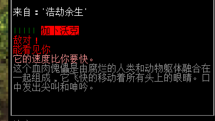
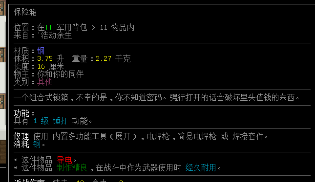
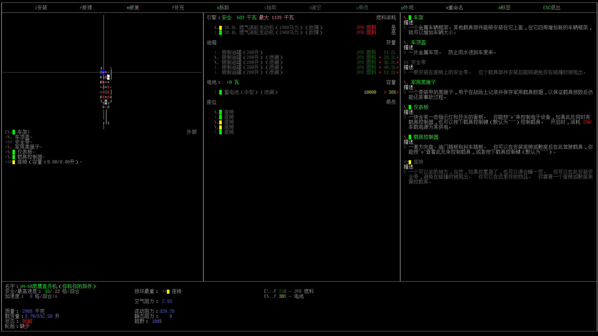
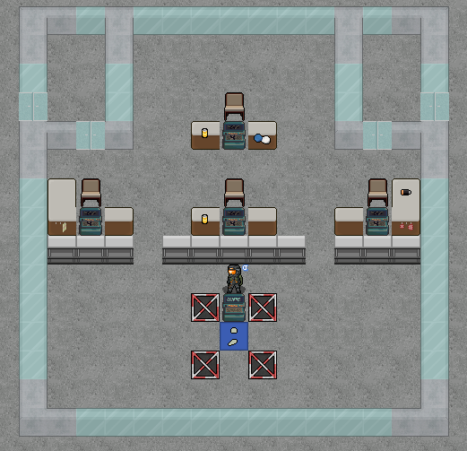
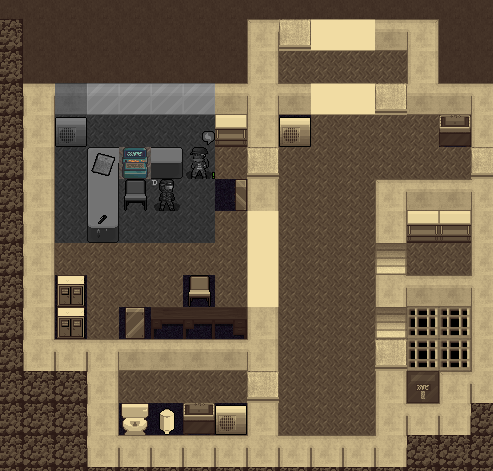

# NPC与任务流程

- [NPC与任务流程](#npc与任务流程)
  - [NPC](#npc)
    - [NPC类别](#npc类别)
    - [NPC能做什么](#npc能做什么)
    - [NPC态度、性格](#npc态度性格)
    - [派系营地](#派系营地)
  - [任务流程攻略](#任务流程攻略)
    - [情景任务](#情景任务)
    - [常见任务](#常见任务)
      - [任务线：丧尸杀手](#任务线丧尸杀手)
      - [任务线：狡诈政客](#任务线狡诈政客)
      - [任务线：旗帜飘扬](#任务线旗帜飘扬)
      - [任务线：分析数据](#任务线分析数据)
      - [任务线：追忆往昔](#任务线追忆往昔)
      - [任务线：宗教信仰](#任务线宗教信仰)
    - [独特NPC任务](#独特npc任务)
      - [任务线：气象学家](#任务线气象学家)
    - [阵营任务](#阵营任务)

## NPC

非玩家角色，也就是NPC，他们是由游戏AI控制的幸存者，通常绝大部分的NPC都是你的朋友，当然也可以是你的奴隶，有一些组成劫掠者阵营的NPC则是你的敌人，取决于你的视角，他们也可以是储备粮食。您总是可以通过按「c」或者触碰「交谈」来与友善或中立的NPC贸易，接受他们发配的任务，或是说服他们加入你的队伍。

与NPC进行社交存在一定对抗机制，具体是你的社交行为、属性需与NPC的社交能力与属性互相对抗，如欺骗高智商的NPC成功率会更低，说服高社交能力者比较困难等……不过一般NPC应该都对抗不过你。

如果你没有开启「NPC无需求」模组，你需要将食物、饮水交付到NPC的背包之中，他们才能正常的吃饭喝水。

**关于NPC的绝大部分内容，均可以与NPC交流并选择「教程」来了解；**

### NPC类别

通常会有一个NPC与你一起生成在初始位置，此类NPC有一套随机的基础装备、技能，并愿意向你提供一个基础的任务，如果你不打算搭理他，他也乐于帮你看守初始的避难所直至永远；

除此之外你也能在世界的各个地点找到不同的NPC，绝大部分是随机生成的幸存者，有不同的职业能力与装备，也会提供一些随机任务，并且通常很乐意加入你。

还有一些是特殊的阵营NPC或是独特NPC，通常有固定的基地、生成地点，提供独特的任务与奖励，他们有自己的阵营和责任，大部分不太会考虑加入你的队伍。

最后一些则是末日中的破坏分子、劫掠者，他们自成一派，装备精良，他们和你敌对并热衷于把你杀死、切碎、夺走你全身上下的每一分财产，他们无法交流。

### NPC能做什么

**作为同伴的NPC**是你比较忠诚的仆人，他们会听从你的命令保卫一个特定的地点、跟随并和你并肩作战，他们虽然智商不是很高，也不擅长打带跑的战术，但起码还能自己给自己包扎、服用止痛药物等；

同伴NPC还可以协助你制作物品，当你是文盲时也会为你读书，当你用「Y」+「O」规划出一些区域时也可以命令他们做一些杂活，尤其是拆解车辆、耕耘田地这些耗时耗力的事情，不过你也需要给他们提供一些对应工具；如果你有需要，还可以让NPC建立起派系营地，通过投入大量资源来获得各种各样的好处。

你也可以更换同伴NPC的装备来增加他们的战斗力，或是让扒光他们的装备给自己便利，或是给他们点工具让他们干更多的脏活累活，

**未被你说服入队的中立NPC**会在原地驻守，他们会追随声音并查询情况，随意的攻击敌对目标，他们对你没什么兴趣，但会为了自己的安全奋战。你可以将敌人吸引到中立NPC附近，让中立NPC帮你分担压力，或只是单纯的让丧尸杀了他们以便于你顺利脱身。

**阵营的NPC**通常有独特的对话选项、独特的任务、一些阵营里还会有可供贸易的商人，他们与中立NPC一样会捍卫自己的安全；

**敌对的NPC**通常只是想杀了你，你无法和他们进行任何有效的交流；

### NPC态度、性格

NPC通常分为友善NPC（绿色）中立NPC（粉色）敌对NPC（红色）；

绝大部分NPC有一套态度指数，你可以通过交谈并选择观察态度来确定NPC对你的态度，你也可以通过一些行为来改变NPC对你的态度，不同的态度也会关系到NPC和你之间的一些关系；

态度一共分为四种：「信任」、「恐惧」、「重视」、「愤怒」

**「信任」**：信任对所有互动都有加值，通常你完成任务就会增加信任；低信任的NPC

**「恐惧」**：恐惧会对威胁性的互动有加值，变异、丑陋、装备武器、枪械等都会让中立NPC对你感到恐惧，他们可能会要求你放下武器，要求你离开等，如果他们太过恐惧也会转身逃跑；

**「重视」**：与信任一样会给各类互动提供加值；

**「愤怒」**：采取一些敌意行动会积累愤怒，愤怒会导致NPC敌对；

影响态度的因素实际上是非常繁多且较为复杂的，但一般情况下不需要过于考虑态度问题，绝大部分NPC都可以说服并交流。

——————

NPC内置也有一些性格要素，正常情况下无法查看NPC性格；

性格分为：「兽性」、「勇气」、「收集」、「良心」

每个NPC的性格会随机生成，性格与态度互相作用，最终会形成对你、对环境的互动结果。

### 派系营地

派系营地是以NPC为基础扩展而出的，属于玩家自己的阵营基地；你可以跟NPC沟通并建造派系营地，也可以找他们了解在各个区域建造派系营地所带来的好处，总体来说派系营地会需要你投入大量资源来获得各种各样的便利与好处，占大头的主要是建材和食物；

#### 营地选址的注意事项？

通常来说你可以在NPC建议的各类地点建设特殊营地，特殊营地通常会有一些独特功能或便利，或者只是单纯的更好发展。你也可以在荒野从零开始建造一个野外营地。

营地相邻的方格最好为「旷野」区域以便于扩展营地，四周最好有收集食物建设水车的河流或湖泊、用来伐木的森林、建设盐场的沼泽等；

#### 派系营地具体可以做什么？

可以命令NPC做各种各样的事情，他们可以种植作物，可以树林里伐木、加工木材，生产木炭，整理战利品，狩猎、屠宰动物，烹饪，虽然这一切都需要你投入大量资源让NPC建设，还需要食物作为工资让NPC帮你干活，但最终的成果还算令人满意；

#### 我需要做哪些准备？

1.  你需要几个NPC来做各种各样的工作，至少要有个两三个去承担不同的事项、任务，随着你营地的扩展、可以做的事情增加，你可能还需要更多NPC来覆盖营地的各种职责范围；
2.  工具，基本上所有的基础工具，如锤子、螺丝刀、锯子、焊接工具等；
3.  食物，大量食物，将这些食物放入营地食物储存区并通过告示牌的「分发食物」以将他们转化为卡路里，这些卡路里将作为资源用于营地NPC的各项行动之中。
4.  建筑材料，大量建筑材料，建设营地需要海量的木板和钉子，有可能的话直接去抢几个木材厂、差遣NPC多砍几棵树。

#### 注意事项

1.  即便开启了「禁用NPC需求」模组，你仍需要在营地内提供食物，且最好保持营地内有十分充足的食物储备，否则很有可能导致NPC生气并进而导致叛变。
2.  提供给营地的食物应当全部转化为卡路里来供给NPC使用。
3.  当你发布了一些建设任务、采集任务时，NPC并不会真跑过去干活，他们只是单纯的从这个世界上消失一段时间，然后从其他次元搬过来你需要的东西，习惯就好。

## 任务流程攻略

**/ / / / / / 剧透警告 / / / / / /**

任务会从一些特殊开局中获取，然而更常见于各种各样的NPC寻求免费劳力的过程之中，虽然他们会要求你做各种各样的苦差事，其中有相当一部分有着致命风险，不过很快你就能反过来奴役他们，或是从他们那里博得各种各样的好处，所以总体来说还很值得；

当你完成了NPC的任务，根据任务类型，通常你可以获得NPC的「好感度」及「盈余」，好感度可以让你对NPC的各种社交互动行为获得加值，「盈余」可以让你向他索取、交换一些奖励，你也可以让他教你点什么东西来提升技能等级。

有些NPC有着自己的职责与阵营，他们并不会选择加入你的队伍，取而代之的便是各式各样的丰富奖励，甚至于一些独特的武器装备、一些隐秘地点的位置或某些军事设备的通行密码。

### 任务卡死

带领NPC前往某个特定地点的任务只能在指定地点完成，如果接受任务却没有标记出任务地点，则该任务很有可能会卡死，届时只能选择放弃。

为NPC寻找特定物品的任务偶尔也会有这种情况，不过特定的物品通常不唯一，你可以在各种地方找到替代品，只要拥有物品，任务依然可以完成。

### 情景任务

一些开局会给予一些独特任务，指引通常比较明确也比较容易达成，基本只提供一些心情奖励；

应该无需赘述了；

### 常见任务

当你启用NPC生成时，一个有着随机装备属性甚至是变异的NPC始终会生成在你的附近，他们会发布一些较为基础、常见的任务，虽然通常称之为开局任务，不过你遇到的非独特NPC都会发布此类任务。

#### 杀死丧尸妈妈

*「身处全球性类生化危机大灾变之中，至亲的躯体变作怪物并不算什么罕见事迹，不是每个人都有亲自下手的勇气与决心……帮帮这位可怜人吧。」*

**任务难度**：简单；

**任务流程**：接受任务后便会在地图中标记出一处民宅，其中会生成一只有名字的普通丧尸，将其击杀就可以回去交任务了；

**奖励**：NPC的信任；

#### 寻找哮喘吸入器

*「此人所言非虚，时间不多了，如果无法在几天内找到吸入器，他必死无疑。」*

**任务难度**：简单；

**任务流程**：到药店找个哮喘吸入器，交给NPC即可完成任务；如果没有在两天内完成任务，NPC会因哮喘死亡；

**奖励**：NPC的信任，发布该任务的NPC固定会有哮喘特性；

#### 寻找抗生素

*「最好快一点，他的情况不容乐观。不过……就只是一片抗生素就可以立刻治愈他当下的一切问题，大灾变之下，真是发生什么都不奇怪。」*

**任务难度**：简单；

**任务流程**：到药店找个广谱抗生素或抗生素，窄谱不行，交给NPC即可完成任务，完成任务前该NPC固定有-80速度的特殊「感染」状态；如果没有在两天内完成任务，NPC会因感染死亡；

**奖励**：NPC的信任，任务完成后NPC直接痊愈；

#### 生存者证明

*「这人不像其他人那么好搞定，不过也不像其他人会委托你很多事情。既然他怀疑我们活不过十天，我们就等十天后去见他，到时他自然会愿意与你同行。」*

**任务难度**：简单；

**任务流程**：十天后回来找NPC聊天；

**奖励**：NPC入队；

#### 收集香蒲秆

*「香蒲胶，可以大量生产的廉价消毒药品，它或许不如抗菌剂、过氧化氢那么好使，但也是差强人意，最重要的是便于获取，数量庞大。即便不用来消除咬伤，也可以用来消毒伤口加速痊愈速度……此外，顺路拿一个行李袋也没什么不好。」*

**任务难度**：简单；

**任务流程**：接受任务后会获得一个行李袋，之后从沼泽或者河边收集共80个香蒲秆，生存技能高于1级，NPC给予你的行李袋必须归还。

**奖励**：习得香蒲胶配方，获得拉链袋及少量香蒲胶，NPC的信任；

如果不交付任务，你可以一直留着行李袋，交付任务了可以把NPC拉进队伍，然后通过交易等手段拿走他的行李袋；

#### 寻找丢失的狗

*「狗，人类最忠实的朋友，在这末日之下任何猎犬的战斗力都不值得期待，但只是用作宠物嬉闹玩耍也没什么不好……找回那条爱犬吧，之后怎么料理是你的事情。」*

**任务难度**：一般；

**任务流程**：接受任务后会标记任务地点，并获得一个狗哨；任务地点会刷新一只友好的小狗，利用狗哨或宠物包等手段把狗带到NPC旁边，反过来也行，即可完成任务；

任务地点通常在城内，比起找狗更麻烦的是保护狗，狗一旦死亡就会判定任务失败。

**奖励**：NPC的信任，一只可以驯服的狗……也可以吃了它。

#### 寻找天气日志

*「这位试图研究出大灾变起源与传播途径的青年确实志向远大，只是大灾变这事儿如果真的这么简单就好了……总之，去无线电塔，找国家气象日志，还有注意安全。」*

**任务难度**：简单；

**任务流程**：接受任务后会为你标记一处「无线电塔」，其中固定会生成一本「国家气象日志」，将国家气象日志交给NPC即可完成任务；

**奖励**：NPC的信任

#### 任务线：丧尸杀手

*「从森林里那恐怖的伽卜沃克到统领尸潮的丧尸主宰，这活给你的麻烦事不少，好在那枪手装备不错，人也算有两下子，不然这生意可就亏大发了。」*

**任务难度**：困难；作为开局任务来说，强度有点过分；

**总体流程**：对抗高强度怪物-\>对抗尸潮-\>最后对抗由高强度怪物为中心组成的尸潮，之后就是跑图和找东西了；

**全部奖励**：NPC及一个枪手NPC；

如果你想的话，可以把枪手NPC的装备扒走；

##### 1.杀死伽卜沃克

*「要我说，这人的朋友要么被吃得一干二净，要么就成为了这怪物的一部分。当然了，我们也不能排除是那家伙看我们不顺眼，让我们来送死……做好准备，接下来是场恶战。」*

**任务流程**：

接受任务后便会在地图中标记出「伽卜沃克」的位置，前往对应位置，找到「伽卜沃克」，干掉它后就可以回去交差了；

另一种完成方法是选择说谎，没点「说谎达人」的情况下成功率较低；

**基本情报**：

伽卜沃克，400生命值，速度140，伤害4d8钝+3切，近战10，闪避3；

任务地点通常会刷新在树林中，虽说有良好的迂回空间，但对于刚开局的玩家来说依然是个难以战胜的对手，建议在有一定装备基础之后再考虑完成这个任务。

**攻略建议**：

「伽卜沃克」属于大型目标，瞄准对其有命中加成，常见的.45口径或9x19mm口径手枪每击能对「伽卜沃克」造成25点左右的伤害，在距离不远，手动瞄准的情况下每轮大概能射击1\~3次，全弹命中的情况下约16次射击可以完成击杀，手枪通常可以在警察丧尸的尸体上找到。

纯近战要麻烦许多，最起码要有点靠谱的武器和带有控制能力的武术流派，或提前铺设好陷阱，将伽卜沃克引入陷坑；

实在要开局挑战的话，考虑下放火吧。

**奖励**：NPC的信任

##### 2.清理100只丧尸

*「你听到了吗，他说我们可以成为传奇人物……如果杀一百只丧尸就是传奇，我们早就能与神祇并肩了。」*

**任务流程**：

接受后NPC会跟随你，当你杀够一百只丧尸后就可以找他交任务了；

另一种完成方法是选择说谎，他先前对你的信任会大幅提高说谎成功率；

**基本情报**：

进城，然后杀丧尸，一百只不是什么小数量，咬咬牙一两天也能过去；

能说谎过就说谎过，不能就稍微照看下NPC，慢慢杀满一百个就可以了；

**奖励**：NPC的信任

##### 3.杀死尸潮首领

*「检查武器装备，确认弹药情况，反复设想一切最糟糕的情况，接下来可是一场稍有不慎便会丢失性命的硬仗……」*

**任务流程**：

接受后NPC会跟随你；

接受任务后便会在地图中标记出「丧尸主宰」的位置，前往对应位置，找到那个有特殊名称的丧尸主宰，干掉它后就可以跟旁边的NPC交差了；

另一种完成方法是选择说谎，两次任务积累的信任足够叠满说谎成功率；

**基本情报**：

一只有特殊名称的丧尸主宰，周围聚集着数量较多的各类丧尸，通常还生成于城区，然后丧尸主宰的特殊攻击是10轮一次的「进化」，随机挑选一个幸运丧尸，加速进化进程；

第一时间干掉主宰就可以回去交任务了，拖得越久越不利，一旦拖出「死灵法尸」一类的丧尸，整个局势就会变得很有趣；

不过一般来说，说谎直接过就行；

**奖励**：NPC的信任

##### 4.征募追踪者

*「终于，那个躲在幕后给我们发派一些要命活计的家伙愿意见我们一面了；」*

**任务流程**：

接受任务后便会在地图中标记出一座林中「小屋」的位置，与小屋内的NPC-2碰面即可触发对话，该NPC-2自动入队。

**基本情报**：

Npc-2默认配枪且有一定枪法等级；

带着NPC跑过去就行，Npc-2入队后再跟NPC对话即可完成任务。

**奖励**：NPC的信任，NPC-2自动入队

##### 5.寻找副官勋章

*「勋章……又是勋章……为什么有如此之多的人追捧一个毫无意义可言的旧世象征？还是说那些微小而渺茫的金属制品真的有着令人振奋的魔力？我是无法理解……但我很乐意在结束这一切闹剧后，好好地睡上一觉。」*

**任务流程**：

想办法找一个副官勋章，交给Npc-2；

**基本情报**：

副官勋章可以在警察丧尸身上找到，警局、警察总局也可以找到勋章；

拿到徽章后跟Npc-2对话。

全任务流程结束；

**奖励**：NPC-2的信任

#### 任务线：狡诈政客

*「这人正大声嚷嚷着大灾变的一切都是那些狡诈政客的错，虽说他看起来缺乏经验且过于激进，不过帮帮他也花不了多少时间，再说了，政客的秘密保险箱里，谁知道有什么好东西等着你呢。」*

**任务难度**：中等，预期最大的麻烦是办公大楼里找总账和进入银行金库；

**总体流程**：寻找公司会计总账-\>取回保险箱-\>寻找副官勋章；

**全部奖励**：一个NPC的信任，强力的近战武器或枪械，但不提供弹药；

##### 1.寻找公司会计总账

*「他说的倒也不全错，但努力方向绕了个弯路……反正你也说服不了人家，咱们不如就干一单子，看看这家伙能不能真的从里面翻出点什么东西。」*

**任务流程**：

到办公大楼、地区学校一类的地方找本「公司会计总账」，交给NPC即可完成；

**基本情报**：

如果附近有的话，NPC就会给你标记一座办公大楼，直接进去找总账就可以了，没有的话就自己找个办公大楼，翻一翻文件柜。

**攻略建议**：

办公大楼处于城市之中，一般伴随着中等规模的丧尸集群，注意安全。

**奖励**：NPC的信任

##### 2.取回保险箱

*「有人把自己保险箱的密码写在了小册子里，还贴心的标注了箱子所在的银行，这说明他对银行的安保系统很有自信……真希望你对自己的计算机水平有同等的自信，这样我们就能看看那箱子里到底有什么宝贝了。」*

**任务流程**：

接受任务后会标记一处银行，并在金库内生成对应的「保险箱」物品，设法进入银行、骇入或撬开金库以获取保险箱。

**基本情报**：

保险箱以物品形式生成，找到并交给NPC，他会帮你打开箱子并给予你一件随机物品，通常是优秀的武器或枪械，但不会给你对应的弹药；

**攻略建议**：

银行有可能会伴生有鹰爪无人机，骇入金库需要较高的计算机等级，破门需要焊炬，墙体还是那种十分坚固的类型。慢慢来。

**报酬**：NPC的信任，随机的优质武器或枪械；

##### 3.寻找副官勋章

*「我可没想过咱们能有那么大的收获……那既然人家愿意把玩意给咱们了，咱们也帮人家最后一个忙，把那人见人爱的副官勋章发给他吧。」*

**任务流程**：

想办法找一个副官勋章，交给NPC；

**基本情报**：

副官勋章可以在警察丧尸身上找到，警局、警察总局也可以找到勋章；

拿到徽章后跟NPC对话。

全任务流程结束；

**报酬**：NPC的信任

#### 任务线：旗帜飘扬

*「充满国家自豪感的人要求你为他寻找一面旗帜，这事儿本来还算简单，可他又谈到什么直升机里的黑匣子、提取数据的实验室、还有那个什么……秘密的掩埋地点？那这事儿可是有点意思了。」*

**任务难度：困难\~致命**；

**总体流程**：到学校寻找国旗-\>到直升机坠毁地找黑匣子-\>到实验室破解黑匣子-\>到放射性掩埋点地下二层；

**总体报酬**：NPC的信任，一座实验室的地址、放射性掩埋地的地址及电梯密码；

##### 1.寻找美国国旗

*「一面美国国旗？他要国旗干啥？」*

**任务流程**：

为NPC找一面美国国旗，通常在「警察总局」、「火警瞭望塔」、「退伍军人协会」、「地区学校」等地点可以找到；

**基本情报**：

火警瞭望塔处于郊区，丧尸数量极少。

其他区域都处于市区，请小心谨慎。

**报酬**：NPC的信任；

##### 2.寻找黑匣子

*「黑匣子，从国旗跳到黑匣子？我们要上哪儿给他拆黑匣子啊？」*

**任务流程**：

从「直升机坠毁地」事件中找到黑匣子交给NPC即可；

**基本情报**：

直升机坠毁地系地图事件，一般伴随有飞行员丧尸、士兵丧尸、运气足够差的话还会碰见生化战士丧尸；

黑匣子则作为「军用直升机」的载具部件存在，需要2级机械学及一把螺丝刀将其拆下才能取走，此外完全损坏的黑匣子只会被拆成电子材料，做好多找几架直升机的准备。

**报酬**：NPC的信任；

##### 3.恢复黑匣子记录

*「要我说，匣子里有啥都是虚的，实验室里的宝贝才是真的。所以我们接下来要攻打实验室？你东西带全了吗？」*

**任务流程**：

接受任务后，NPC会将黑匣子交给你，并为你标记出一处「科学实验室」地点，你需要进入其中以恢复黑匣子记录

**基本情报**：

实验室的危险性无需多言，建议装备完全，有枪械和优秀的近战手段，有爆炸物，有较高计算机等级的情况下开始任务。

进入实验室需要科学家ID卡或足够的计算机等级和黑客工具以破解入口。

进入后寻找如下图的「数据演算仪MK IV」房间，将黑匣子放到计算机前的蓝色地板区域，与计算机互动并启动「解密算法」，解密成功后将掉落在脚下的「黑匣子记录」带回去交给NPC，即可完成任务；

需要注意运行数据演算仪并破解黑匣子需要经过多次计算机骇入判定，每次失败都会刷新大量的敌对飞锯无人机。

科学实验室还是很值得探索一下的，注意安全；

**报酬**：科学实验室位置，NPC的信任；

##### 4.追踪埋点调查队

*「他竟然还真能找到点有用的讯息，之前是我看走眼了。总之，我们要带他去那个掩埋地点调查，那里一定隐藏着什么秘密……保持警惕，带上抗辐用品和战斗用品，让我们深入地底，探寻真相。」*

**任务流程**：

接受任务后会获得「危险品开启密码」，并在地图上标记出一处「放射地掩埋点」，带领NPC前往掩埋点并启动电梯，进入地下二层的掩埋设施，将NPC带往控制中心后，与NPC交流即可完成任务；

**基本情报**：

只要将NPC带到如图所示的位置即可完成任务，需要注意的是放射地掩埋点整片区域都含有辐射，请自备「碘化钾」及「普鲁士蓝」以减轻辐射影响，记得给NPC也整点，地下二层如果只是把NPC带过去还好说，如果要探索的话预期要面对大规模的丧尸威胁，注意安全。

至此任务流程结束；

如果地点没有被标记出来，则任务线卡死；

**报酬**：NPC的信任，以及放射地掩埋点的电梯密码；

#### 任务线：分析数据

*「这家伙打算让你回收一些对治愈病毒有所帮助的资料……虽然确实算是头等大事，但这人靠谱吗？」*

**任务难度：一般**；

**总体流程**：去城市某处下载数据-\>给丧尸采血并在医院分析；

**总体报酬**：NPC的信任；

##### 1.取回软件资料

*「这地方……之前有这台电脑吗？」*

**任务流程**：

接受任务后会给你一个「U盘」并为你标记一处地点，前往指定地点就可以找到一台电脑终端机，与之互动并选择软件下载后即可将「医疗软件」下载到U盘之中，如果你有多个U盘也可以多次下载。

将装有软件的U盘交给NPC即可完成任务，多余的可以自己留着。

**报酬**：NPC的信任；

##### 2.分析血液样本

*「这人拿了医疗软件就让我们去分析血液样本，之后就再也不吱声了……你觉得他打算做什么？」*

**任务流程**：

接受任务后会标记出医院的位置，并给你一个「U盘」和采血管。你需要从丧尸尸体上采集血液样本（站在尸体上使用采血管），然后去医院找一台离心机来分析血液样本，离心机由离心机主体和一台电脑主机组成，你需要将血液样本放置于离心机内（使用「/」高级物品管理放置），然后再操作电脑主机来下载「感染数据」到U盘中，这可能需要一定的计算机水平，祝好运。

一切完成之后把U盘交给NPC，任务线结束。

**报酬**：NPC的信任；

#### 任务线：追忆往昔

*「让我捋一捋，这小子到处在找自己的亲朋好友兄弟姐妹，然后这群人有一些在医院，有一些在联邦应急管理局？好吧，肯定都死干净了。」*

**任务难度：困难**；

**总体流程**：诊所找治疗记录-\>带NPC去联邦营地-\>带NPC去农舍；

**总体报酬：NPC的信任**；

##### 1.寻找患者治疗记录

*「依靠病人名单去找什么幸存者？我觉得这简直就是浪费时间……收拾东西准备动身吧，多少也得倒腾点医疗资源回来。」*

**任务流程**：

去医院、诊所找一本「患者治疗记录」，交给NPC即可完成。

**报酬**：NPC的信任；

##### 2.到达联邦应急管理局营地

*「这小子接下来想去的地方可不简单，还好他只打算看一眼……他要是想住在那儿，咱们可别陪他闹腾了。」*

**任务流程**：

接受任务之后Npc会跟随你，并为你标记出一处联邦应急管理局营地。将NPC带往指定地点并对话即可完成。

联邦应急管理局营地的丧尸数量也很多，注意安全。

如果地点没有被标记出来，则任务线卡死；

**报酬**：NPC的信任；

##### 3.到达农舍

*「他的朋友都死完了，一个不落，一干二净……现在他想去乡下建立一个开心农场？」*

**任务流程**：

接受任务之后Npc会跟随你，并为你标记出一处农舍，将NPC带往指定地点并对话即可完成任务，至此任务线结束。

如果地点没有被标记出来，则任务线卡死；

**报酬**：NPC的信任；

#### 任务线：宗教信仰

*「星慧教堂……宗教仪式……这群人是嫌这个世界还不够疯狂吗？」*

**任务难度：困难**；

**总体流程：去大教堂地下室找「小巧圣物」-\>去标记点找「牧师日记」-\>去林中小屋找「铭刻头骨」-\>去监狱找「荒野胜景」**；

**总体报酬：NPC的信任**；

##### 1.寻找圣物

*「以诸神的名义和我全部的尊重……那\*\*\*到底是个什么鬼东西？！」*

**任务流程**：

去「大教堂」地下，找到那个被「苍白人体」环绕的「小巧圣物」，交给NPC即可；

**报酬**：NPC的信任；

##### 2.寻找牧师日记

*「在这个节点上，什么宗教信仰都是一家人了……我有跟您提到过我的信仰吗？等你找到那本牧师日记，我们可以坐下聊聊这个。」*

**任务流程**：

接受任务后会高亮一处地点，在那里找到牧师日记，交给NPC即可；

**报酬**：NPC的信任；

##### 3.调查祭仪地点

*「星慧教堂……活人献祭……林中小屋……我以为大教堂里看到的那玩意已经足够离谱了……这又\*\*\*是个什么东西！」*

**任务流程**：

接受任务后会高亮一处林中小屋，逐个砸碎窗户找到下层楼梯，在地下室中找到铭刻头骨，交给NPC即可完成任务；

林中小屋的地下层有大量独特的「疯人怪」及一个固定的「血祭牺牲者」，而第一层可能会出现「地缚灵」。

一旦确认目标地点出现「地缚灵」，请直接绕开寻找那个下层楼梯，不要发生冲突。如果一定要殴打「地缚灵」，请携带全自动枪械在远距离处理此事。「地缚灵」拥有高达800点的生命值及较高的移动速度和自愈能力，同时拥有分裂出「幽灵」的特殊能力。「幽灵」本身威胁不大且过一段时间就会自然消失，但集群「幽灵」是另一回事，幽灵会使用抓取攻击，一旦被多个「幽灵」抓取就会导致窒息及体力快速耗损，最终可能出现致命风险。

地缚灵并不需要硬打，你只需要找到下去的路就好。

**报酬**：NPC的信任；

##### 4.狱中神示

*「监狱预言家……这个世界的疯狂已经超出我的认知水平了。」*

**任务流程**：

接受任务后会高亮一处监狱，进入其中并在囚室找到「荒野胜景」，交给NPC即可完成任务，至此任务线结束。

至于监狱的丧尸有多少，我想这点就不用赘述了。

**报酬**：NPC的信任；

### 独特NPC任务

一些特定的地点可能会刷新出一些独特的NPC，他们通常有特定的技能分配倾向和属性，固定的装备搭配，并会为你提供一些独特的任务。

#### 前往难民中心

*「这台电脑为我们指示了一个难民中心的地址……如果您想要寻找幸存者、同伴或是一点麻烦，去看一看倒也无妨。」*

**任务地点**：紧急避难所的电脑终端，「互动」并选择「联系我们」即可；

**任务难度**：简单；

**任务流程**：接受任务后便会在地图中标记出一处难民中心地点，抵达即可完成任务；

**奖励**：难民中心地点；

#### 骨之先知

*「装备精良，身手矫健，还信仰着一种奇异地宗教……不管怎么说，她能帮助我们。」*

**任务地点**：位于荒野的2x2规模墓地，镶花玻璃窗房间内的「布丽吉特·拉克鲁瓦，骨之先知」，与之对话并接受任务即可。

**任务难度**：简单；

**任务流程**：随便杀一个野生动物，屠宰并拿八块骨头回去找骨之先知，即可完成任务。

**奖励**：可以让你招募骨之先知入队的「先知之印」特性。

#### 任务线：气象学家

*「倒腾无人机的气象学家？那好吧，让我们看看他能研究出来点什么东西。」*

**任务地点**：位于城市中的无线电站，在一个小房间里可以找到「气象学家」，与之对话并同意帮忙即可开始任务线。

**任务难度：一般**；

**任务流程**：。

**奖励**：。

##### 1.为气象学家收集废料

*「记住，50块废料，6个中型电池，5个小型高清镜头，1个无线控制器，按顺序来；」*

**任务流程**：

给他五十块金属废料，金属废料可以通过拆车拆柜子拆铁器获取，这东西是不会缺的。

**报酬**：无；

##### 2.为气象学家收集电池

*「还有6个中型电池，5个小型高清镜头，1个无线控制器；」*

**任务流程**：

给他六块电池（中型），你可以在笔记本电脑一类的电器里找到，电器店、商场有不少这种类型的，凑齐六块不难。

**报酬**：无；

##### 3.为气象学家收集镜头

*「还有5个小型高清镜头，1个无线控制器；」*

**任务流程**：

给他五个小型高清镜头，小型高清镜头可以通过拆解智能手机、显微镜、传感器阵列获取，智能手机很常见。

**报酬**：无；

##### 4.为气象学家收集无线控制器

*「最后是1个无线控制器，让我们看看他要创造什么样的奇迹。」*

**任务流程**：

给他一个无线控制器，是玩具车用的那种，不要做成载具用的那种。

在学校、别墅、电器店一类的地方可以找到玩具车套装，把里面的控制器交给NPC之后即可完成，下一步任务需等待两天才能进行。

**报酬**：一本指南书；

##### 5.寻找坠毁的无人机。

*「不出所料，他的无人机失控坠机了……他不敢出门，所以我们还得拉他最后一把，要我说不如干脆趁这个机会把他拉进队伍，这样对他对你都是好事。」*

**任务流程**：

在标记地点找到「无人机存储模块」，周围有一些米戈需要处理。

**报酬**：NPC加入队伍，招募入队就好；

### 阵营任务