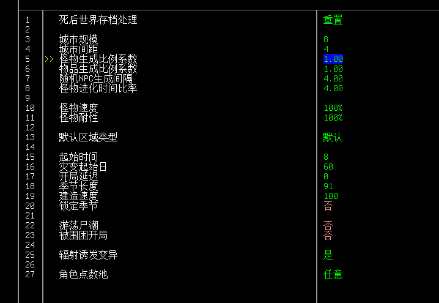

# 世界设置详解

## 1、死后世界存档处理

当你的角色不幸死亡时如何对待留下来的世界，基本都是字面意思；

## 2、城市规模

城市规模比例，默认设置的城市规模至少有10\~100的建筑物，调低或调高都会显著影响城市规模；

## 3、城市间距

城市之间相隔距离，数值越低则城市之间越近，数值越高则越远；

官方默认设置的4相对比较合理，将其提高会享受跑长途的快感，调低则有可能过于密集，稍微动一点就好。

## 4、怪物生成比例系数

设置怪物生成数量，数值为零则停止生成，数值为2则翻倍，算法明确；

将其改低会明显影响城市内怪物数量，对于新手生存很有帮助；反之亦然，用于熟悉游戏之后提高难度挑战自我。

## 5、物品生成比例系数

设置地区战利品数量及敌人携带的物品数量，算法同上；

默认数值的比例就挺高了，调低提高一定难度，调高会显著降低难度；

## 6、随机NPC生成间隔

调整为零可以禁用随机NPC生成；

一般影响NPC生成在刷新范围外生成的平均时间，时间流逝、已有NPC数量等都会显著影响生成率。就保持默认别乱动吧。

## 7、怪物进化时间比率；

调整怪物进化所用的时间，调整为0可以禁用进化，调高数值则提高进化所需要的时间。

默认设置下预期会在第一周遇到少量进化丧尸，随时间推移逐渐增多进化丧尸的数量；

新手玩家将其调高一些有助于更快的积累资源、发展装备以对抗进化丧尸，借此积累更多经验； 但还是建议在基本熟悉游戏之后调回默认设置……吃苦的人越多越好；

## 8、怪物速度/耐性；

调整怪物的速度和生命值，调低时怪物速度更慢、生命值更低，调高则更快、更难被击败；

## 9、默认区域类型

调整你开局所在区域，尚未完成；

## 10、起始时间

从几点开始游戏，0为午夜，12为正午，以此类推；

## 11、灾变起始日

决定从哪一天开始游戏，具体可以决定从哪个季节开始游戏，不影响实际游戏进度；

## 12、开局延迟

决定你在灾变开始后多少天来到这个世界，显著导致食物腐烂、丧尸进化等，没啥想法就默认0吧；

高延迟算是经典挑战的一种，有兴趣可以试一试；

## 13、季节长度

影响一个季度有多少天，同时会影响游戏内农作物的生长等关乎季节的进程；调低以获取更快的作物生长和更短的季节，调高以享受漫长不变的季节和长不出来的作物；

新手玩家建议调低到30天左右来快速体验各个季节变化带来的显著影响及带来的游戏玩法变化，体验一遍就差不多了。

## 14、建造速度

越低越快，越高越慢，建议不动；

## 15、锁定季节

如果不喜欢季节变化可以打开这个，锁定什么季节取决于灾变起始日，锁定后的作物生长按季节长度计算。

会少很多挑战和乐趣，但永春也挺好的。

## 16、昼夜循环

永昼或者永夜，各有各的好坏吧，一般还是不太建议开。

## 17、游荡尸潮

是否生成根据声音等级移动的尸潮，他们在大地图上以瞬移形式移动，自行吸纳路径上的丧尸，直到接近你所在的区域之前无法被任何事物阻挡。

建议在积累了一定游戏经验之后开启以增添难度，不开也没什么不好。

## 18、围困开局

为开局地点增添几十只丧尸作为初始挑战，显著增加角色落地的难度；

不太建议开就是了。

## 19、辐射变异

辐射是否会导致变异。

开着吧，也没啥大不了的……；

## 20、角色池点数

任意就可以了，开游戏再细选；

## 对新玩家的地图建议

**此条目需要一些建议和意见订正，有兴趣的话请使用批注在各段留下自己的建议与想法。**

考虑到玩家偏好不同，其所能享受的游戏内容也各不相同，我比较喜欢种田养殖，其他人可能就享受于到处掐架，还有一些人乐于收集各种各样的东西放在家里，换而言之，基本不存在能让所有人享受乐趣的配置。

一般来说，习惯默认设置给予的难度是最好选择，但你也可以先调低各项难度数据来学习并掌握游戏中各项机制，待到基本熟练之后再回到原版难度设置，慢慢来，不要太着急。

我这里尽可能的给予一点我个人的主观建议改动来让你有充足的安全时间去掌握并理解游戏内各项机制，又可以快速体验到游戏中一些比较多样性的内容与挑战。

1.  尽量不要修改「耐性」与「速度」，不要调整「物品生成比率系数」，高耐性与高速度主要作为挑战要素，低耐性与低速度很容易让游戏变得无趣，低物资倍率对新手来说更难处理，高物资倍率也容易变得无趣；
2.  不要启动「游荡尸潮」，除非你确保自己的游戏经验与理解足够应对大规模尸潮及居家工作期间时不时抽出时间对抗尸潮，这玩意主要作为挑战要素存在而不是说会让游戏更真实。
3.  「怪物生成比例系数」调整至0.7左右（约减少30%怪物数量），「怪物进化时间比率」调整至8\~15（约将初次遇到进化丧尸的时间延迟至第十天左右）；这些设置能够有效降低早期游戏的难度，让你拥有更长安全时间来学习游戏内的各项基础机制。
4.  「季节长度」调整到30天，在此期间尝试一些诸如种植一类的机制，一方面能让你更快的了解各个季节带来的游戏玩法变化和挑战，另一方面能更快的熟悉种植、畜牧等系统。
