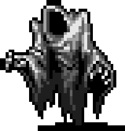

# 基础战术准则

## 1、做好万全准备

**背包里一定要常备用以减轻疼痛影响的「止痛药」、可迅速止血的「绷带」或「创口贴」、被深度咬伤时迅速消毒的「抗菌剂」或「过氧化氢」，「香蒲胶」也成。**

当你可能要在室内对抗带有燃烧技能的敌人时，便携式灭火器可以有限地控制火势以避免环境伤害，对抗酸液攻击的敌人时，酸抗装备和鞋子能让你避免酸蚀伤害，而当你要对抗带有毒性的敌人时……原版没解毒剂，你自己带点强效止痛药凑合凑合吧。

每次行动前妥善准备物资与合理规划探索区域都将提升你的生存概率与探索时长，每个医疗物品的消耗都等同于你避免死神侵袭的次数。

## 2、一定要留条后路

**和敌人作战时一定要确保有路可退**，当事态超出预期或战况陷入不利时便于战略撤退。一旦你被逼入绝境，没有可供逃跑的路线意味着游戏终结。

时刻注意周围的环境、连同各处的通道与窗口，每次战斗都需尽可能避免将自己拖入无法逃脱的境地。

## 3、尽可能保持一对一

**一对一永远是最优解**，丧尸普遍具有迫使你无法移动的抓取攻击，多个丧尸抓取也会导致窒息效应，即便面对其他生物围攻也不免被积累大量疼痛与伤势，一旦被包围，你所建立的所有优势都将会在敌军压倒性的数量及每轮积累的伤害中消耗殆尽。

观察并利用周围环境、利用敌人不可堆叠的特性不断减少能威胁到你的敌人，如果有被包围的风险，选用奔跑模式进行战略性撤退。

## 4、了解你的对手

毒气、烟雾丧尸死后会炸出大量雾气，如没有合理的环境保护将会严重影响战斗力并最终带来致命的危险。

酸系敌人除却威胁颇大的酸性喷吐外还会留下酸液地表，在没有抗性的情况下走上去会受到伤害。

电系敌人的电击会带来巨额疼痛并造成减速，对于近战来说极为致命。

除上述之外还有失明、燃烧、震慑等诸多减益状态。

**知晓你的敌人有什么样的手段并采取相应措施可最大限度避免在战斗中承受不必要的损伤。**

## 5、时刻注意自己的状态

耐力不足便无法奔跑与战斗，过高的疼痛会显著影响你的战斗效率，若被一些异常状态击中也会有很多不良影响，血量不健康或出现大出血也会有致命风险。

**时刻注意好自己的状态，不要到筋疲力尽时才想起来自己本该战略撤退。**

## 6、打带跑战术（HAR）

**当你的敌人「速度比你慢」时，你便可以在确保自己有富裕行动点时攻击一次，后退一步。**

打带跑战术系近战战术基础，适用于所有武器，非常适用于长矛等具有「远距攻击」词条的武器。该战术需对行动点有最基本的概念，近战风险较大，实质上更加适合远程武器或「远距攻击武器」。

## 7、利用环境创造优势

当周遭地形中含有「移动耗时」大于100的地形时，你便可试图将敌人带到此类地形之上，让它们花费更多的时间用于移动及脱离地形，在此过程中你便可以拥有充足的机会进行攻击。

不稳定的地形将会对近战命中率造成减益，将敌人带到此类地形中也有益于降低受伤的几率。

**陷阱、燃烧的地面、你自己点的火、坑洞等一系列环境，周围的家具桌椅，窗户、门扉，利用这些随处可见的环境去创造优势是打带跑战术的进阶版本，适用于所有近战武器及所有场合，游戏内近战战术的核心。**

## 8、战略性撤退

当你感觉自己无法处理大规模敌军或难以对抗那些强度颇高的目标时，**你总是有个绕开它们或者转身就跑的选择。**

## 9、不讲武德

若你感觉大批敌人实在棘手，手上的资源难以处置，但你又迫切需要一些资源加快发展进程，你便可以采取对环境利用的最终解决方法，**不 讲 武 德。**

-   高速行驶的汽车足以击杀绝大多数单位，如果一次撞不死就持续碾压直至撞死为止，不过目前实验版本修改了车辆耐久，很废车。
-   自行车、独轮车、摩托车搭配长矛类武器可以以速度优势对任何丧尸进行有效的打击，小心不要被拉下车就是了。
-   狗群、米戈一类的野怪、认识或不认识的NPC都与丧尸敌对，拉入敌群中任其乱斗吧。
-   点燃一座房子，让建筑损毁的噪音吸引周围大片丧尸进入火场并被尽数烧死，请记得抽出时间处理尸体，不然它们会作为焦尸复活。
-   利用噪声陷阱吸引丧尸，周围点起火堆、挖出深坑、布置陷阱。
-   开3D上二楼，用长矛或其他远程武器攻击楼下丧尸……多带几根长矛。

## 10、以崇高的人类之身面对死亡

当你感觉局面已然回天乏术，任何手段也无法逃出生天时。

你拥有最为高贵的「Q」+「Y」+「Y」操作指令。

你或许无法赢下这场战争，但你至少能以崇高的人类之身面对死亡

我们终将面对死神