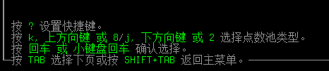
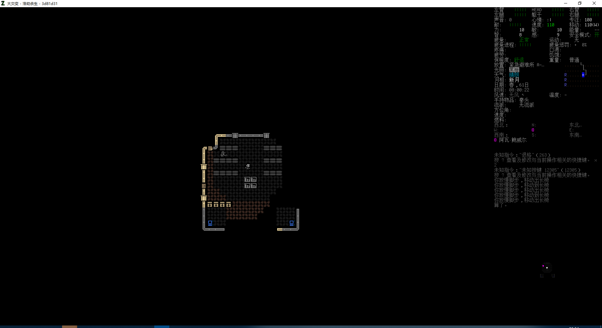
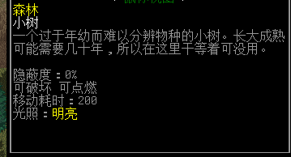

# 基础教程

**您可以在进入世界之后按下「0」查阅游戏内的官方基础攻略。**

## 1、从创建新世界开始

进入主界面并选择新游戏时，游戏会要求你创造一个崭新的世界。

**0.F3稳定版及更早版本**：你会进入一个选择模组的界面，您可以用「方向键」查看模组说明，使用「\<」、「\>」滑动模组列表并通过「回车键」添加或移除模组，调整或者看完模组之后，按下「TAB」或「Shift」+「TAB」在「当前世界模组」、「当前世界设置」之间切换。

**实验版本**：你会进入一个创建世界菜单，可自行调整「城市」的规模、「难度」等级、「NPC」的数量。按「s」打开更加详细的世界设置，按「m」调整世界之中的模组。

建议在初次游玩时保持默认设置，如需简单的游戏体验，您可以手动调整世界设置，在「世界设置详解」条目中有你所需要的讯息（实验版则直接调低难度即可）；

世界调整完成后，按「TAB」以完成世界建设。

## 2、构筑属于你的角色

世界建设过程中做出的所有改动都会在此时生效，如果在载入过程中出现报错，只需按「I」键忽视即可。

### 选择点数池

角色构筑界面的第一步便是选择你的点数池系统，通常有三种选择；

**独立点数**：将点数分为「属性池」、「特性池」；「属性池」的点数只能用于属性，「特性池」的点数只能用于特性，技能则共用两个点数池；您需要在技能等级与特性、属性之间权衡利弊，具有一定策略性；

**统一点数**：取消独立点数的限制，你可以自由分配这些点数在你想分配的位置上。可以通过积累负面特性、选择少量正面特性以换取高属性、高技能，也可以通过削减属性来换取技能等级，使用起来更自由；

**无限制**：你有无限的点数可以用于角色构筑，可以实现大量负面的缺陷人物或是高属性高技能的超人角色，大体相当于是构筑角色中的创造模式；

**界面操作说明**：

### 选择场景

场景代表大灾变当天你所处的环境是安全的避难所还是混乱的战区中心，场景会决定你的出生地点、限制职业选取并带来挑战或便利。

通常来说带有「挑战」字样的场景将增加开局难度并给予一定的点数奖励，反之消耗点数的会为你带来一些开局便利（但同样伴随着颇有难度的挑战要素）；

-   对于初次接触游戏的玩家而言，「被疏散者」开局提供了最安全的初始位置与最为广泛的职业选择。
-   建议当你对游戏理解较为深入时再选择其他场景。

### 选择职业

-   **可选职业会因你所选择的场景发生变化；**

职业代表你在大灾变发生前所从事的工作，游戏给予了从街头落魄的瘾君子到死而复生的生化战警等种类繁多的职业选择，不要在职业上纠结太久。哪些职业有强大且配置合理的装备、哪些职业适合开局发展，这一切都需要你对游戏有一定理解才能知晓。

你的角色会拥有与职业相符的装备、技能与专长知识，你在职业上花费的点数越高昂，你的角色也就越强大。

如果你愿意接受一些挑战，你也可以获得更多的可用点数；

-   **如果需要一些建议，试试这些廉价实用的职业；**
-   **「幸存者」经典开局，一无所长；**
-   **「伐木工」初始携带颇为强大但也十分笨重的近战武器「伐木斧」**
-   **「购物中心保安」具备一定的躯干防护能力「防刺背心」，快速有效的近战武器「甩棍」，记得使用前先将其激活。**
-   **「棒球运动员」有近战技能等级及性能优良的近战武器「棒球棍」，只需再额外投资一些点数便可以成为强大的钝击武器选手；**

### 选择背景（实验版特性）

背景是实验版新增的开局选项，如果说职业是角色在大灾变前所从事的工作，那么背景就是角色业余的兴趣爱好，你可以选择复数背景，它们所造成的影响将会叠加。

背景会给予技能经验、专长或特性，也有挑战背景会给予可用点数，有些背景还会赋予你背景专属特性，你可以在左侧目录中「特性」一栏阅览这些特性的效果，但通常没有必要强求；

-   **如果您需要一些背景建议**：
-   **背景价值在于成本颇低的技能经验与专长，但尽量不要和你已有的技能与专长重合，否则其收益会有所下降；**
-   **背景给予的是技能经验，技能等级越高，技能经验带来的提升就越低，如果背景给予了一项技能经验，则在此技能投入的任何点数都会削弱背景的提升；**
-   **专长可以让你省去大量练习时间，那些优秀的专长往往比较昂贵；**

### 四维属性

属性决定之后便难以提升，四维属性的具体解释可以在「属性影响」中查阅，这里只提供概述；

-   **力量**：提供更高的生命值与负重，提高一定的近战伤害；
-   **敏捷**：提高远程、近战的命中率，提高闪避技能等级、暴击率；
-   **智力**：减少读书花费的时间、提高技能升级速率、降低制作失败的可能，即便失败也有可能规避惩罚；
-   **感知**：提高远程命中、夜视视野与探测陷阱的能力、提高暴击率；

力量可以提高你的战斗能力与生存能力，敏捷则提供命中与规避伤害的能力，智力能提高技能升级速率，感知带来的效果虽不明显，但低感知带来的夜视惩罚非常致命。

对于新玩家来说，保持智力在基础水平，给感知一点以获得夜视增益，剩下的提高力量与敏捷就好，战斗能力强总归能活得更好；

### 特性选择

特性的具体加成可以参照「特性」条目，特性会对你整个游戏进程造成影响，正面特性会带来一些优势，但带来的优势越大也就越昂贵；负面特性会带来一些麻烦，但同样会带来可观的点数；

**建议选取的正面特性有**：

-   **「背肌发达」-2点**：增加25%负重，该特性无法在游戏流程中获取；
-   **「快速反应」-2点**：增加3点闪避技能；
-   **「乐天派」-2点**：常驻10点心情，增加心情获取，减少心情下降；
-   **「夜视」-2点**：增加2格夜晚视野范围，搭配9感知可在晚上看得更远。

**建议选取的负面特性有**：

-   **「餐桌礼仪强迫症」+1点**：心情惩罚不高，条件容易满足；
-   **「成瘾体质」+2点**：控制使用成瘾物品的频率即可视为无负面；
-   **「健忘」+3点**：不开启「技能遗忘」机制即可视为无负面；
-   **「远视」+2点**：条件容易满足但难以移除，请谨慎选择。
-   **「近视」+2点**：条件容易满足但难以移除，请谨慎选择。
-   **「说不出谎」+1点**：仅影响欺骗NPC时的成功率，基本没有影响；
-   **「痨肠寡肚」+1点**：不吃会引发食物中毒的腐烂食物和生水即可；
-   **「路痴症」+1点**：负面可接受，但始终少一些大地图视野；
-   **「重度沉睡」+1点**：确保睡眠环境安全即可，某种意义上是正面；

**请保持自己的个人判断，并参考特性表中各个特性的实际加成，如近视远视的影响难以祛除，在开启技能遗忘时也不推荐选取健忘。**

**如果你觉得一些负面对你有较大的影响，可以更换为其他负面。**

### 2.7 技能选择

技能的详细数据请阅览「技能」条目；

技能，代表你这个角色在专业领域中所掌握的各项技能水平，无论技能等级如何，每个技能首次投入的点数都会提高2点技能，后续1个点数1点技能，持续增长技能也会持续加大消耗。

考虑到点数并不充裕的现实，想以高技能等级开局必然要牺牲一些属性与特性，以全面的技能开局并不现实，所以我们最好只提升那些比较关键的技能，至于剩下的那些就留到实际游戏进程中慢慢提升；

**战斗技能**总能让开局时期变得更为轻松；开局可以通过制造`长棍`训练近战等级到三级, 因此不用点战斗技能

**工艺技能**非常容易通过练习提升, 没有太多开局点的必要；

**互动技能**则没有太多选择可言，「操作装置」收益不高，「社交」主要侧重说服NPC入队和贸易，「计算机学」虽然关键，但需要高等级才有用、「驾驶」提升的特别快，「医疗」可以通过练习快速提升。因而你应当把重点放在「机械学」上，该技能允许你对车辆进行拆卸、改装、维修，你可能很快就会需要它；

**具体技能加点建议根据个人体系流派构建，当然对游戏不太了解时可以按照我的建议，辅助你个人的一些想法构建。**

### 2.8 总览

当你完成了所有的事项，你可以切换到最后一个标签页「描述」，在这里你可以看到你所构筑人物的全部信息，你可以在这里为角色取名、更改身高、年龄、血型等信息；（影响基础代谢率，年龄越小，身高越高则代谢率越高）

如果你对总体属性有所不满，可退回去修改直至满意为止再开始游戏，此外你也可以将你的角色保存为模板，这样每次开新游戏时可以少去捏人时间；

## 3、按键操作方式

CDDA的操作模式与现代繁多花哨的游戏类型有显著不同，你要利用键盘上所有的键位进行操作，个人建议将此栏目复制到记事本中以便于随时阅览，慢慢来；

### 3.1 如何移动：

通过hjklyunm移动, 或不习惯的话用数字小键盘进行移动，数字代表八个方向，「5」则代表原地等待，若不考虑斜向移动也可以只使用方向键。

### 3.2 常用操作（大小写敏感）：

**「Esc」或q** 退出当前面板

**「回车」** 打开行动面板，基本囊括游戏内所有操作，用起来有点麻烦；

**「@」** 打开角色属性面板

**「i」** 打开背包界面

**「g」** 拾取物品；

**「d」** 放下物品；

**「a」** 使用背包或角色周围的物品；

**「D」+「方向键」** 将指定物品丢到指定位置；

**「W」** 穿背包里或附近的装备；

**「T」** 脱一件身上的装备；

**「w」** 手持背包或附近的物品；

**「R」** 阅读背包或周围的书籍；

**「e」+「方向键」** 与指定方向物品互动，如果没有可检查的物品，则该指令无效，如果周围只有一个可互动物品，则与此物品互动。

该指令会根据你所检查的位置执行或生成一些指令，和存放物品的铁柜互动可以取出柜内物品，与窗帘互动可以选择关闭窗帘或扯下窗帘，与花草互动则可以采集花朵等；

**「E」** 吃、喝、消耗物品；

**「x」或「;」** 观察模式，你移动鼠标或键盘观察远方或你感兴趣的对象，当你选中感兴趣的对象时，按**「e」**详细观察以获取对象信息；

**「X」+方向键** 向指定位置窥探，通常用于拐角或门口，允许你看到更多信息且不会被敌人发现，与**「t」**键组合可以在窥探位置投掷物品（如手雷等）；

**「V」** 列出周围物品，可通过「s」分类，按「TAB」可切换为周围生物；

**「TAB」** 自动攻击处于射程内的敌人；

**「t」** 投掷指定物品

**「o」 &「c」** 开门&关门；

**「G」** 拖拽载具或家具；

**「B」** 屠宰与拆解指令，屠宰主要用于尸体，可获取肉类、骨骼与内脏；拆解则根据拆解物不同获得一些材料；

**「r」** 为可以装填的物品装填弹药/电池

**「U」** 清空容器，将容器内的物品全部取出来，如果是液体则可以选择倒入其他容器或倒在地上。

**「p」** 打开生化插件（CBM）界面，可以查看或激活你所拥有的生化插件；

**「[」** 打开变异界面，可以查看或激活你所拥有的变异；

**「_」** 打开武术流派界面，可以查看或激活你所拥有的武术流派；

**「^」** 驾驶车辆，需坐在驾驶座中，如已经在驾驶座中或周围有车辆控制模块，则打开车辆控制菜单；

**「"」** 切换行动模式，奔跑、行走、蹲下、趴下；

**「$」** 睡觉，当角色疲倦时就需要睡觉，但不要让角色睡在泥土或草地上；

**「&」** 打开制作清单，可制作物品或查看制作物品的需求；

**「\*」** 打开建筑清单，可建造物品或查看建造建筑的需求；

**「\\」** 搬运地面上的物品，比背在身上耗时更多，但是不受容量等限制；

**「Y」** 规划一些区域以便于物品管理等；（可以慢慢研究此项）

**「O」** 当你用「Y」规划好区域后，按「O」执行区域命令；

**「?」** 打开键位绑定菜单以查看键位的详细描述或更改、绑定更多键位；

**「0」** 游戏攻略

## 4、于是你降临于世间

角色构筑完成，键位表也差不多放在随便哪个地方了，那么你算是正式踏入了这个游戏之中……冷静点，不要畏惧那些乱七八糟的贴图和复杂的侧边栏，我们慢慢来。 如果你只是需要开局建议的话，请跳过下方一系列对于信息、系统等各种各样的机制的描述，不过还是建议你稍微看一些，不过以后想要了解的时候再看也行；

### 4.1 侧边栏信息概述

总而言之，肉眼可见的占领大片区域的图形化界面是游戏的主要画面，一般站在中心的就是你的玩家角色，通常情况下游戏时间停滞，只有你做出行动时时间才会开始推进；如果你觉得自己的图形包不够直观、好看，你使用「ESC」打开菜单，在「选项」→「图形」→「使用贴图包」一栏更换。

而右侧黑底且有密密麻麻信息的是侧边栏，这些信息大部分直接告诉你有什么用，如果您想知道更详细的用途可以直接看下方的「其余属性」部分（仅限有比较详细用途的内容），这边只给一些较为关键信息的概述；

**「肢体状况」**：可视为生命值，每个部位独立计算，四肢生命值归零会导致「肢体折断」，头部和躯干生命值归零则视为死亡；

当部位生命值变为红色、粉红色时代表流血、蓝色则代表被咬伤，有严重感染风险、绿色则代表已经感染，如果变为（\~\~&\~\~)就代表部位骨折；

通常流血需要使用绷带、创口贴等医疗物品进行止血，蓝色需要使用抗菌剂进行消毒，损失的生命值在打上绷带后会缓慢恢复，如果角色睡着，则恢复速度就能大幅加快，如果角色不困就不要强求他睡觉了；

**「声音」**：代表你当前发出的噪音水平，只要你行动便会根据行动类型产生不同的噪音，噪音可能吸引附近怪物的注意；

**「心情」**：以字符画代表角色当前的情绪，非常直观，好心情有助于技能升级，按「v」可以打开心情菜单以查看近期影响心情的事件；

**「专注」**：代表角色当前的注意力水平，主要影响技能升级速度，专注低只会导致技能升级效率变慢，不会带来其他负面效果；

**「耐力」**：代表角色当前体力水平，有一个很直观的进度条和颜色警告；

消耗耐力会增加移动耗时；

耐力显示为黄色代表你至少消耗了一半体力，如果此时你正处于战斗之中，请考虑前往安全的地方恢复体力；耐力显示为粉红色就代表体力将耗尽，如果你很不巧仍在战斗之中，不迅速脱离战场将会有致命风险；耐力值显示为红色代表体力彻底耗尽，大部分行动需要耗费更长时间完成，并有可能被施加「气喘吁吁」的负面状态；

**「属性」**：代表角色当前的属性，其可能因各种状态效果而减少或增加，如受到较小影响则显示为黄色，如果受到严重影响则显示为红色；

**「速度」**:可视为「行动点数」，代表角色所拥有的行动点数上限及每回合恢复的行动点数，行动点数耗尽则回合结束，等待会直接清空剩余行动点数；

**「移动」**：代表当前回合花费的行动点数；

**「移动耗时」**：在「@」界面查看，代表你在平地上移动一格所需要消耗的行动点数；

**「能量」**：代表你的生化能量储备，如果你拥有CBM储能插件，则此处会显示你剩余的生化能量，否则显示为 「——」；

**「安全模式」**：用「!」进行开关，关掉一段时间也会自动打开，主要效果是遇到威胁时暂停游戏并弹出警示框，就开着它吧。

**「疲惫」**：代表角色当前总体体力消耗水平，当你进行高强度行动时就会疲惫。**「疲惫进程」**会为你显示进度；低于「正常」的疲惫会导致所有行动更容易积累疲惫，再低一级就要考虑休息了；

**「运动」**：代表角色运动强度，反应此行动消耗多少「疲惫进程」；

**「疲惫惩罚」**：代表过度劳累积累的惩罚，加大行动积累的疲惫；

**「疼痛」**：角色受伤时积累的疼痛，较高的疼痛将带来显著的不利影响，可随时间自然消散或服用止痛药加速自然消散的进程，给药物一点时间而不是看没有效果就大量服药；

**「疲劳」**：角色感到的困意，随时间自然增长，醒着时间久了就会困；

**「口渴」、「饥饿」**：角色的生理需求，随时间自然提高，如太长时间不给角色进食或饮水将导致死亡；一般来说出现「脱水」及「饿死中」就是最危险的情况，请尽量在角色感到非常饥饿、非常口渴时及时喂点吃喝；

**「保暖度」**：当前角色感受到的温度，舒适为宜，微热或冰凉都会带来一些不便，如果角色感觉更热或更冷将会带来显著的麻烦，如果气候实在太热或太冷而不采取任何手段将会导致死亡；

**「地点」**：代表当前所处的地点的类型，开局会处于避难所中，到马路上就会变成「公路」，具体地点类型取决于「m」大地图中分配的类型；

**「光照」**：代表所处位置的光线情况，分「明亮」、「模糊」、「阴暗」、「黑暗」。环境黑暗将会影响视野范围，但你总能看清视野内「明亮」格的内容。

此特性对怪物同样适用，意思就是大晚上开着手机灯容易吸引远处怪物的视线；

**「天气」**：代表现在的气候，大晴天的阳光刺眼，雨天会把你淋个透彻，下雪会降低环境温度，空间风暴会带来危险和一切有趣的事件；

**「月相」**：代表月亮的阴晴圆缺，月亮越圆，夜晚的视野范围就越广；

怪物普遍都是夜盲症，月相对他们的影响微乎其微；

**「日期」**：代表现在的季节持续了多久，一般会严格遵循你所设计的季节长度执行；

**「时间」**：显示当前的具体时间，如果没有带表，则显示大概时间；

**「风速」、「风向」**：影响气味扩散，风力过强会导致体温下降。

**「温度」**：携带温度计即可显示具体数值，代表当前所处格子的温度；

**「手持物品」**：代表你现在手上拿着的东西，一般建议拿着武器；

**「流派」**：当前使用的武术流派，一些职业、背景会在开局时要求选择一种武术流派，近战等级1时自动掌握「斗殴技」，你也可以在游戏中找到训练手册并通过一段时间的修炼学会武术流派；

**「方位」、「速度」、「燃料」**：代表车辆情况；

**「方位指示器」**：一般叫罗盘，显示视野范围内各个方向的生物，这是一个非常有效的索敌手段，可以帮助你快速确定威胁；

**「信息栏」**：显示最近发生的事情，按「P」打开信息栏阅览。

**「地图」**：类似于一个雷达，非常靠谱且好用，敌人会以红色闪烁图标显示，NPC则以紫色显示，见多了也就知道什么情况了；

### 4.2 游戏基本机制

### 4.2.1 行动

正如上文所述，如同某个电波游戏SuperHot一般，只有你行动时周围的东西才会动，每当你行动时便会消耗行动点数，进而推进时间发展；

通常情况下，当你移动、使用道具、制作物品、战斗时都会消耗行动点数，而打开背包、检查周围的情况、观察敌人这些行为则不消耗行动点数；

敌人的行动和你一样，都取决于速度，你无法直观的得知敌人速度具体有多快，但你可以知道他们行动与你相比是快是慢，比你快的单位可能会在你做一个行动时做出更多动作，反之亦然，比你慢的单位在你做出一个行动时可能还在原地发呆；

你可能会在之后发现，一些明明比你慢的生物在攻击你几次后就变得迅捷，原本一回合或两回合才能打你一下，却突然变得能在一回合连续攻击两次；实际并不是它变快了，而是你变慢了，你的速度会受到诸如疼痛、耐力耗损等诸多因素影响，一旦受到伤害，你就会积累疼痛，疼痛过高时速度就会变慢并带来更多显著的风险；记得经常观察自己侧边信息栏并确保在状态不佳时迅速撤出战场；

### 4.2.2 满足个人需求

既然你已经走过几步路了，接下来阐述一下你的角色个人需求吧；

如同现实世界一样，你的角色需要食物和水分才能生存下去，当他劳累了一天或无所事事了一天后也会感到困乏并需要睡眠，只有满足这些基本需求才能更好地去探索世界，建筑营地；

所有的需求都会随时间流逝而提升，一旦角色感到饥饿、口渴，你便可以在侧边栏直观的看到警示，饥饿和口渴可能会带来一些不太显著的影响，但如果任由其继续发展，最终将会导致角色饿死或渴死；

**觅食**：游戏中的食物多姿多彩多种多样，无论形式外观如何，最终目的都是在于填饱你的肚子；严重的饥饿必然会导致一些行动惩罚，长时间的饥饿也会消耗脂肪使你变瘦，如果变得太瘦也会有一些麻烦，反之每天摄取热量、食物过多也会有点变胖的风险；你暂且不需要考虑这些东西，饿了就吃总归没有什么太大错误；另外提个醒，开局避难所里面的蛋白口粮难吃的要命，不是紧急情况下还是别把他塞嘴里了，严重影响心情；

一般你可以在城市民居的厨房中找到大量食物，牛奶很快就会过期所以先喝掉，其他保质期或长或短的可以考虑先设法带回基地或就干脆留在原地，下次再来探索时再顺便吃掉；

你也可以在野外寻觅到各种食物，比如蕨菜、虎杖、浆果等，不过这些食物分量、热量都比较低，你可能需要大量摄入才能满足基本需求，而且长时间只吃这些东西会导致体重减轻。个别野菜，如蕨菜中含有毒素，需要好好料理才能食用；

如果你设法狩猎并杀死了一只动物，你可以通过「B」屠宰其尸体获得生肉、骨头及内脏，但你不能就这么直接去吃未经加工的生食，茹毛饮血不太适合现代人的生理结构，况且还会导致显著的寄生虫疾病；你只需要找一口锅子，找点生火的燃料，找个炉子或者就地「\*」建筑石塘或「&」制造火盆，把火点起来之后便可以把肉煮熟食用了；

**饮水**：通常而言消耗最快的就是水分，幸运的是，开局的避难所通常有一些净水可供你消耗，如果运气好的话会有足以支撑几天的量（只要你不是每次都喝到撑），但你必须找到更具效率的饮用水来源以应对未来的需求；

河流、小溪、湖泊，城镇里的一些水池都是非常优秀的饮用水来源，森林沼泽可见的浅坑里通常也有大量的水，如果你心理上能够接受的话，马桶水和水槽积水也可以。但是请千万注意，水源本身无法直接饮用，未经净化的水将会导致食物中毒并带来一些负面状态，如果不是马上就要渴死的情况下请勿直接饮用；此外，民居的地下室或屋顶有时会有净水器，其内部直接含有少量可直接饮用的净水；

净化水只需要有能持续燃烧一段时间的火源和用于烧开水的锅，当然还需要水；烧开水的锅具可以在民居中找到，至于火源可以找点易燃物往野外一堆就地点燃，但要想保证火焰能够持久燃烧到把水烧开则至少需要在「&」制作菜单中建造火盆，或在「\*」建筑菜单中建造火塘；你也可以直接利用一些民居中的火炉生火，只是一定记得要把民居周围的怪物清理干净；

**睡眠**：长时间不睡觉会导致「睡眠不足」从而产生一些显著影响，即便只是一段时间不睡觉也会导致疲劳积累并最终变为「极度疲劳」，当角色感到困倦时，最好尽快忙完手上的各项事务，尽早入睡；

按「\$」即可进入睡眠状态，理论上你可以在任何地方入睡，但比起冰冷坚实的水泥路、湿润肮脏的泥土与草地，你显然更想睡在柔软地汽车座椅、沙发、床铺之上，实在缺乏条件也可以睡在椅子或桌子上，总归是比地板要好；

角色无法在强光环境下睡着，因而你最好拉上窗帘，确保处于黑暗环境，如果有必要可以做一副眼罩；睡觉时如果有噪音也可能会惊醒玩家，因此确保周围安静同样重要；

角色并不会沾床就睡，进入睡眠状态所需要的时间受床的质量、疲劳程度、一天下来积累的疲惫的影响，越困越疲惫则越容易入睡，相对而言也越难起床，有必要的话可以定个闹钟以防止睡眠时间过长影响你其他安排，早睡早起规律作息有助于你安排每一天的日程；

如果想快速入眠，可以在睡前按「回车键」→「其他」→「锻炼」，以最大强度运动1小时，让你的角色感到无比疲惫，进而沾床就睡；运动有助于健康，所以我非常建议你每次睡前都锻炼锻炼；

角色睡着时十分脆弱且基本没有对外界的感知（如果没有带耳塞的话至少还能有保留听觉和痛觉）如果你无法确保周边安全就入睡，可能会发生被怪物攻击而惊醒的状态，或者如果你点上了「重度睡眠」，你很有可能会在梦中被怪物吞噬殆尽（一般受伤太重还是会醒的）；

**心情**：心情以非常直观的字符表情显示，红色代表心情糟糕，绿色代表心情良好，当你心情低下时，专注度就会缓慢下降，当心情愉悦时，专注上限就会提升，其恢复速度也会些许加快；按「V」可以查看心情受到的影响及专注度上限；专注度可以用于提高技能等级，专注度越高，读书或实践带来的训练效果就越好。

通常来说保持良好心情很有必要，提升心情的手段多种多样，如享受美味的食物、零食，听歌，小酌几杯都能有效增长心情；而吃了些不好的食物，受伤感到疼痛、杀死无辜的npc、淋雨等也会降低心情；

杀死儿童类别、奶奶类别等怪物也会有心情减益，杀够100只此类别怪物则感到麻木并消除惩罚，通常意味着每种都要杀100只，所以开局点上`无情`天赋很好；

**成瘾**：游戏内存在一些成瘾物品，如常见的咖啡因、尼古丁及一些不那么常见的成瘾品；如果你在短时间内大量消耗了一种成瘾品，则有极大可能性导致成瘾症状；

成瘾通常会导致非常严重的后果，如果无法定期使用成瘾物质就会遭受惩罚，具体惩罚高低取决于成瘾品的成瘾强度；咖啡因、尼古丁的惩罚总归比吗啡要小的多；

通常情况下，玩家对每个成瘾症状都有一个隐藏计数，当你不摄入成瘾物品时，此计数就保持为0；一旦你摄入成瘾物质，则该计数就有一定可能性提高1点，该可能性主要取决于成瘾品的成瘾强度，具体只能靠生活经验判断；一旦计数抵达到3点则视为成瘾；一旦信息栏中出现你迫切需要某种物质，则代表成瘾已经开始产生影响；

成瘾发生时你有两种选择，忽略它以彻底戒除成瘾，满足它以结束成瘾；如果选择满足它，则成瘾症状暂时消失，但下次他会更快到来也更难被戒断；如果选择忽略它，你将会经受漫长且逐渐显著的负面状态，承担各种各样的后果，但最终你会战胜它，并彻底戒断它；

在游戏中使用成瘾品需秉承谨慎适量原则，有节制且保持一段时间间隔的使用而不是短期内大量使用，即使是最为紧急的时刻也请保持谨慎给药，控制剂量；

### 4.2.3 衣物与装备

然后我们来讨论温度和衣服，温度具体就是环境温度，对抗你的保暖度；太冷和太热都会造成显著影响，因而最好维持保暖度在「舒适」水平；游戏中主要影响保暖度的是环境温度及身上的衣物保暖度，一些状态也会影响保暖度；

寒冷的天气会慢慢减少你的速度并最终导致冻伤甚至死亡；

炎热的天气会更容易口渴，身体起水泡而疼痛，以此削弱你各方面属性；

对抗这些气候的主要武器就是你身上的衣物，衣物通常想穿多少就穿多少，但同种位置无法超过两件，帽子和鞋子则无法超过一件；

完全覆盖每一个部位且具备强大防御力的装备显而易见的重且累赘，其会严重拖缓你的行动效率，甚至可能使你变成一个缺乏机动型的靶子，你需要在其中寻觅到一些平衡之道；

除了基础的钝斩射击防护外，游戏内还提供有特定的属性保护；如橡胶鞋子可以让你安全的行走于酸液池中，防火装备可以让你更快的扑灭火焰并有效降低火焰造成的伤害……只是别真的站在火里就行，环境保护可以让你免疫各种各样的气体侵袭；

如果装备在战斗中损坏，则需要工具进行维修，通常情况下会随材质 产生一定变化；

如果你捡到了一些丧尸身上的优秀护甲却发现他们十分肮脏，穿上去会降低心情时，你可以通过制造洗衣板、洗涤工具箱，再搭配上肥皂条和一定量的水将其清洗干净，我可能会在后面再提一下；

### 4.2.4 近战机制

战斗是你基本不可避免的事情，对于新玩家来说是最为主要的挑战，虽然本手册下方有一些战斗建议和相关条目，但你要了解一些战斗的基本内容还是请阅览此条目；

通常当你移动到一个中立\\敌对目标所在的格子时就可以发动近战攻击，近战攻击消耗的行动点数受累赘与武器本身数据影响；

当你发出攻击指令后，你所拥有的近战技能、武器技能将联合一致对抗敌人的闪避技能以决定是否命中敌人，通常来说小体积敌人会更难命中，而大体积敌人则更容易命中。

命中敌人后的伤害取决于技能等级加成与武器本身性能，敌人也有护甲用以减少你所造成的伤害；

敌人的攻击同理，它们使用内置的近战技能对抗你的闪避技能，如果闪避失败则计算武器或武术所提供的格挡，如格挡失败，则敌人攻击命中，则随机对一个部位造成伤害；

而敌人命中后所造成的伤害取决于其内部数据给予的伤害骰，通常以XdX+X为主，代表投掷X枚X面的骰子，+X则代表在投骰结果后加上此类伤害。如2d6+5就是投掷两枚六面骰子，伤害在2\~12之间波动并在最终结果上+5，即为最低可造成7点伤害，最高可造成17点伤害，此处假设他造成最大值17点的切割伤害；

敌人造成的伤害还需要再次对抗你的护甲，假设他击中了你的手臂，而你的手臂有20点切割防护和75%的覆盖率，则敌人有至多25%的概率绕过护甲值造成17点切割伤害，如果他无法绕过护甲，则伤害减去护甲值，最终结果不能等于负数，最终造成0点伤害，在信息栏中显示伤害被护甲所阻挡；

总体来说，你使用技能对抗敌人的闪避，而面对敌人的攻击，你有闪避、格挡、护甲三种手段用以保护自身，在游戏后期你还能获得一些其他的减伤手段；

### 4.2.5 载具驾驶

驾驶车辆进行长途旅行总归来说比走路更快也更节省时间，车辆也可以帮助你存储/搬运战利品，可以通过各种各样的车载设备为你提供便利，甚至是通过车载炮塔自动攻击任何胆敢接近车辆的敌人；这就是该游戏中颇为重要的一个系统，载具；

我们先抛开上面那些离谱的东西不谈，正常情况下你的第一辆车应该是路边或马路上那些尚且完好且基本没有故障的车辆，要找到这样的车可能有点困难，但花点时间总是可以解决的；

每个可驾驶的载具都有一个「载具控制器」，通常都在某个座位之上，你只要站在「载具控制器」所在的方格即可按「\^」尝试驾驶汽车，如果车内正好有钥匙，则你可以直接把这辆车开到任何地方，即便没有钥匙你也可以通过一把螺丝刀花费一点时间取得载具的控制权……然后就假装你平时都是用钥匙启动的就好；

车辆通常有两种驾驶模式，默认为「定速巡航模式」，当你可以先设定一个速度，汽车将加速到你设定的速度值，直到你设定下一个速度；你可以通过小键盘「8」、「2」来控制加速和减速，「4」和「6」即为左转或右转15°，「7」和「9」即为转弯并加速，「1」和「3」即为转弯并减速；按「5」即为保持此速度、方向向前行驶；另一种驾驶模式是「手动驾驶」，此模式会关闭速度显示和剩余燃料显示，并要求你持续加速以保持你想要的速度，其他操作不变；

每辆车都有一个安全速度和最大速度选项，你可以按「e」检查载具查看具体信息；安全速度代表你驾驶时不会出现任何问题的速度，一旦超出安全速度，驾驶就有可能导致引擎损坏；最高速度就是你的车本身能抵达的最大速度。一般情况下我们并不需要开的特别快，因为这游戏车辆开快了真的很难操作；

所有的车辆都可以自定义名字，自由改装，你可以给车上装更多货仓也可以给他们扩充一些车体或功能。你也可以从零开始从无到有，组建属于自己的车辆，不过这些事情就以后再说吧；

## 5、面向新手开局的基本流程

前面的繁多数据确实有点无聊而且难以理解，不过我还是觉得对于一些系统有点基本了解有很多好处，这里会给予你开局一些流程上的建议，可以让你最大化利用初始资源来入手基本武器及一些必需品；

首先默认你是幸存者、避难所开局，自带近战武器的开局可以忽视自制武器部分，自带背包开局可以忽视自制背包部分；

开局要做的第一件事情是按下「m」以打开大地图，确定周围环境，你的周围通常会有城市、森林及沼泽，或至少有一些其他有趣的东西；在你差不多确定好周遭环境，并决定好探索计划之后再关闭地图。

然后你要探索并收集这个避难所内所有的资源，先摸一下电脑并选择「联系我们」来获取难民中心的地点，不过不用急着过去；

在楼梯上使用「\<、\>」进入地下室，注意柜台和铁柜中的物品需要你靠近才能看到内容物；

通常情况下是一些没什么太大意义的急救夹克、可以作为临时床铺的折叠毯、一些急救箱，内有绷带、消毒水、生理盐水、创可贴和一本医疗手册、一些洗衣服用的肥皂或洗涤剂，还有可能有电可能没电的「手电筒」，一个可以制造噪音吸引丧尸的「哨子」如果你运气好的话，避难所中说不准还有可用的防毒面具，有的话直接扣脑袋上并激活，如果防毒面具内的滤芯不可用也没关系，多少算点防护；

把物资集中到避难所任何一处你觉得方便的地方，如果想的话可以Y+O分类一下，然后拿上一点绷带、一瓶消毒水、所有的创可贴，先到附近的森林处捡点长木棍； 看到下面这个东西了吗，按「W」手持你的折叠刀给他一下，他要不肯断就多来几下，再按「W」将其中一根长木棍拿在手里，回避难所；

拿着你的长棍按「s」砸坏一个椅子，打开制作菜单制作洗衣板，如果你有找到布条或者海绵，可再制作为洗涤工具箱 ，这样你可以用它来清洗各种带有肮脏词条的衣物装备；

随便搬一个椅子到外面公路上，距离避难所稍微远一点点就行，按「a」使用你的火柴把椅子引燃，按「&」打开制造界面，此时你应该可以制造「木质长矛」，这是初期颇为有效的武器，手持时按「F」可以攻击二格外的单位，对于初期的「丧尸」大约只需要4\~6下成功戳刺即可完成击杀，你可以戳刺一次后退一格，如果敌人距离你为1格，则继续后退；

如果你有背包等会显著增加躯干负重的装备，建议在战斗前先脱掉……记得脱哪儿了以及别在火场脱就行；

完成了以上所有准备之后，开局的几日只要不同时面对复数敌人、不招惹到中小规模的尸群、不被一些视野死角的丧尸突袭，理论上甚至不会受到任何创伤，尽可能的吸引少数怪物注意力并等待他们朝你移动过来再处理，比直接莽撞的跑上去结果吸引更多怪物好得多；

背包等较为关键的容器装备有大概率可以在丧尸的尸体上找到，记得在家做个洗衣板洗干净；

沿途上的各种车辆都可以按「e」观察一下，如果车辆情况完整、不缺轮胎不漏油、载具控制器姑且还在，你就可以尝试一下是否能够驾驶，拥有一个可以驾驶的车辆对于探索效率和资源收集、搬运等有极大地帮助；

出血可以用绷带或创可贴治疗，打绷带也需要时间，请在战斗结束后再疗伤；

如果点有生存技能，你可以抽空到沼泽收集香蒲以制作香蒲胶，这是前期成本极低且可以大量制作的消毒品；

现在请慢慢的清理城市外围丧尸，以探索民居收集吃喝和工具为主要目的，若是有些诸如枪械商店一类的建筑物，设法突入其中可以为你带来大量的武器及弹药，服装店则通常会给你一些衣物储备和裁缝用品，诊所有不少医疗用品，慢慢探索，慢慢熟悉就好；

除此之外，如果你愿意牺牲一栋建筑物的收益，你可以点燃一栋楼来吸引周围大片区域的丧尸，把尸体集中起来点燃并形成一个小规模火场，设法将丧尸群引入其中也可以快速清理丧尸，不过操作上可能稍微有点困难；

## 6、面向新手初期开局的游戏建议

通常来说游戏的早期你需要迅速满足基本而简单地需求，如水、食物、睡眠、容易制作的武器装备等，如果可能的话还需要一个可以将战利品从A转移到B的载具或手推车，基地在此时只要能保证周围安全，可以供你恢复伤口、读书、制作与烹饪就好；

————

**开局你需要去寻找的常用工具**：

-   **「烹饪用的锅具，哪种锅都行」**：民宅厨房基本必出；
-   **「螺丝刀、螺丝刀组」**：民宅、五金店；
-   **「锤子」**：民宅厨房基本必出；
-   **「钢锯」**：很可能要去车库、肉铺，五金店，民宅也会有；
-   **「扳手」**：路边的车里、民宅、五金店；
-   **「电烙铁」**：很可能要去电器店、公寓大楼，民宅当然也会有；
-   **「焊接用品及护目镜、面罩」**：车库、带车库的民宅可能会出；
-   **「橡胶软管」**：砸冰箱，或者在民宅花园里捡一根；

**开局你需要去寻找的药物**：

-   **「消毒用品」**：抗菌剂、过氧化氢等，诊所或民宅洗手间的急救包；
-   **「止痛用品」**：阿司匹林可以在民宅找到很多，更高级的需要去诊所或者药店；
-   **「抗生素」**：诊所、药店；

**开局你需要去寻找的武器及其他物品**：

-   **「霰弹枪」或「中/大口径的步枪」**：丧尸身上可能会掉，但一般要去枪店，去枪店最起码需要一把钢锯；
-   **「指南书」**：任何指南书都具备价值，无论是配方还是加速技能提升；
-   **「购物车」**：杂货店、药店、五金店都可能会出；

——

**开局建议**：

首先，你当然需要且非常需要饮水和食物。烹饪用的锅具可以煮水，而可饮用的净水是生命之源，好在锅具随处可见，随便找一个民宅就能翻到好几种锅子；也可以用民宅里捡到的咖啡机, 使用电池电源净水.

至于食物……在游戏刚开始的几天你可以从各种民宅里找到大量食物，但一段时间过去之后，那些容易腐烂的牛奶、肉食就会尽数腐败甚至于消失，不过你总是能找到一些耐储存的罐头等密封食品；

而上述列出的各类工具会广泛地用于今后各类制作配方中，所以请尽量在开局的数日尽可能的搜寻齐备；

衣物方面在春季并无过多需求，你只需要寻找一个储物用的背包、防护刺眼阳光的太阳镜（并不刚需）、防毒面具就好。

防具方面，容易入手的有护膝、护臂、摩托头盔等装备，如果能找到更高级的装备，直接穿上去也可以，就是多注意一下累赘问题，一般前期累赘最好控制在20左右（脱下背包的情况）；

你所见到的任何可以开且不漏油漏电的载具都是有价值的，无论是帮你运输更多战利品还是便于快速行动，能找到的话就砸一个冰箱，从残骸里面挑一根橡胶软管，再用橡胶软管从其他载具里面抽油养车；

如果你在杂货店、五金店等地方找到了手推车，按「G」推走它就是了，你可以通过「/」打开高级物品管理器并往其中堆放物资，对于搜刮各类资源及作为额外储物空间而言很有帮助；

所有的书籍都很有帮助，有些能给你提供配方，有些则可以提升大量的理论等级（来加速技能等级的提升），一般都是要带回家并放在你制作物品的工作台附近；虽然娱乐用书籍确实没太大用处，但至少他们比较值钱（反正你拿他们确实也没太多用处；）

至于战斗……如果你有遵循基本流程或者选了个有不错武器的开局，你通常来说有一定战斗能力，但缺乏经验的事实可能会让你难以处理数量较多的敌人，谨记一个最基本的战斗法则：「利用一切高移动耗时的地形，尽可能保证自己每轮只面对一个敌人，若有条件，最优先处理高威胁目标；」

遇事不决可以放火，牺牲一栋建筑物（或者多栋）来创造一个熊熊燃烧的噪音陷阱，通常会吸引周围大部分看不到你的丧尸前来送死，通常大部分会被就地焚化，不过也有可能会残留一些尸体并在日后变成柴薪类别的丧尸……一般来说算是可以接受的代价；

你也可以把尸体集中起来点燃以创造一片小区域的火场，如果愿意制作燃烧瓶就更好了，剩下的就是用走位或者「哨子」、「压缩气体喇叭」把他们喊过来沐浴烈火了，当然还是请注意安全；

## 7、面向新手度入中期的游戏建议

通常来说游戏中期你需要建立好一个属于自己的基地，无论是以车辆为核心还是以一栋安全的建筑物为基地都无所谓，然后你需要一些更为进阶的制作工具、材料，你还需要寻找到一些步枪及与其适配的大量子弹，如果你已经洗劫过枪械商店则可以忽略此条；考虑到时间的推移，你可能会在此时遭遇到进化丧尸，一段时间之后也要面对全新的季节，不过一般来说也不会太过麻烦。

**此阶段的主要目标**：

-   让你迈入铁器时代的制作工具；
-   维修、改装车辆的工具；
-   更多更强劲的药物储备；
-   大灾变前的食物腐烂之后的食物储备；

**建议搜寻、制造的工具设备**：

-   如果还没找到乙炔焊炬，尽快找一个；

    你可以在车库、轻工厂、购物广场（不推荐）、购物中心等地方找到，焊丝焊条同理，不过到后面还是得自制；

-   制作铁器必须的熔炉、铁砧；

    石头熔炉可以用石头做，挖土或者找建材市场都可以找到很多石头；

    铁砧则是轻工厂、炼钢厂、金属工艺店（工艺店的其中一个变体）中低概率出现。

-   用来熏制烟熏食物、脱水食物来延长储备期的烟熏架，有条件的话整一套屠宰用品；

    烟熏架可以在肉铺、沼泽小屋等地方找到现成的，自己制作也很简单；

    屠宰用品包括屠宰架和屠宰刀，前者可以在肉铺找现成的，后者基本厨房里到处都是；

-   冷冻冷藏食物的冰箱或冰柜；很好找也到处都是。
-   用以填充熔炉、烟熏架及生火燃料的炭窑；

    可以自己做，也可以毛沼泽小屋的；

-   拆墙的冲击钻；

    地铁站底下有不少，也可以去家装超市；

-   起重车辆用的吊机；

    自己做一个起重臂没什么难度；

**建议制造的武器装备**：

**近战**：说实话没什么能推荐的，有了上述工具，并确保自己找到了一些武器配方指南书，再磨上一段时间的专长和材料收集，你基本就可以直接锻造出斩、刺、钝、复合类别最为合适的强力武器了，一般来说近战武器到这里也算是走到尽头，不过你的技能等级仍需磨炼，你也会需要武术指南书来进一步提高近战能力；

一般来说有武术就锻造武术适配武器，没有的话：

钝系的晨星锤、钉头锤、镔铁棍（并不是很推荐）

斩系的长剑、巨剑等

刺系的钢矛；

复合系的琉森锤；

**枪械**：而枪械由于其不可自制的特性，你仍需要去枪店挑选一把自己最喜欢的武器，一般来说最好使用中大口径的步枪，或具有较远射程的精确射手步枪；如果你比较偏好于近战，至少也请带一个装有手枪的枪套来应急处理毒气、自爆、吐酸、放电等近战稍微有些棘手的特殊丧尸；

**防具**：自制皮甲或是铁甲，取决于你是想要低累赘还是高防护，不过其实都算过度类装备；

**其他建议**：

-   如果还没有车辆就赶紧找辆车，大量材料、战利品需要最起码的运载能力才能拉回家。
-   此时应该有攻略绝大部分区域的能力了，四下搜寻物资，有CBM、重机枪一类的宝贝就先存下来吧，CBM此时可能还比较缺乏安装条件或地点，不缺乏就直接去安装。 重机枪在目前阶段用起来有点浪费，放在后备箱以备不时之需就好；

——

**中期建议**：

对比于很快就会结束的初期，中期实际上是相当漫长的一个寻找材料、工具、物资、磨炼专长及技能的阶段；你需要逐渐提升自己的能力来打造、更换更好的装备和护甲，丧尸的进化也会迫使你寻求更有效的武器，与之所带来的更大的材料、物资运输需求、更远的探索范围也需要一辆载具协助才会变得轻松。这个阶段你会非常忙碌且可能会面对很多重复性工作，不过对我来说反而是最有趣的环节；

此阶段的武器与铠甲并不一定要自己铸造，尽管大部分情况下你确实找不到一些性能卓越的正品中世纪武器或日式武器，但如果运气足够好，你仍可以在豪宅、古董店等区域找到一套老旧铠甲、正品武装……不过通常我们还是会回到找一个铁砧，然后开始锻造这个环节，不要给自己的运气太多期待，这样找到正品武器的喜悦才会更深刻；

除上述中世纪的老古董外，你还可以期待士兵丧尸身上的防弹背心，不过你还需要一个护臂、护膝来保护裸露的手臂和双腿；如果运气足够好拿到了防暴护甲，它起码能坚持用到你打造出更好的装备；

近战武器就……通常还是自己打造吧，掉落物所提供的近战武器类别很难满足需求，除了那柄伤害面板足以比肩大部分可铸造武器的消防斧，虽然它确实又重又难挥舞，但你可以在初期捡到；

至于载具方面的需求，你总是可以检查载具来确认它能不能开走，而且你也可以检阅上面是否有你可以用得上的完整组件来进一步升级你的车体。

而载具相关的工具，千斤顶总会在车辆后备箱找到，起重类工具可以自制一个吊臂，也可以从叉车上拆一个叉车臂，事情其实还算简单，总比满街找一个铁砧要容易些。

食物储备在这个阶段已经成为了十分显著的问题，绝大部分大灾变前的食物已经正式宣告成为食腐动物的盘中美食，你需要找出一些新的食物来源并开始研究如何延长食物储存时间了，这个手册目录中可以找到相关条目，需要具体一点的可以直接从目录中找「如何延长食物保质期」；

而通常来说，你需要自己建造一个「烟熏架」及为其供给木炭的「炭窑」来制作烟熏或脱水食物，如果你有电池供给「食物脱水机」运转，你也可以用脱水机快速完成这个过程。「食物料理机」则可以将部分食物、作物打粉来变相延长储存时间，并使其可以适用于各类食物配方；

而食物储存的最终解依然是人工冷库及罐装、封口，出于工作量考虑姑且只考虑罐装、封口，前者需要大量的玻璃罐或锡罐及配方书来执行整个操作流程，后者则大量需求塑料袋及真空包装袋。罐装封口的特点就是只要不将其开启食用或使用即可永久保鲜；

总之这个阶段我没有太多可以提供的建议，慢慢探索以满足材料和工具需求，打造出一套装备并拥有一定的食物储备之后，你已经可以正式丢掉新手的标签朝着更远、更危险的实验室、军事掩体、跨洋物流等区域探索，从而更进一步的向着游戏后期前进了，请时刻保持小心谨慎，愿幸运与胜利伴随与您；

## 8、面向新手度入后期的游戏建议

其实很难说一个玩家到游戏后期时还能被称之为新手，你已经拥有大量军火、一辆经过改造且足够坚实的车辆、甚至很可能已经开始接触CBM及变异体系，从事实上而言，抵达后期的概念就是你所拥有的火力及能力可以应对游戏内绝大多数……甚至全部的威胁，只要小心谨慎就不会丢掉性命。

一般这也意味着游戏很可能要走向终点，除非你的终极目标是建造一座末世堡垒或是末日战车一类的事情，再开一盘游戏其实也没什么不好。

我认为一般抵达这个阶段的玩家从事实上而言已经掌握了游戏的基本玩法甚至可能更加深入，换而言之，把新人标签丢掉吧，你已经学会了在这个世界生存所需要知道的一切常识与知识，希望这本手册还能为你提供一些力所能及的帮助。
