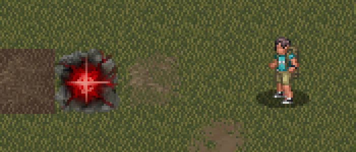
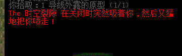
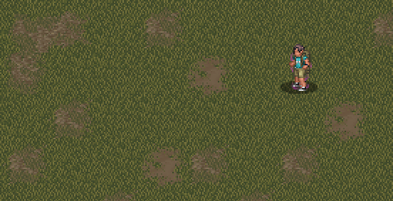
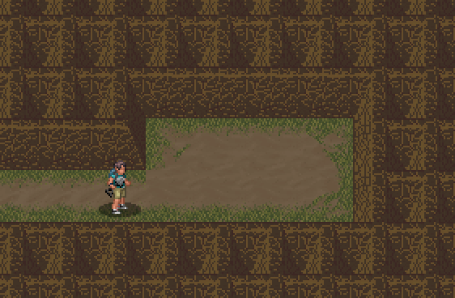
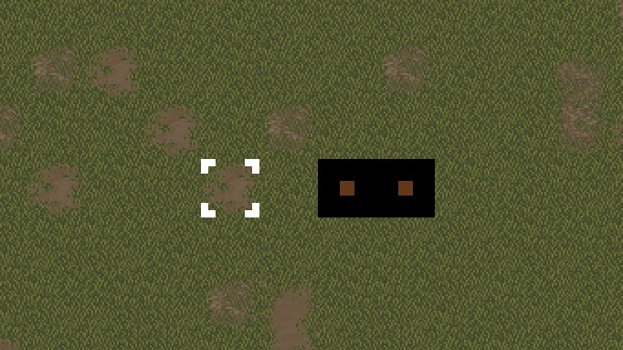
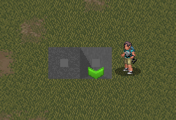
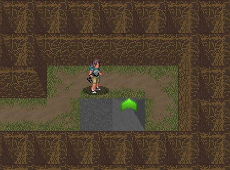

# 常见问题 Q&A

**一般是不知道怎么分类或者不太值得单独开个条目的问题会丢到这里；**

## 1、再一次的开局建议

**Q：我在开局时进入城市探索，与一群丧尸搏斗并受伤，敌人数量实在是太多了，我不知道如何才能取得胜利；**

**A**：刚开局一无所有时并不建议立刻进入城市冒险，先在避难所内借助急救毯（0.F版则为窗户上的布料，按E拽下）制作一个小包裹，再搜刮避难所内所有的医疗物资（通常是急救箱内的绷带、抗菌剂等）再到周围收集木材并制作一把基础武器（如木棒、武术长棍、木质长矛等）后再去市区探索，探索时建议带上绷带、创可贴及抗菌剂以备受伤时用于急救，还有一瓶阿司匹林用于在接近战前服用以控制疼痛；若是缺乏绷带，则可以通过切割一些棉质衣物以获得棉布片，用棉布片制作「简易绷带」，如果物资足够也可以将其煮沸或漂白以增强效果；

开局阶段并不具备制作护甲的基础条件，因而最好选择具有「格挡」能力的初始武器，请避免同时被多个敌人攻击和避免一次吸引太多敌人的注意力，尽可能多的利用周边地形进行迂回作战（鼠标放到地形上时会提示行动耗时，将敌人引到行动耗时高的地区并殴打它即可），在战斗之前请记得放下你的背包以避免累赘过高带来麻烦，也请记得将包放在容易回收并且比较安全的位置，不然事后回收会有点麻烦；

开局角色携带有点火源时（火柴、打火机等），可以通过随身携带一些小型引燃物，遇敌时丢在地上点燃以作为简易陷阱使用，不过千万别在室内或者房屋边上这么干，有可能会引燃房屋导致一些不太理想的事情发生；

如果你实在需要到某个房区探索，但周围丧尸又有些超出你的能力范畴之时，你可以通过先到一个地方制造噪音（通常是用哨子、汽车喇叭等方式），先行吸引大量敌群到远处之后，再到房区进行探索，但要确保自己能逃走；

转角可以使用「x」进行观察，如果搭配「t」还可以用来投掷爆破物；

如果察觉自身有被包围的风险，则可以通过「"」切换行动模式至奔跑，快速脱离战场，在战斗中也请时刻注意自己的耐力及疼痛，当耐力水平低于50%时将会带来显著的麻烦，况且耐力低了也不好进行战略转移；而疼痛会显著影响作战效率，一旦疼痛开始严重影响属性及速度时，应立刻撤退；

如果在战斗中遭受重伤，则需立刻脱离战场，并将伤口消毒并包扎以最大化伤口恢复效率，然后在安全地区通过睡眠快速恢复；因角色困乏之前通常难以入眠，因而建议阅读一些指南书或是制作其他物品、道具以最大化利用闲暇时间；

不要畏惧死亡，死亡会让你学会并认识到一些危险；

## 2、如何清洗肮脏的衣物？

**Q：我从警察丧尸的尸体上发现了一些不错的铠甲，还从一些丧尸身上找到了更大的背包，但他们统一显示为（肮脏），我该如何清洗他们；**

**A**：砸碎避难所里的一张椅子，或者随便从哪里找块木板以制作「洗衣板」，加上常见的刷子或海绵或是棉布片等来制作「洗涤工具箱」，接着只需要一些洗涤剂、肥皂条等洗涤用品和足量的水便可通过按「a」激活洗涤工具箱来清洗物品装备；

## 3、如何让衣服变得合身？

**Q：虽然洗好了那些衣服，但他们显示为「不合身」，穿上去累赘比正常要高一些，我该怎么处理它们？**

**A**：不合身累赘惩罚是原累赘的倍数，若原累赘大于20则+10，「&」制造一个木针或是找一个缝纫工具箱、裁缝助手等任意拥有缝纫功能的物品，往里面填充缝衣线或筋腱等物品，激活并选择修理，选中需要修改合身的衣物，通常此时会提示你需要什么样的材料进行修补，材料足够则进入修补菜单。

修补菜单上方会显示每次尝试的成功率与伤害率，成功会使装备状态更好，失败则损害装备一格耐久，在确保有一定成功率且失败率处于极低水准时再考虑尝试，在满耐久反复尝试直至成功后，装备将会被被修改为合身；

修补菜单还提供一些其他选择，如将其强化（即为多出1格额外耐久，可以抵挡一次损坏）

## 4、如何获取可饮用的净水？

**Q：我注意到了河水和湖水无法直接饮用，我该怎么收集并净化它们？**

**A**：通常情况下携带容器到水边，按「e」与水互动即可将水收集到容器之中，此时收集的水还未经净化，直接饮用会导致食物中毒；

通常只要在火源附近按「&」选择制造净水即可，批量会稍微快一些。到游戏中后期时你会有一些净水器等更具效率的净水方案，目前就先这样吧；

## 5、如何安全生火？

**Q：经历过一场不幸点燃避难所的事故之后，我想问一下怎么安全生火？生火的燃料该选用哪些？生火又会有哪些好处？**

**A**：「&」制造一个火盆或是「\*」建造一个火塘，在其中放置可燃物并点燃即可；比较优秀的可燃物就是木材和尸体，游戏中期也可以通过建造「炭窑」的方法来大量获取木炭，届时也可以将火盆火塘更换为「壁炉」；

生火好处还挺多的，惊骇野生动物、烧水做饭、取暖照明、一些合成也需要你点火作为前置，不过燃料需求这块确实不太吃得住；

建议在民宅里捡一些轻便电炉和咖啡机, 用丧失掉的电池或其他电器的电池进行烧水做饭.

## 6、如何提高技能等级？

**Q：我意识到一些技能等级至关重要，但我不知道该如何提升他们；**

**A**：技能可以通过实践、阅读与练习进行提升，技能升级的效率取决于你的「专注」，专注高于100则效率提升，低于100则效率下降，而专注的上下限则取决于你的心情；

近战、远程技能提升需要与敌人的闪避对抗来升级；

闪避则与敌人的近战技能对抗来升级；

工艺类技能通过制造与制作等级相当或更高的物品升级；

互动类技能同理，但操控装置、计算机学、社交需要频繁实践；

技能的升级还会受到技能难度影响，如2级难度的烹饪只能让烹饪升级至3级，1级近战的敌人只能让你闪避升级至2级等，具体公式是（难度\*1.25+1），在实验版技能封顶10级，但部分技能可以通过一些加成来达到硬上限20级；

| 难度 | 0 | 1 | 2 | 3 | 4 | 5 | 6 | 7 | 8  | 9  | 10 |
|------|---|---|---|---|---|---|---|---|----|----|----|
| 等级 | 1 | 2 | 3 | 4 | 6 | 7 | 8 | 9 | 11 | —— | —— |

## 7、如何习得专长？

**Q：我在制作物品时会因为缺乏对应专长而受到制作时间惩罚，我应该如何去学习那些专长？**

**A**：通常来说和技能升级一样，你需要通过不停地制作一些物品来磨炼专长，如果你有一些书籍或物品，也可以通过制作菜单中的练习来磨炼一部分专长；抛开那些各种制作物品专长先不谈，你可以通过练习包扎以获得医疗专长及通过解刨丧尸获得对弱点打击的弱点专长，反正……多练，就是多练；

## 8、如何提高健康值？

**Q：我注意到每次起床时有关健康值的描述都会变得更糟，我该怎么做才能防止他们继续下降，又该如何才能提高健康值？**

**A**：远离所有降低健康值的垃圾食品是你最需要做的事情，虽然一些药物也会降低健康值，不过你总是需要服用他们的；

提高健康值的方法非常简单，只需保持健康生活和健康饮食及健康的维生素摄入并且每日锻炼一小段时间即可（锻炼需在键位设置界面调整键位或在回车菜单中寻找锻炼，实验版专属）；

## 9、丧尸会刷新吗？

**Q：我刚占领的建筑物不知为何进来了一些丧尸，他们会凭空刷新吗？**

**A**：不会，丧尸跟随地图一起生成，没有任何再次刷新的可能性，虽然一些怪物可能会因为一些特殊原因生成，但丧尸不会；刚清理过的建筑物出现丧尸更大的可能性是它们被噪音、气味等信息吸引到了屋内，这种事情非常常见；

「游荡尸潮」本身也不会凭空生成丧尸，他们只是把本来在一些地方的丧尸聚集起来形成尸潮，然后再通过特殊的移动机制追寻声源（在大地图上瞬移，直到进入你的现实气泡之中才会恢复正常的行动模式）。因此它们有可能突然出现在一些奇奇怪怪的地方，但其本身并不会刷新丧尸。

## 10、进入游戏中期

**Q：所以我已经有了一些枪械弹药的储备、有足够多食物及一些资源、药品，但我的装备依然比较基础，我该如何制造更好的武器装备？又该如何去储藏大量的食物？**

**A：锻造更好的武器装备**：「\*」打开建筑菜单，检阅「炭窑」、「熔炉」的制作材料及需求，通过挖土敲石头等方式获得大量石头以建造这两个建筑，接着拆车拿钢造「铁砧」，到海边河边搞点黏土做「坩埚」，其他还有一些零碎的金工凿、锻造模具等材料需求，集齐之后便可锻造钢制武器装备护甲，配方书、技能等级就得自己磨了；

基本到这个阶段就可以视为进入中期，你所拥有的各类资源借此转化为武器装甲后也足以对抗这游戏绝大部分的威胁……慢慢来就好；

**储藏食物**：「\*」打开建筑菜单，检阅「炭窑」、「烟熏架」，借此制造的脱水食物是最简单的储存手段，如果你能搞到冰柜一类的东西也可以用他们储存，更进一步的冷藏室需要大量资源构筑，你可以在本文左侧目录中的「延长食物保质期」一栏找到具体构筑方法；

## 11、力量不足如何使用高级弓？

**Q：总之，我是个8力量开局的玩家，想要使用弓箭作为武器，但我无法满足高级弓类武器的使用需求，我该怎么样才能用更高级的弓？**

**A**：实验版本的专长机制允许你通过射箭或练习来获得「弓术基础」的专长，该专长可以让所有弓的力量需求-1，继续选择高级练习还可以获得另一个力量需求-1的专长；

## 12、寻找武术流派指南？

**Q：除了开局选项之外，还有其他途径可以获取武术流派吗？**

**A**：武术可以在体育馆、拳击馆、茶馆找到训练指南，花费时间就能学会相应的武术流派；

## 13、与NPC交朋友？

**Q：如果我选择了诸如「丑陋」、「无情」等影响社交的特性，我还能否说服NPC加入队伍？**

**A**：影响社交的特性会降低社交选项的成功率，但你只要为他们做过一些任务，帮助他们解决过问题，他们对你的信任最终会盖过歧视与偏见；

**Q：选择了「失聪」是否意味着永远不可能让NPC加入队伍？**

**A**：确实如此，失聪无法与NPC沟通，无法沟通就意味着无法令其加入队伍，尽管你还有一些其他办法，但我们不讨论这个；

**Q：我的NPC朋友受伤了，我该如何治疗他们？**

**A**：你可以按下「e」键与之互动，选择使用物品-\>绷带以包扎他的伤口，你也可以跟Npc对话来命令他使用医疗物品，也可以将医疗物品置于其背包之中，这样他受伤或者生病时会自己使用物品，不过它们并不是很聪明，有可能会在糟糕的时机决定治疗自己或是服用药物；

**Q：我可以让我的NPC朋友们获得变异或是植入CBM吗？**

**A**：如果他们足够信任你，你可以命令他们喝下诱变剂以进入变异过程；只要他们处在自动手术台之上，你也可以为他们安装CBM，不过并不是所有的CBM都能给NPC安装的，请注意CBM上是否有「可被同伴植入并使用」的标签，如果有则可以正常安装；

## 14、骇入机器人 \\ 让原型机器人恢复人性？

**Q：我在各个论坛、贴吧等地方都有听说可以骇入机器人，具体应该如何操作呢？**

**A**：你需要到HUB接受「狩猎钢铁」任务以获取「眩晕步枪」，之后用这把枪命中机械单位即可将其干扰，然后走到机械单位身边按e关闭即可将其变为物品，如果该机器人不可变为物品，则不会出现关闭选项；

当机械单位变为物品之后，拿在手里并激活，根据你的计算机等级决定是否变为友好单位，否则放出来的单位仍然保持敌对或中立。

如果机器人受伤，可以将其关闭后进行维修以恢复它的生命值，只是可能有点吃你的技能水平。

**Q：我已经成功骇入了原型改造人，我要如何才能让他恢复人性？**

**A**：你需要将它放在全自动医疗手术台上，然后你来操作全自动医疗仪，选择移除部件并使用人格重载功能即可令其恢复人性，变为NPC；

此类手段获取的NPC职业固定为改造人，带有大量损坏的CBM生化插件和一些合金装甲CBM。

## 15、如何防止电子设备入水损坏？

**Q：当我要进入水中时，游戏提醒我会损坏手机、电子黑客仪，我该如何避免他们因进水而损坏？**

**A**：你需要将它们放入水密容器之中，较大的电子产品可以放入「拉链袋」、「玻璃罐」等，药物最好放在塑料药瓶之中储存，手机还有额外的防水手机壳可供使用。此外……通常来说能装水的容器一般都有水密能力。

## 16、我的最终目标是什么？

**Q：我已经玩过一段时间的游戏了，我可以随心所欲的做任何事情，但我更喜欢有某种目标可以去实现的游戏……总之，我不知道该做什么，我也不知道该去哪里探索，我不知道我所做的一切究竟是为了什么，这个游戏是否存在着名为「通关」的终极目标？**

**A**：所以……宇宙的意义是什么呢？这是一个沙盒游戏，你可以自己制定你的目标，你的方向与未来。

如果你感觉对发展方向有些迷惘，不如尝试着去完成难民中心的任务，建立一座属于自己的基地或是基地车，试着探寻实验室与游戏的故事背景，或者只是单纯的去自己从没去过的地方看一看。只要愿意探索，你总是能发现一些未曾见过的惊喜。

如果你真的需要一些明确地「终极目标」，开一局新游戏，立下一个诸如用CBM将自己改造成终结者、尝试完成某种突变、收集足够数量的NPC并建立一个宏伟的家园一类的终极目标，然后去实现它就好。

## 17、食物的注意事项；

**Q：对于游戏中各类食物资源，我有什么需要知道的事情吗？**

**A**：对于储存而言，您可以在左侧目录中找到「如何延长食物保质期」，其中有一个目前而言对于食物储存的最优解「冷藏」；

然后就是一些你需要注意的事情；

**「热量」**：正常而言一个角色一天需要摄入1500\~3000左右热量，当你摄入食物时可以尽量将热量控制在这个范畴之内以避免发胖或过瘦等问题带来的恶果，不过这通常是有预兆且可控制的，不必担心。

**「维生素」**：维生素匮乏与过量的负面目前实装的不多，不过保持良好的维生素摄入可以为你带来一些健康奖励，这些健康奖励最终会化作对于恢复速度的增益。你需要特别注意的维生素是「钙」、「铁」和「维生素C」。

钙很难匮乏且一般不会是什么问题，铁通常则发生在大量失血之后，维生素C则是你特别需要从饮食中摄入的维生素，缺乏维生素C将会导致坏血症……尽管你要缺乏它至少需要几个月内不吃任何蔬菜。

**「长期食物供应」**：如果你打算进行长期游玩且游戏风格是营地流派或者基地流派（取决于是否建立营地），总之只要你打算长期以一个固定区域为中心发展，种地就是必不可少的一个过程，左侧有种植指南可以给你提供一些比较专业的参考和建议，这里则给你一些我个人的经验。

**农业**：如果你的机械学技能足够造一辆耕种收割一体机或是找到了一辆拖拉机，再或者你有足够多的NPC朋友（奴隶）供你差遣挥霍，则最耗费时间的耕地、种植就不再劳烦你自己亲自动手了，而种植方面我个人建议就是多样化种植如燕麦、小麦等谷类及大豆等豆类来满足各方各面的维生素需求，另一方面也能拓宽你的食谱和可制作的食物丰富程度。

谷物需要额外磨成面粉来加工，所以你最好再找个靠河沿水的地方做水力研磨机或找个地方放风力研磨机。

一些杂七杂八的蔬菜可以冷藏可以用烟熏架脱水，一般来说比较大量的作物最好是统一冷藏。

**畜牧业**：其他养殖的东西直接做熏肉干或者冷藏即可，需要额外处理的只有奶牛生产的生牛奶。一头牛一天生产的牛奶就足以满足当日的热量需求并提供颇为可观的维生素，但牛奶显而易见的不耐储存问题也会迫使你尽快将其变为各种其他产物。除了最为常见的冷藏法之外，你还有一些其他的加工方法；

奶粉：可以大量制作也非常好制作，奶粉的钙含量较低，但是好做；

炼乳：需要糖，很多糖，钙含量同样比较低，但比较好做；

黄油：步骤比较麻烦，但在各类食物配方中被大量使用；

奶酪：通常来说的最优解，因为基本不会损失维生素；你需要牛奶、醋、一些野菜或者别的什么东西来制作，然后等待四小时就可以获得奶酪。时间成本是个问题，但毕竟保留了最多的营养成分。

**渔业**：这个就详见钓鱼条目吧，在左边目录翻一翻就能找到；

## 18、当专注耗尽时该做些什么？

**Q：我的专注会在制作物品时迅速地被消耗掉，考虑到专注会影响技能经验获取的效率，我在消耗完专注之后应该做些什么来让它快速恢复？我可以在游戏中尽可能的控制自己的专注消耗到我想要的技能中吗？**

**A**：通常来说，执行可以增加技能经验的行为都会消耗专注，所以你只要反着来就行，另外你还需要保持较好的心情；

你可以修理物品、洗衣服、做一些比你当前技能等级低两级的杂活来消耗时间，也可以进行一些诸如听音乐、玩游戏等娱乐活动来提高心情并尽可能快的恢复专注；

对于第二个问题，你可以在「@」菜单切换到技能面板，并按「回车键」来禁用那些你不想投入专注的技能，这也会导致此技能无法再继续提升等级，请时刻注意自己的技能管理。

不去考虑专注其实也是个选择，因为它确实很快就会消耗殆尽；

## 19、我要如何治疗我的宠物？

**Q：我设法驯服了几条狗来协助我进行战斗，经历了一场惨烈战斗之后，我突然意识到我似乎没有治疗宠物的手段，我该做些什么来拯救我的小狗？**

**A**：很不幸的，在原版环境下你真的没有其他选择，你只能把它们放在安全的地方，等待它们的生命值自然恢复，这通常需要数日甚至数周之久才能恢复完全；

如果你有使用大魔法模组的话，你可以对他们释放治疗法术；

## 20、如何用导电武器攻击电系丧尸？

**Q：我遇到了一些静电丧尸，我知道攻击他们最好使用「不导电」的武器，但我最好的武器就是导电武器，我应该更换武器吗？游戏中是否有着可以让我直接使用导电武器攻击电系丧尸而不触电的方法？**

**A**：你需要佩戴一个橡胶手套或者其他不导电的手套，只要不导电且覆盖率大于95%就可以了，你是在用手拿武器，只要手不触电就不会有事；

不过这不能防止丧尸的电击攻击或是逸散而出的电弧，只能保证你使用导电武器打电系丧尸不触电；要防止电击只能考虑「法拉第防鲨服」及「介电电容CBM」，二者入手都有些麻烦，还是用枪远距离射击处理吧；

## 21、关闭时空裂隙

**Q：我家附近有个不停刷新出异界怪物的「时空裂隙」，我是否有办法将其关闭，还是说我只能选择离开？**

**A**：如果你离这个时空裂隙确实足够近，通常来说你只能选择离开；如果有一段距离的话，只要不靠近那片区域就好。

关闭时空裂隙可以使用稀有且独特的实验室神器「导线外露的原型」，需要你付出一些随机且可能相当严重的代价（如严重受伤、廷达罗斯裂隙等）来关闭传送门，关闭之后这个神器就失去作用了，丢家里当摆件吧；

## 22、破墙拆门的方法？

**Q：我想要入侵枪械商店，但我无法撬开金属门，也没办法穿过金属栅栏，有什么建议吗？**

**A**：方案很多，不过都比较依赖工具，除枪店之外也基本适用其他环境；

**方案一：冲击钻拆除墙体；**

激活冲击钻把枪店的砖墙破拆掉就好，需要注意清场；

冲击钻可以在五金店、地铁站等地点找到，汽油随处可见，不过需要一个橡胶软管抽取，橡胶软管可以在民居花园等地方找到；

耗时估约半小时，凿墙噪音在15左右，消耗300单位汽油；

**方案二：钢锯切割栅栏；**

激活钢锯等具有2级金属切割的物品，选择切割金属，切割栅栏，切完再砸烂窗户就行，注意砸烂窗户会引发警报；

耗时十分钟，切割栅栏噪音在15左右，警报噪音在40左右；

**方案三：撬锁；**

有撬锁器的情况下与上锁的金属门互动来撬锁，对技能等级有一定需求，工具越好成功率越高，有专长更好；

耗时二十分钟，无声，成功率取决于技能水准、专长等，失败则有可能损坏撬锁工具的耐久度，在技能水准不高、工具不佳的情况下不太值得期待；

**方案四：强拆；**

一般力量水平够高也确实足以砸碎金属门拆掉砖墙干碎金属栅栏，或者如果这个枪店允许你开一辆速度拉满的车辆撞上去（并且你还能够顺利跳车逃生），你可以直接把建筑物撞烂来解决这个问题；

**方案五**：CBM穿墙、CBM或陷阱随机传送

一般你可以玩这种花活的时候，你也已经具备上述方案的执行能力了；

## 23、开启保险箱的方法

**Q：游戏中有大量的保险箱与电子保险柜，我应当如何撬开他们？**

**A：0.F稳定版可以用冲击钻，实验版本目前通用解法是焊炬；**不过焊炬有可能会引燃保险箱内的可燃物质；另一种通用解法是破坏保险柜，方法不限；

其他方法就，每个保险箱有每个保险箱的应对方法：

**保险箱**：如果你有听力增强CBM或听诊器，你可以花费大量时间尝试打开；如果运气足够好，胡乱拨弄表盘也有打开的可能性；

**枪用保险柜（锁）**：撬锁工具撬开，非常吃技能水平；

**电子枪用保险柜**：黑客工具黑掉打开，也非常吃技能水平；

## 24、收音机有什么用？

**Q：我找到了一个收音机并且为它填装了电池，但我打开它时只能收到一些乱码，收音机在游戏中有什么作用吗？**

**A**：你需要打开并再次激活收音机，选择扫描来调整频道才能收取到清晰的内容，频道内容的清晰程度取决于下方的描述及你所处的环境周围是否有信号塔，通常来说你可以用这个东西模糊的定位LMOE避难所、无线电塔等地区，不过显然不如直接目视来得快，具体定位方法：

**距离**：调整频道并检查清晰程度，距离地点越近则给出的清晰度描述就越好，直至声音非常清晰就代表周围有相关的发信源，但一般来说你能监听到信号且有一定杂音的情况下，通过攀登高处获取大地图视野也差不多能侦测了；

**类型**：收信并判定信号内容，如果是LMOE避难所，则会发出「自动应急避难所信标」及避难所编号内容；

无线电塔会有一些军方频道、新闻等相关内容，比较随机；

HUB01相邻气象站，所以监听到天气信息时一般就是HUB01；

此外也有各种各样的乱七八糟的频道，一般是一些新闻、求救等；

## 25、如何建造可供车辆通行的混凝土斜坡？

**Q：我已经满足了混凝土斜坡的材料需求并确认了这个建筑没有其他任何的需求，可为什么会提示它无法在此处建造？**

**A**：完整的混凝土斜坡至少需要两个「露天」区域，你可以打开3D视野并按「x」观察，使用「\<和\>」来切换上下层观察。图中便是在地下挖掘出的一块地洞，**其地表的天花板因缺乏墙体支撑自然坍塌**，让我们得到了两块露天区域来建造混凝土斜坡；

混凝土斜坡的底层与顶层都需要在同一层建造，建造完成后便是图中的效果，混凝土斜坡可以让载具穿梭Z轴也就是上下层，也可以让你不用按上下楼按键就能穿梭楼层；小到基地建设，大到活捉三尖树之心、蚁后，其应用范围颇为广泛，泥土斜坡同理。

## 26、如何给武器镀膜「钻刃」？

**Q：我在各个论坛中见到了带有「钻刃」标签的武器，我应当如何获取钻刃武器，钻刃武器对比普通武器有什么优势吗？**

**A**：首先您需要在实验室奖励房间中找到「CVD」镀膜机及控制台，通过控制台来为武器镀膜；

通常来说只要武器能够造成斩击伤害便可镀膜（这也使得一些机器人的尸体也可以被镀膜，但并不绝对，一些可以造成斩击伤害的武器很奇怪的不能被镀膜，如玻璃片、仿制武器等，可能还有个材料要含有钢的限制）。

镀膜需要消耗「固态氢罐」及「碳」（煤炭还是木炭皆可）；

通常来说每0.25L体积就会增加5点固态氢罐及25碳需求，小于0.25L的武器如今似乎并不存在，但有报告说早期小于0.25L的武器可以免费镀膜；

**镀膜后会为武器附上钻刃词条，并额外增加30%的切割、刺击伤害，钝击不受影响；**

## 27、商人进货时间？

**Q：我和难民中心的商人进行了交易，我想知道他们是否有着补充库存的机制，还是说我一旦买空了他们的库存，他们就什么都没有了？**

**A**：通常来说是每七天进货一次，不过这个进货机制只限于拥有进货能力的NPC，具体来说就是阵营商人而非随机NPC……有可能会因为现实气泡等因素导致你需要离开NPC几十格再回来才能正常刷新，一般别蹲着NPC刷就好；

## 28、莫名其妙的掉血？

**Q：我注意到自己的生命值莫名其妙的下降，什么因素会导致此类情况？**

**A**：按下你的「@」，认真检阅自己的状态，思考自己最近有没有什么反常举动。

在原版情况下莫名其妙的掉血事件通常是「低温冻伤」、「高温烫伤」、「辐射威胁」等因素，它们都可以直接在状态栏中查询到相关信息；环境温度问题会在状态栏中提示部位温度过高或过低，辐射会显示为减少属性的「虚弱」，除上述问题之外还有一个「血液寄生虫」可能性，吃生肉就有可能罹患寄生虫，思考一下最近有没有吃生肉、硬啃骨头就行，有就吃抗寄生虫药；

## 29、水冻住了如何解冻？

**Q：现在有个问题，我的水冻住了，我有办法处理吗？**

**A**：实验版一个更新允许你把他们捡起来了，要处理的话就……找个锅生个火，把他们加热融化就行了；载具里的水冻住了可以先拆下来再加热处理。

不想挨个操作可以直接丢到火堆旁边让高温融化，需要点时间；

## 30、如何快速入睡？

**Q：我命令角色睡觉时它并不会立刻入睡，而是翻来覆去很长时间之后才会睡着，我有什么办法可以加速睡眠进程吗？**

**A**：简单地办法就是让你的角色累一点……按下「?」并搜索或找到「锻炼」一栏，绑定快捷键后启用「锻炼」，强度拉满一两个小时就能让角色变得疲惫，基本就可以快速入睡了。

可能会有后遗症的办法就是服用酒精、安眠药等积累镇静剂，他们可以帮助入眠，但短期内大量摄入酒精或安眠药有高度成瘾风险。

## 31、流感、感冒持续多久？

**Q：我的角色感冒了，我几乎每天都服用感冒药物，它到底要持续多久？**

**A**：这方面做的有点写实，你体内的免疫系统没办法在几天的时间内干掉流感病毒，就和现实一样通常需要一周到两周左右的时间才能完成痊愈；

对抗感冒最好的方法就是保持高昂的健康来预防感冒，如果你足够浪费的话，某个实验室药物也能帮助你。

## 32、丧尸会自愈吗？

**Q：如果我大战一场后因状态不佳选择撤退，那些我没能及时杀死的丧尸会自愈吗？**

**A**：除了少数具有自我恢复能力的丧尸外；一般情况下，游戏内绝大多数生物及怪物都有自然痊愈的能力，差不多是每天回复1\~3点左右的生命值，它们的恢复效率远不及你，所以大可放心；

## 34、螺旋石有什么用？

**Q：总之我找到了一些螺旋石，它们的类别为神器，有什么用吗？**

**A**：原版环境下没有任何作用，实在想给它找点事情干就丢着玩吧；

## 35、屋顶怎么造？

**Q：总之我想从零开始造一个基地，但我发现我没办法封上屋顶？**

**A**：建筑要求有写明需要两面墙体支撑，即为需要一个L型墙角开始，屋顶本身也可以算作墙体，按照这个规则延伸就可以了。

## 36、技能等级不够的情况下拆除陷阱

**Q：我被陷阱堵路了，我的技能等级不足以解除陷阱，一旦尝试解除就会立刻将其激发，我该怎么办？**

**A**：往陷阱上丢个东西就能将其击发了，虽然回收不了绝大部分陷阱，但至少可以保证自己的安全；另外利用游戏机制的话，也可以用刀片陷阱删除其他陷阱，不太建议就是了；

## 37、制作范围

**Q：当我制作物品时，所有的物品必须放在身边吗？**

**A**：游戏内有一个制作范围的概念，以你为中心，半径6格，也就是13x13的正方形，只要你可以移动并获取到方形内的物品，你就可以将他们应用到配方之中。

换而言之，你可以把零件书籍一类的整整齐齐的叠放在以你为中心的13x13空间，并保证你可以在其中自由穿梭，这样你就可以完全有效的利用他们进行制作；

## 38、我无法把车辆完全修好？

**Q：我设法找到了一辆轻度损坏的载具，我发现我没有办法将一些损坏的部件修复完全，为什么？**

**A**：目前游戏内允许车体部件损失生命上限了，也就是他们的损坏会逐渐累积并最终达到无法修复的程度……拆了换新的吧；

## 39、维生素代谢，如何合理地硬吃变异肉？

**Q：我了解摄入变异肉的一切风险，我现在只想知道一件事情，我该怎么吃变异肉才比较安全？**

**A**：这个文档各个地方都有提醒你变异肉的毒素是以维生素形式运转，而毒素每15分钟代谢1单位，正常来说一天应该是代谢96单位的毒素……变异肉含有25%的毒素，这个百分比算法目前比较模糊，但至少你一天摄入四个变异肉，第二天不摄入任何含有毒素的食物，基本就能把毒素代谢完，不过百分比大概率不是这么运作的；

所以为什么要吃变异肉……

## 40、骑兵是否有可行性？

**Q：既然我可以驯服马匹，我也可以骑乘他们，我是不是可以进行一个骑兵的角色构筑？**

**A**：并不能，马匹靠近丧尸时会因恐惧而动弹不得；不过游戏内的机甲以骑乘模式实现（这也导致你会被一些抓取攻击从机甲里掏出来），另外摩托车骑士也是骑士，摩托车配长矛是可行的；

## 41、对抗真菌地形感染？

**Q：真菌对于各类地形的感染是否有合理方法避免，我该如何对抗真菌蔓延？**

**A**：最简单也是最合理的方法就是跑，确保真菌远离你的现实气泡，让他们在永恒的静止中与马卡斯同在；如果您坚持要跟真菌对抗的话，放把火然后挂一会也算能解决一部分问题，不过你最终还是要解决掉真菌地形中的核心并确保干掉了所有的真菌体、孢子云等真菌生物；

游戏中有可以直接阻止真菌生成或大幅下降蔓延速度的模组，开存档之前把他们带上也能从根本解决问题；

## 42、对抗辐射？

**Q：所以，如果辐射是一个隐形杀手，我该如何才能与之对抗？**

**A**：常备辐射侦测徽章及其他辐射检测装置，少量碘化钾片和普鲁士蓝，没有条件就带个辐射侦测徽章。

如果徽章变色，立刻服用碘化钾以减少一定程度的辐射风险，如果徽章连续变色，酌情考虑是否停止探索，探索结束之后或探索进行阶段中，检查自己的状态栏有无「虚弱」状态，若存在虚弱，则服用普鲁士蓝以降低辐射水平。

如果你有辐射清洗CBM，能量足够就反复激活直到虚弱消除吧；

## 43、体型影响

**Q：如果我通过变异获得了不同的体型，我能从中获得什么？**

**A**：大体型会提供10%的负重加成，4点力量加成，但也会导致你难以穿过狭窄区域、驾驶有顶车辆时积累疼痛、只能穿大号衣物等麻烦。

小体型会提供2点闪避加值，让你行走无声，但也会导致负重下降50%、部位生命值下降30%，只能穿小号衣物等麻烦；
