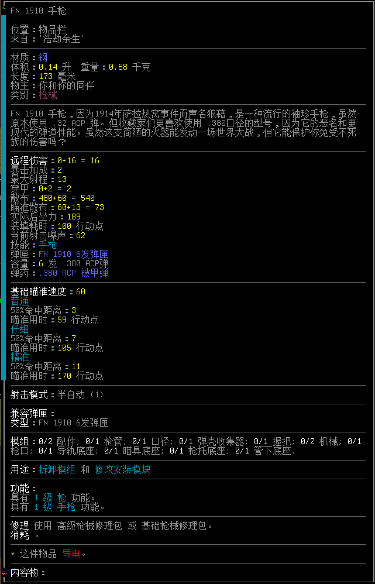

# 攻击与防御

- [攻击与防御](#攻击与防御)
  - [近战机制及基本概念](#近战机制及基本概念)
  - [武器机制及基本概念](#武器机制及基本概念)
  - [枪械机制及基本概念](#枪械机制及基本概念)
  - [武器类型的区别](#武器类型的区别)
  - [防御机制及基本概念](#防御机制及基本概念)
  - [护甲机制及基本概念](#护甲机制及基本概念)
  - [总结](#总结)

## 近战机制及基本概念

**近战攻击**：当你尝试向敌对目标所在格移动，或相邻格有敌人时按下TAB即可发动近战攻击；

**攻击耗时**：近战攻击消耗的行动点数（通常称为攻击耗时）受躯干累赘与武器数据影响，武器数据通常受武器本身的重量、体积影响；

**命中**：你所拥有的近战技能与武器技能、武器数据加成、流派带来的命中加成将联合对抗敌人的闪避技能以决定是否命中敌人。

通常来说小体积敌人更难命中，而大体积敌人更容易命中；

**伤害**：玩家命中后的伤害取决于技能等级加成与武器数据，伤害将受到敌人护甲减免，如伤害被减免至零或更低，则会出现无法穿透护甲的情况；

**敌对单位的伤害**：你的敌人需要使用自身近战技能对抗你的闪避技能以决定是否命中；如果命中，则随机决定命中哪个部位并投掷该单位的伤害骰以确定其所造成的伤害；

敌人命中后所造成的伤害取决于其内部数据给予的伤害骰，通常以XdX+X为主，代表投掷X枚X面的骰子，+X则代表在投骰结果后加上多少伤害，然后再根据敌人类型决定其所造成的伤害类型；

如2d6+5就是投掷两枚六面骰子，伤害在2\~12之间随机取数，并在最终结果上+5，即为最低可造成7点伤害，最高可造成17点伤害，这些伤害将会受到格挡与护甲的减伤，具体见下文；

## 武器机制及基本概念

**耐久**：耐久会影响武器面板数据，卷刃长剑肯定不如崭新出厂的长剑。

**体积、重量**：一般来说越大越重的武器挥舞越慢、消耗耐力越多，也越难以取出、携带；

**近战伤害**：钝击、斩击、刺击皆是伤害类型，一齐生效；

**命中**：如命中为加值，则提高武器命中率及暴击率，反之则降低；

**基础攻击耗时**：该武器每次攻击所需消耗的行动点，此数据不计算任何加成减益；

**典型DPS**：在各个环境下武器预期的DPS，已经自动计算行动耗时、累赘、命中、技能等加成，有参考价值；

**对护甲**：对抗0闪避，15钝抗，20斩抗敌人的预期DPS；仅用于参考

**对敏捷**：对抗高闪避，零护甲敌人的预期DPS；仅用于参考；

**最佳**：对抗零闪避，零护甲敌人的预期DPS；打靶数据；

**耐力消耗**：该武器每次攻击所消耗的耐力，武器越大越重，消耗越大；

**每耐力伤害**：耐力伤害比率，已经自动计算影响，通常而言武器越大越重则消耗耐力越多，其耐力伤害比率也会愈发丢人，但这并不是说武器不好，只是说武器消耗的耐力较高，你需要更好的控制耐力以发挥其性能；

**手持战技**：持有时可触发的战技，条件效果写得很明白了；

**用途**：除了拿来砍人之外还能干些什么；

**功能**：除了砍人之外还有哪些功能；

**修理**：修理所用工具及消耗的资源；

## 枪械机制及基本概念

**耐久**：枪械同样会在一定程度上影响枪械数据，但更为明显的问题是低耐久枪械会因缺乏维护保养而卡壳。

**体积、重量**：武器越大、越重则越难以取出、携带；

**远程伤害**：子弹正中目标时能造成的伤害数值，受防弹护甲减免，算法为加减法；

**暴击加成**：一定程度上可以视为增加精准度；

**最大射程**：枪械本身拥有的最大射程；

**穿甲**：描述子弹对敌人防御能力的削弱能力；

总伤害 = 基础伤害﹣（敌人防弹﹣穿甲）

有效防御=（防御-穿甲）\*防御系数，至少为0；

伤害量=子弹基础伤害-有效防御；

护甲穿透本身不暴击，只有确认穿透后才能触发暴击；

**散布与瞄准散布**：简单地视作降低精准度的数据即可；

**实际后坐力**：每次射击时丢失的稳定度，在手动瞄准时比较有用；

比如当你使用「.」手动瞄准时，每次射击都会根据后坐力损耗稳定度，让你需要花费行动点继续瞄准来保证精确度；如果你每次射击都使用预设模式，它对你的作用可能并不会太明显（因为你每次都是精准瞄准或仔细瞄准）；

**装填耗时**：装填一个常规弹匣所用的时间；

**射击噪音**：决定不带耳塞的时候一枪聋多久，以及一枪会吸引多少距离的丧尸；

**瞄准速度**：对于枪械来说非常重要的属性，下面已经给你算好了当前瞄准速度下每次射击消耗的行动点；

**瞄具**：装上就生效，如果有多瞄具，则会自动结合实际情况使用；

**两脚架**：装上后，在半格高的家具、建筑旁边朝家具、建筑方向射击即可自动使用。

## 武器类型的区别

### 近战武器

近战搏杀系CDDA中最具性价比及最常见的战斗手段，基本所有可以拿在手里挥舞的物品都可用于近战，当然还是推荐你用武器战斗，这游戏没有家具城战士特性。

一般来说，**你手中的东西越大、越重，挥动所需要消耗的体力、花费的时间也就越多**，具体还请以手中武器的数据为准。

武器共有钝击、斩击、刺击三种伤害类型，若一个武器有多种伤害类型，则所造成的伤害是所有伤害单独计算抗性后的总和，**三种伤害类型及对应武器各有优劣，面对不同的对手也有不同的表现，并无严格意义上的强弱之分。**

**近战技能主要影响所有近战攻击的命中率、伤害；**

**使用武术流派将会大幅增加近战武器的强度，不过武术流派的书籍也不是太好找就是了；**

#### 刺击武器 — 高成长潜力

**刺击武器暴击时穿透33%护甲，暴击伤害随等级提升，每级提高0.1倍率，**

**不具备刺击武器等级时，暴击造成1倍伤害，5级时，暴击造成1.5倍伤害；**

**以刺击为主要伤害的武器分为 - 长矛、匕首、刺剑**

**长矛具备远距攻击特性、匕首攻击耗时短、刺剑性能均衡；**

刺击如今拥有了颇为显著的成长性与暴击伤害，缺点便是更加依赖技能等级带来的加成……刺击原则上有着优秀的暴击穿甲效果，但不暴击的情况下和斩击武器一样缺乏有效的对甲手段。

刺击类型武器都有点或多或少的小问题，如长矛性能一般、匕首伤害偏低等问题，刺剑属于性能均衡的类型；

你要说复合武器琉森锤那大伙都不困了。

#### 钝击武器 — 优秀的泛用性

**钝器武器暴击预期会造成1.5倍伤害并穿透估约50%左右的护甲；**

**以钝击为主要伤害的武器分为 - 锤、棍、拳；**

**锤类伤害高消耗大、棍类普遍具备快速打击、拳头吃徒手攻击；**

尽管有了些许限制，钝击武器依然是最为泛用且极为强悍的武器，绝大多数敌人缺乏有效钝抗，外加钝器本身就有高额破甲能力，即便是面对凯夫拉体系的高抗性敌人也能打出颇为显著的伤害。

钝系武器普遍问题是耗费耐力较多，很需要使用者控制耐力，避免长时间持续作战。

#### 斩击武器 — 把自己均衡进去了

**「斩击武器」暴击造成约1.25倍伤害，暴击穿透少量护甲；**

**斩击武器分刀、剑、斧；**

**刀类武器有较快的攻击速度、剑类性能平均、斧则是钝斩双高的重武器；**

斩类赢在了平均全面，输给了平均全面，前期靠谱的斩击武器难以制造，中期斩击武器难以破甲，本身均衡的属性虽然十分靠谱……但，难以破甲。

刀类因为快速攻击特性在后期效率较低，稍微有些支棱不太起来，剑类则以优秀的数据站在了较高的位置上……然而斩击类武器里面有斧类这种复合武器，他靠着高贵的混合伤害站在了最高的位置上。

#### 徒手格斗 — 强度主要看流派

**徒手格斗有高命中、低伤害的特性，非常依赖暴击，其暴击机制和钝击一致，预期造成约1.5倍伤害，穿透50%护甲。**

**徒手的主要发挥取决于流派，不选流派的徒手并不完整，因为徒手的不同流派带来的效果和适用场合实在是有点多样化，具体可以参照[武术流派详解](武术流派详解.md)。**

### 远程武器

**远程射击是CDDA中后期面对各种高强度单位时的主要输出手段**，枪械、弓弩、投石索皆是优秀的远程攻击武器，随手抄个石头砸别人勉强也算是远程。

**远程武器所能造成的伤害主要取决于弹药**，大口径弹药的伤害总归要比小口径高，穿甲弹对高护甲单位效果显著，空尖弹则能更有效地对抗无甲目标。

**远程武器大多可以附加模组提供加成或赋予一些特性**，安装模组的武器会在名称后方缀以「 +（模组数量）」的标签。

**枪械、弓弩、投石索等可射击的远程武器命中率取决于瞄准花费的时间**，而花费更长时间瞄准也可以提高暴击概率……总而言之，远程武器发挥稳，收益高，系中后期相当可靠的输出手段。

**枪法技能**影响所有远程武器的命中率（弓箭不确定吃不吃加成）；

**手枪、冲锋枪、步枪、霰弹枪、重武器技能**仅提高对应武器的命中率；

**弓术技能**提高命中率并减少行动点耗费；

**投掷**提高命中率及投掷范围；

#### 弓弩 - 沉默杀手

弓弩是一种十分安静的武器，全系列都具有无声射击的特点，大晚上摸黑射丧尸算是最为常用的用法。

弓弩的劣势在于虽然有较远的射程，但精确度往往只支持中近距离射击，此外弓系对于力量属性有严格要求，弩系则有非常冗长的换弹时间……你要多带几把弩我也不拦着。

弓弩系还会随着弓术技能提升而减少射箭消耗的行动点数，加上弓术颇为显著的精确度加成和多样的箭矢，即便伤害几经削弱也能有优秀发挥，不过弓弩的基础伤害极低，虽说暴击有十倍加成，但面对重甲单位仍然十分无力。

**此类武器的优势在于**：

-   安静，非常的安静；
-   自制弹药成本不高；
-   有特种弹药可以提供一定的战术选择；
-   十分适合狩猎，不管是代入角度还是什么角度；

**此类武器的劣势在于**：

-   找一把好弓很难；
-   箭矢不便携带；
-   练起来费时费力；
-   拉弓极其耗费耐力；
-   对重甲单位效果极差；

#### 手枪 - 高效的应急武器

手枪算是游戏中不太受人待见的枪类，其较低的精准度与较低的伤害都注定了它难以作为主力武器使用。

不过其所特有的低重量、小体积的便携性、搭配枪套可快速提高拔枪射击的速度、颇高的换弹速度与射击速度使它可以成为十分优秀的副武器与应急武器。

**此外，手枪中有大口径手枪及左轮手枪的特例，其牺牲了一定便携性换来了相当可观的伤害，即便是游戏中后期也有一定的发挥空间。**

**此类武器的优势在于**：

-   低重量、小体积、低行动力花费；
-   优秀的换弹速度与射击速度；
-   可用于近战体系中对抗特定敌人，也可在远程体系中应急使用；

**此类武器的劣势在于**：

-   绝大部分手枪的口径不足，没有连发功能，杀伤力较低；
-   精准度较差，只能用于近距离作战；
-   进入中后期时难以对抗逐渐增多的高防怪物；

#### 冲锋枪 - 优秀的副武器选择

冲锋枪系发射手枪弹的自动卡宾枪，有手枪般迅速地换弹与射击效率，也继承了手枪弹较低的伤害，虽然可以连发，但精准度并不可靠。

重量、体积和精确度算是冲锋枪的小问题，它们并不如手枪便携，精确度不高，然而其连发特性搭配大弹匣带来的爆发伤害可以弥补这些缺陷。一般定位和手枪类似，作为优秀的副武器使用。

冲锋枪中也有少数比较离谱的情况，如苏联产的PPSH-41可发射高威力的7.62x25mm手枪弹且有71发颇为写实的大弹匣，RM216卡宾枪可发射更高威力的5x50mm镖形弹，这玩意有100发的大弹匣。

**此类武器的优势在于**：

-   低行动力花费，优秀的换弹速度与射击速度；
-   连发与大弹匣搭配带来的持续爆发伤害；
-   可用于近战体系中对抗特定敌人，也可在远程体系中应急使用；

**此类武器的劣势在于**：

-   武器口径不足，单发杀伤力较弱；
-   精准度较差，基本只能用于近距离作战。
-   弹药耗费多，需要额外携带弹匣以应对弹药不足的情况；
-   绝大部分冲锋枪在中后期难以对抗逐渐增多的高防怪物；

#### 步枪 - 泛用性极强的主武器

步枪基本是大部分CDDA玩家的首选武器，射程优秀、精准度高、绝大多数可全自动射击或连发射击，重机枪及精确射手步枪也皆在步枪行列之中。

重量、体积、长度都是步枪最显而易见的问题，它真的不是那么便于携带，遇到突发情况时也需要花费较多时间握持、瞄准，一旦打空弹匣也需要较长时间换弹，但总体而言，他们是最优秀的主武器选择。

**此类武器的优势在于**：

-   极高地伤害潜力，特化伤害的大口径机枪足以在短时间内击杀最危险的敌人，两枪凿碎大部分建筑物；
-   优秀的射程与精准度，特化射程的狙击步枪与精确射手步枪可以在绝大多数敌人的感知范围之外进行击杀；
-   种类繁多且普遍强势，泛用性最高的突击射手步枪也有非常优异的数据面板；

**此类武器的劣势在于**：

-   换弹速度、拔出武器速度慢，难以应对突发情况；
-   射击耗时高，近距离发挥不佳；
-   噪音较大，容易吸引大量敌人；

#### 霰弹枪 - 近距离特化的多功能武器

霰弹枪非常容易操作，精准度也不怎么吃你的技能需求和枪法，根据弹种不同也能打出各种各样的效果，属于沾手就能用且发挥优秀的多功能武器，其主要优势在于近距离高伤害及多功能弹种。

霰弹枪的劣势也显而易见，严重受限的射程、巨大噪音及并不那么便于携带的体积，其弹药也着实有点重量。

**此类武器的优势在于**：

-   非常卓越的近距离伤害；
-   大部分霰弹枪可根据需求更换不同种类的弹药，如高爆弹、龙息弹、镖形弹等，几乎可以应对所有场合……要带多少弹药是另一回事；
-   双管霰弹枪及少数自动霰弹枪支持二连发以提供惊人的爆发伤害；

**此类武器的劣势在于**：

-   射程真的很短；
-   泵动式换弹虽然灵活，但一发一发的装填也确实比较慢；
-   噪音大到开一枪就能让半个街区的丧尸知道你在哪儿；

#### 重武器 - 决 战 兵 器

无后坐力炮、导弹发射器、火焰放射器，多用途高威力武器与成吨的破坏力便是游戏内最为凶恶的重武器。正如他们的名字所言，这些武器又重又难以携带，破坏力惊人，通常只在特定环境下针对尸潮、高强度单位使用。

实际上，车载也是个不错的选择。

**火焰放射器**：根据所用燃料不同有不同伤害，于面前锥形范围内创造大片火海的凶恶武器。其效能可以迅速烧毁一栋建筑、干爆一座森林、焚毁真菌花林。而且惊人地便于携带。

**优势于**：短时间创造大规模环境伤害；

**劣势于**：火焰会燃烧很久，请自备灭火器；于森林里、城市中使用会引发无法控制的大火；和战利品绝缘；需要事后想办法处理尸体，不然会复活成焦尸；

**单兵火箭筒**：根据所用弹种不同有不同的伤害，一发直击能干碎绝大多数生物，对四周附带较高的破片伤害。

**优势于**：你看看人家导弹的单发伤害；范围打击；

**劣势于**：这玩意真的很难搞到手；爽一发就很难有后续了；

**榴弹发射器**：根据所用弹种不同有不同效果，算是相对轻量友善的重武器……上了高爆弹就是正儿八经的重武器了。

**优势于**：发射伤害颇高的榴弹或榴霰弹；可以装高爆弹夺回重武器之名；

**劣势于**：弹药难搞，重武器弹药都难搞。

#### 投掷 - 丢手雷也是投掷

投掷是你将手中的东西投掷到远方的技能，也有专门的投掷武器，投掷的伤害与距离取决于力量，而准度受敏捷和感知的影响，有专门的CBM可加强你的投掷能力，亦有专门的投掷武器。

不过，游戏内的投掷类武器要么伤害不足、要么无法大量携带，考虑到投掷还是主要靠丢出去砸人战后回收这一点，投掷流派实在很难找到有效发挥的场合，不过投石索还是可以使用的，也有一些人摸索出了铁块投掷法，起码还是有一定潜力的。

投掷的具体强度取决于你丢的是什么，你其实可以把炸药丢出去然后说这也是投掷流派的一种，这方面就不赘述太多了。

另外请注意，有引信时间的爆炸物……最好丢在敌人面前数格距离，只要能把敌人卷入爆炸中心，一切都会好起来的。

——————

投掷武器的伤害及机制较为奇怪且难以权衡；

通常来说在游戏初期投掷钢块、使用投石杖，游戏后期老老实实的拿枪丢雷较为合适；

**全属性8、全技能3级、无特性、全正中、五次投掷的伤害、对普通丧尸（80HP、全抗0），实战对抗高护甲发挥可能更差；**

1.  **掷棍**：8、8、9、8、9；

    「制作简单」、「可叠加手持」

2.  **钢块**：11、10、12、12、12；

    「易于获取」、「可叠加手持」

3.  **飞刀**：21、20、16、20、20；

    「出血」、「制作需较多专长」、「嵌入目标」

4.  **投石杖**：19、17、17、20、22；

    「轻度出血」、「弹药便于存储」

5.  **木标枪**：18、18、21、23、23；

    「大出血」、「弹药140cm长度」

6.  **铁尖标枪**：27、30、28、23、29；

    「大出血」、「弹药140cm长度」、「制作需较多专长」

7.  **投斧**：33、24、24、26、24；

    「大出血」、「制作需较多专长」

### 搭设陷阱：

**搭设陷阱并不是什么高效率的战术**，但是合理的陷阱布设、哪怕只是单纯的洒下一些铁蒺藜也能为你带来一些好处，如若开启了尸潮游荡，搭设陷阱防守家园也是很有必要的操作。

#### 就地生火

利用打火机将脚边的尸体、杂物等引燃，将怪物诱导至火堆之上将其引燃，可以与近战技巧组合的基础战术。

#### 燃烧的建筑物

点燃一座建筑物并逃离到安全的地方，等待一段时间让火势扩散，大火烧毁建筑物导致建筑坍塌引起巨大噪音，丧尸循声而来，浴火而死。

虽然有一些尸体可能幸免于难进而复活成柴薪体系的丧尸，至少一切都是值得的。

#### 陷坑陷阱

深坑会造成较低的跌落伤害，你若往里面扎点木头使其变成尖刺陷阱，伤害会大幅提高，落入坑内的怪物需要耗费大量时间起身并爬回地面，在此过程中你有充足的输出时间。

不过挖个坑要很长时间也很累，建筑工地、垃圾场有现成的，慢慢来。

#### 地刺陷阱

钉板陷阱、碎玻璃、铁蒺藜等都可以布置于地面之上，当怪物踩到时便会因此受伤并受到一定的行动点数惩罚，利用地形反复拉扯让怪物不停地踩踏在你布置好的地刺陷阱之上便可造成大量伤害，也会为你带来不少优势。

#### 噪音发生器搭配刀片陷阱

利用噪声发生器将丧尸集中于刀片陷阱区域，借助刀片陷阱的伤害将聚集起来的丧尸尽数歼灭的强效陷阱……就是刀片陷阱比较难做。

噪声陷阱单独使用也可以随便丢在什么地方帮你分散丧尸的注意力，就是你别被丧尸看到就成了。

#### 捕熊陷阱及其他杂七杂八的陷阱

**捕熊陷阱**：此陷阱需要耗费时间布置，当敌人踩踏之后便会对其造成不算太高的伤害和8\~15回合的控制效果，在此期间你可以拿敌人练习射击和投掷……这个控制不是眩晕，近战还是会被反击。

**弩与霰弹枪**：此陷阱需要耗费时间布置，弩陷阱伤害较低且有25%概率失手，一旦触发便会失效。用双管霰弹枪制作的霰弹枪陷阱拥有颇为离谱的伤害，但触发完你还得回收再启用……性价比不是很高。

**绊线陷阱：别期待一根线能帮你干什么。**

#### 窗台

通常来说就是会让你掉到楼下的地方，对怪物来说十分致命，对你也一样，小心谨慎，千万别掉下楼。

而你最大效率利用它的方法（如果你真的想利用这种手段）就是用击退技能把怪物推下楼，记得按C喊一声「这就是CDDA！」，如果你被楼上的丧尸浩克一拳锤下楼了……别跟别人说你看过我的攻略就行。

#### 用粘液罐子生成的粘液坑

这玩意绝对是因果律陷阱……把绝大部分踩进去的怪物变成「变形怪」，生效一次就消失，其效果足以对付游戏中所有高威胁零价值的目标。

## 防御机制及基本概念

防御顺序：闪避、格挡、护甲，通常情况下每轮仅能闪避1次、格挡1次，一些武术流派可以提高格挡次数及闪避次数；

**闪避**：闪避将与敌人的近战技能进行对抗，闪避成功则视为敌人未命中，反之则被命中；通常情况下每轮只有一次闪避机会，有两个敌人同时攻击你时，你只能闪避其中一个敌人的攻击，无论闪避是否成功，另一个敌人一定会击中你； 闪避受躯干累赘影响极大，所以开打前把背包丢在安全可见的位置；

**格挡**：格挡会降低你所受到的伤害，当闪避失败时，根据你是否拥有格挡来源（武器带有格挡词条、大部分武术流派都允许你使用腿脚格挡）来决定是否进行格挡，如果拥有复数格挡来源，则取格挡等级最高的格挡来源；通常情况下每轮只有一次格挡机会；格挡降低的伤害取决于格挡值及格挡效率。

**护甲**：护甲会降低你所受到的伤害，其算法为减法，伤害类型减去同类型护甲，如果有百分比穿甲则额外计算百分比穿甲；

## 护甲机制及基本概念

**体积、重量、长度等不再赘述；**

**总覆盖**：即为覆盖率，可以视为该部位抵挡伤害的概率，图中20%手臂、腿部、100%躯干，即为被击中躯干时有100%概率抵挡伤害，被击中腿部或手部则有20%概率抵挡伤害； 若同一部位有不同装备覆盖，各装备分开计算覆盖率并根据各自的护甲逐一减伤；

**此装备为硬甲&舒适**：制成护甲的主要材料为钢性材料，则此装备被视为硬甲；如果制成护甲的主要材料为软性材料，则此装备被视为「舒适」；二者皆有且比例接近则共有「硬甲」及「舒适」的词条；

同一部位只能装备1件硬甲，如果该硬甲没有「舒适」词缀，则必须在覆盖范围下穿上其他衣物，否则将导致「皮肤不适」，造成减速及疼痛；

**累赘**：该装备对于行动的影响，不同部位的累赘会造成不同的负面效果，累赘越大则惩罚越高，你可以在「@」界面中查看详细数据，不过一般要造成严重影响还挺难的，注意控制累赘，还有打架前先丢包，不要随便穿那些看起来面板很高但累赘很离谱的装备……如果面板真的很高也不是不行；

**保暖**：为覆盖部位提供的保暖程度，春夏季穿高保暖衣物会导致保暖度过高进而导致温热甚至于炎热等问题，一般春夏低保暖，秋冬高保暖就好；

**透气**：涉及到一个颇为复杂的出汗机制；简而言之，在温暖、高温环境下，部位透气值越低，则该部位通过汗水耗散热量的能力就越差，也就是越热、越湿，这通常会导致一些心情减益和速度下降问题；

部位透气值越高，则该部位通过汗水耗散热量的能力就越高，出现因被汗水淋湿或温度过高而获得减益的概率就越低（但还是会潮湿）；不过气温太高或者衣物保暖能力太强的话没啥太大效果；不穿衣服默认为100透气；

**防护**：防护减伤机制为减法，分为钝击防护、斩击防护、射击防护三种，刺击防护始终为斩击防护的80%；防护会随装备耐久度耗损而下降，每级耐久度耗损下降12.5%；在结算完装备本身覆盖率后还有一个材质的覆盖率，即为图中红字（最差情况下的防护）黄字（通常情况下的防护）绿字（最佳情况下的防护），每种防护生效的概率为防护上方对应颜色的百分比；

## 总结

假设你碰到了一只造成斩击伤害的敌人，其骰出了高达25点斩击伤害；

它首先需要用自身的近战技能与你的闪避技能对抗以决定是否命中，若失败则视为未命中，不造成任何伤害；若成功，则随机命中一个部位；

然后我们将进入格挡减伤阶段；格挡减伤程度取决于格挡等级所提供的格挡值及格挡效率，因其算法过于复杂，我们直接视为无格挡来源；

最终，我们将进入护甲减伤阶段；以上图护甲为例，如果敌人命中躯干，躯干拥有100%的覆盖率，则25点伤害大概率（95%）减去14点斩击护甲，躯干受到11点伤害；如果敌人命中了20%覆盖率的手臂或腿部，则只有20%的概率能够成功抵挡伤害，若失败则承受25点全额伤害；如果命中其他无覆盖部位，则硬吃25点全额伤害；

不过正常而言不可能只穿一个钢胸甲到处跑，实战中仍需考虑其他装备或多或少的减伤，按下「{」看一下给你算好的一些数值，然后自己算下铠甲防护就差不多了；