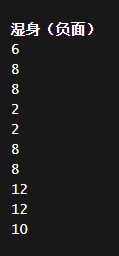

# 特性解释及评价

**特性是您在创建角色时可选择的一些自定义选项，它们与变异的作用相同并同处于角色信息的特性栏中。特性只有角色创建时可以选择，虽然其中一部分可以通过变异获取，但不视为初始特性，自还有一部分特性属于背景及职业专属，仅有选择特定的背景或职业才能获取。**

特性分为 正面特性 和 负面特性 ，正面特性消耗点数换取增益，负面特性则以减益换取点数，正负特性并不绝对，被分类为正面特性的「杀意驱动」在一段时间不进行杀戮就会下降心情，被分类为负面特性的「重度睡眠」也有让你不易被环境噪声惊醒的小小优势。

多数特性带来的影响并不显著，合理的选择特性会为你带来相当可观的可用点数，这些点数都将为你的生存带来更大优势，以角色扮演为重点来选择特性也会让你的游戏更具乐趣。。

## 初始特性：

**角色创立时所拥有的特性将被视为初始特性。初始特性可以通过变异来进化成更高级的特性，但无法被其他变异覆盖，也无法被净化，如该变异已经进化为其它特性，则净化此类特性只会将其变为初始特性。**

可以被其他手段去除的特性为「近视」、「远视」，此类特性可以通过更换某个眼球CBM去除，基本来说就是换了个不受近视、远视影响的机械眼球，虽然代价也十分显著。

### 模组特性（有人问就往里加）：

#### 「斗气击」 属于神话武术MOD

**如果玩家徒手或持有「视为徒手」的武器，则徒手格斗等级视为X2，并为每次「猛击」额外附加等同于基础徒手格斗等级x2的额外伤害。**

「猛击」基础伤害同徒手攻击，伤害加成则取决于上文公式，猛击本身可暴击，三者结合即为猛击的最终伤害，如果使用武术流派，则加成伤害会附加到武术攻击之中。

「猛击」的出现概率会随徒手等级上升，最终将取代徒手攻击（但仍有一定可能性出现伤害极低的徒手攻击）

**斗气击会随等级显著增强徒手格斗的命中率、暴击率及伤害**，其甚至还能与武术互相搭配，徒手等级上去之后一拳打出上百伤害似乎不是什么很困难的事情……不过那也要很高等级了。

另外，无武术流派时会持续出现伤害稳定的猛击，有武术流派时伤害则会随流派特性出现明显波动，只有伤害有明显提升这点是确定的，具体还是看大伙想怎么用吧。

### 独特的背景与职业特性列表：

#### 「兴奋剂精神病」不固定

**冲突于「抗瘾体质」**

**曾经是个可选正面特性，此特性可从大部分「药品成瘾」类背景获取。**

**效果：将兴奋剂过量上限从30上调至60点，使角色从兴奋剂中获取更多增益，使用兴奋剂时有可能出现幻觉症状。**

鉴于成瘾背景本身作为一项挑战及此特性并不显著的加成及末日精神病的负面在实验版喜提加强。这是一个非常不建议选择的背景特性。你如果只是想挑战成瘾开局或者想毛1\~3的可用点数，他作为一个正面特性，起码还是能给你点安慰的。

你说你想扮演动力小子？！那……那似乎，不是，这似乎还挺合理的？

#### 「讨厌读书」+1点

**冲突于「文盲」、「书虫」，曾经是个可选负面特性，此特性可在「讨厌读书」背景获取，获得1点可用点数。**

**效果：看书要么不加心情、倒扣心情。**

本来读书就要抽烟喝酒听音乐供着了，怎么还想倒扣心情的……扫一眼书并利用其中的合成配方不受此特性影响。

考虑到这个背景只给一个可用点数，如果不是处于扮演需求，我们还是来选点别的吧。

#### 「书虫」-1点

**冲突于「文盲」、「讨厌读书」，曾经是个可选正面特性，此特性可在「阅读」背景获取。**

**效果：所有书籍增加5点心情增益。**

效果有，但是十分有限，如果你打了魔法mod可能很适合读魔法书，但我们这里只无模组的实验版……起码往好处想，你读一些高级书本时可以少吃点心情增益。

其实算是我本人最想拥有的特性，我为何没有读书的耐心和才能……

#### 「声如洪钟」-1点

**兽人变异路线特性，此特性可在「公开演讲」背景获取。**

**效果：按C大吼时声音更大，更容易吓跑野生动物，更容易恐吓NPC，此外背景本身给予可观的社交技能。**

我姑且放一个 **(首)** 在这里，然后这个背景价值主要在社交技能上，社交又不算是一个特别优秀的技能，看个人选择了。

#### 「说谎达人」-1点

**冲突于「说不出谎」，曾经是个可选正面特性，此特性可在「恶作剧」背景获取，该背景额外提供操控装置和社交技能加成。**

**效果：提高40%对NPC说谎时的成功率，说谎通常用于劝说NPC加入队伍，接受任务后再骗NPC说任务已经完成来白嫖奖励、好感。**

社交类特性的作用主要取决于你想不想社交，大部分阵营任务都无法通过说谎来白嫖奖励、跳阶段，总体来说用处不多。

除此之外，40%的加成看着离谱……但社交本身具有对抗性，NPC的社交、智力、特性都会影响你对其说谎及执行其他行动的成功率。

#### 「户外客」-1点

**曾经是个可选正面特性，此特性可在「钓鱼」、「露营」等诸多户外活动体系的背景获取。**

**效果：无条件增加十分显著的潮湿防护，意义和价值取决于你个人感受。**

#### 「跑酷专家」-2点 他为啥是专长啊！

**曾经是个可选正面特性，现在是个……专长？！那你可以后天取得了！**

**效果：可令你在复杂地形穿梭时的行动耗时减半。**

你从100行动耗时的地板出发，穿过如下地形，抵达另一个100行动耗时的地板时；

地形行动耗时为400：无加成约260每格，有加成约130每格；

地形行动耗时为300：无加成约208每格，有加成约100每格；

地形行动耗时为200：无加成约156每格，有加成约100每格；

你从在同样耗时的地板上移动时，行动耗时与描述一致；

地形行动耗时为400：有加成约200每格；

地形行动耗时为300：有加成约150每格；

地形行动耗时为200：有加成约100每格；

除此之外，跑酷专家还能让你更快的翻越篱笆围墙、安全的从二楼跳下一楼（别带太重的东西、也别被人打飞到楼下），允许你跳更远的距离。

通常你没太大必要点这个背景，因为现在你可以通过「跑酷栏杆」花费长时间的练习获取，而时间是你在CDDA中最不缺乏的东西，2点可用点数总有更重要的地方可用。

（**实验版特性）**

*我不会再迷惘了！因为我是跑酷专家！*

#### 「直升机驾驶」-2点 是专长！

**效果：可以驾驶直升机，首先你得有个直升机。**

直升机还是很强的，虽然并不完善，但它是游戏内跑得最快的交通工具。

但首先，你得有个能开的直升机，然后你还不能给他开坏了。

要不别点了吧。

#### 「滑冰高手」-2点 ，同时也是职业特性

**效果：降低穿着轮滑鞋时遭受近战攻击而摔倒的概率，约67%。**

轮滑鞋是不错啦，跑路、放风筝也很优秀，但其带来显著的近战惩罚并不是「滑冰高手」一个技能能支棱起来的，你仍有概率被击倒，一旦被击倒就很可能陷入起身再被击倒的反复循环。

他最大的作用是增加轮滑鞋远程体系的容错率……但你骑个自行车、独轮车其实效果也差不多，甚至还更安全。

#### 「地下城主」-2点 ，同时也是职业特性

**冲突于「文盲」；**

**效果：增加10%的阅读速度，免受书籍阅读难度导致的时间惩罚；。**

如果你连三宝书都读得下来，还有什么读不下来的，话虽如此也不是什么很优秀的特性。在角色扮演方面倒是很有趣，把世界末日当做跑团的地下城主什么的。

如果真能拉NPC跑团，我就把他尊为神技。

#### 「全自动医疗仪专家」-4点 职业特性

**效果：安装、卸载CBM检定时，医疗、电子学等级视作+1，降低CBM安装失败时所造成的负面影响，CBM安装失败时不会出现故障CBM**

人体强化协会会员职业的专属特性，该职业本身具有提高CBM成功率的4点医疗和4点电子学等级，自带少量医疗用品和一个手术台用的麻醉工具箱，也已经预制好了医疗专长。

话虽如此……尽管这样……在拿到CBM之前基本没有发挥场合，即便没有此特性也不会太影响CBM安装，4点还是太奢侈了。

#### 「生化警察」、「警探」、「警官」、「特警」 职业特性

**效果：佩戴职业徽章时，眼形机器人、警用机器人不再对你产生敌意。**

我一直觉得生化警察是在neta机械战警……所有警察都有此类特性，不同的警察有不同的徽章，理论上只有正确佩戴职业所属的徽章才能享受特性。

特性意义倒不是很大，但警察类职业都很适合远程流派开局。

在某个任务线尽头，你会被赋予「联邦执法官」职务、徽章与特性，效果同上，记得带徽章。

#### 「实习医生」 职业特性

**效果：安装/卸载CBM时，计算时医疗等级+1。安装CBM失败时降低所造成的影响，避免安装失败时出现故障CBM。**

不知道为啥所有的医生都是实习医生，医生职业基本都有此类特性。

特性意义同样不是很大，对CBM安装的增益不如「全自动医疗仪专家」，但二者都有安装失败时避免故障的特性，但医生职业多而且普遍靠谱。

#### 「空手道黑带」 -8点数 职业特性

**空手道黑带职业专属；**

**效果：开局可选择一种武术流派。**

考虑到这个职业本身附赠5级的近战、徒手格斗、闪避，不管选哪个武术都能发挥出全部效果……不过本身可选的武术都是开局特性能直接选用的。

算是开局即完成徒手流派毕业的职业吧。

#### 「武术家」、「格斗家」、「击剑运动员」 职业特性

**武术家同空手道黑带，开局可选一种武术流派。**

**格斗家开局可获得「拳击」流派。**

**击剑运动员开局可获得「击剑」流派。**

#### 「真正的美食家」 - 0 职业特性

**效果：不带着美食家面具就不能说话。**

真正的美食家开局赠送，实验版翻译为美食人，当吉祥物当入魔的整蛊特性，该开局送一个美食家面具，可用于解锁美食家门，一般来说没太大意义。

主动使用美食家面具的效果是变成移动广告宣传机器，而且不到工作时间结束就摘不下来，在此过程中制造出的噪音显而易见的会吸引大量怪物。

我很难想象会有这么个强制劳动的产物会让人因此入魔并为此疯狂……话说当美食人一个月多少钱啊。

#### 「中世纪农夫」 职业特性

**效果：该特性不具备任何作用。**

中世纪农夫专属特性，在场景挑战中的中世纪农夫会额外附赠「文盲」、「快餐不耐症」、「肠胃发达」、「神学家」等特性，但和特性本身无关。

### 开局可选正面特性列表：

#### 「爱吃甜食」-1点数

**冲突于「快餐不耐症」**

**效果：这个技能可以让甜食获得持续一小时，一次5点的心情增益，最大可叠加30点。**

游戏内大部分甜食、糖果也都是小体积的零食，随身携带时不时吃几颗也能维持高心情、进而提高专注、再变相提高技能等级提升速度……是不是听着就感觉有点麻烦。

**功利向建议：这1点，总有更优秀的选择。**

#### 「背肌发达」-2点数

**冲突于「背部旧伤」**

**效果：提高你最大载重量35%，无法后天获取。**

通常来说比较推荐点，其主要价值在于前期带更多东西回家，后期承担一套装备重量的同时还能携带更多资源。

当然，你总是有手推车和汽车这个选择。

**功利向建议：点了全阶段都有不错的隐性收益，不点也有手推车用。**

#### 「肠胃发达」-1点数

**冲突于「痨肠寡肚」**

**效果：减少食物中毒、酒精摄入过多导致的呕吐概率，即便呕吐也不会有后续恶心buff；**

如果你不会食物中毒或酒精摄入过量，你就没有点这个技能的必要，就算你会犯错导致上述问题，这些问题也不会持续太久。

**功利向建议：不点。**

#### 「出色记忆」-3点数

**冲突于「健忘」**

**效果：将记忆的地图量翻倍，增多记忆内容。降低33%的技能遗忘速率**。

**如果你开了技能遗忘，他就值3点。如果你没开，他最多就值1点。**

记住地图是一个说不上好也说不上坏的能力，如果你玩的够久，仅凭经验就能大概判断一些重要环境的地形图及内容物。即便你还没有这种见微知著的能力，大部分环境你走一遍估摸着也不会去第二遍了。

更不用说这游戏有地图标记系统，你可以把探索过的地方和认为缺乏价值或具有高价值的地方标记清楚，好记性完全不如烂笔头。

**功利向建议：开技能遗忘，他就有点的价值，否则不点。**

#### 「打包专家」-1点数

**效果：提高10%从包里取东西的效率。**

我们永远铭记，它曾经还加背包容量的那个年代，每个人都会高呼祂的名讳，恳求其赐下不可替代的容量祝福。

**功利向建议：10%提升太少，这1点总有更具价值的选择。**

#### 「动物共鸣」-1点数

**冲突于「动物公敌」、「恐惧气息」**

**效果：影响所有自然动物（即为未变异动物），包括熊、狼、狗、驼鹿这些个玩意。降低这些自然生物10点的攻击性（一般攻击性在-20\~0之间）。大幅提高自然生物的士气，使最为胆怯的兔子也不会逃离你。**

宛若童话故事主角一样的动物亲和能力，可以让大部分野生生物对你友善，十分适合用于狩猎，但也没太大必要用这个狩猎，它的主要价值是开局不至于被野生驼鹿一头撞死。此外，你可以借此接近各种野生生物并更加方便的驯服他们，你要不走这条路线就算了。

中后期变异生物明显增多时，技能收益就会大幅下降。

**功利向建议：意义不是很明显，如果不考虑畜牧时可以轻松一点或者已经退版本的动物园流派，这1点总有更具价值的选择。**

#### 「活化肾上腺素」-1点数

**效果：头部生命值低于25，或躯干生命值低于15；**

-   **持续二十分钟，-3智力，增加10速度，增加体力恢复速度，疼痛免疫；**
-   **效果结束后，-2力量、-2敏捷、-1感知、-1智力、-10速度；**

**功利向建议：已经没有超人模式了，所以更加不推荐点了。**

#### 「坚硬脚掌」-1点数

**效果：不穿鞋不受运动惩罚……多数影响足类的变异自带这个特性。**

**功利向建议：不点。**

#### 「节食者」-2点数

**冲突于「快速新陈代谢」**

**效果：降低33%左右的食物需求。**

不是低物资倍率基本不缺那口吃的……低物资倍率也不是没法找吃的，两点就为了少吃一口饭是不是太奢侈了。

**功利向建议：不点。**

#### 「精力充沛」-2点数

**冲突于「乏力」**

**稳定版：提高25%最大耐力值。**

**实验版：提高30%心肺运动效果；**

25%就很可观了，近战体系遭遇大规模敌群时会很需要它。

**功利向建议：点上肯定不吃亏，高耐永远不吃亏，高耐！永远！不吃亏！**

#### 「抗病」「抗毒」 「抗瘾」-1点数、「抗感染」-2点数

**抗病体质减少66%患上感冒、流感的概率，但低健康该出事还是出事，常驻防毒面具，保持高健康一般也不会感冒；**

**抗毒体质减少食物中毒和化学中毒（毒气或三尖树的攻击）的不良反应。**

**抗瘾体质减少一半的成瘾强度（成瘾算法的关键部分）快速脱瘾，即便成瘾，一次成瘾物也能维持更久。 抗瘾冲突于「成瘾体质」**

**抗感染体质减少咬伤、感染带来的疼痛，提高三倍咬伤、感染自然痊愈的概率。**

**功利向建议：全部都可避免……全部都可变异，全部没太大用。**

#### 「恐惧气息」-1点数

**冲突于「动物公敌」、「动物共鸣」**

**效果：提高15%恐吓NPC概率。**

**功利向建议：不点。**

#### 「快速反应」-2点数

**效果：提供3点闪避加成。**

简单直接且粗暴的加成，简单直接且粗暴的效果。

**功利向建议：打算以近战为主的话，加上去能减少受伤概率；**

#### 「快速学习」-3点数

**冲突于「学习缓慢」**

**效果：通过实践计算技能经验时，专注度为当前值+15。这个技能另一个意思就是，无论什么情况下你都有15点保底专注，即便专注消耗殆尽也可以有一定的升级效率。读书不吃这个技能的加成。**

**功利向建议：我们也不是特别缺时间……但他有15的保底诶…难以抉择。**

#### 「快速阅读」-1点数

**冲突于「文盲」、「阅读障碍」**

**效果：简而言之，25%读书速度加成。**

只论读书效率，这一点比智力要值。预期有长时间依赖读书升级的话可以点一点，就一点也不是特别心疼。

**功利向建议：读书效率快也挺好的，反正只要一点，有需求就点吧。**

#### 「快速自愈」-2点数

**冲突于「慢速、弱化、无效、无法自愈」**

**效果：清醒时的伤口恢复效率提升20%，睡眠恢复效率提升50%，断肢愈合速度提升100%（但还是刚需夹板）。**

**功利向建议：尚且不太熟练游戏时很容易受重伤，这玩意能让你从打击中更快的恢复过来，也能迅速痊愈一些微小伤口，觉得有需要点吧。如果你能有效避免受伤或知晓什么时候见好就收，通常也没有太多对此技能的需求。**

#### 「乐天派」-2点数

**冲突于「易怒」。**

**效果：心情下降幅度减少20%，心情上升幅度增加20%，常驻10点心情。**

快快乐乐的小艾特比什么都好，常驻的10心情基本保证时刻都很开心，也能更快的从心情低落中恢复，高心情意味着高专注，意味着更高效率的技能升级速率。

**功利向建议：点上后全阶段都有相对不错的隐性收益，提升心情的手段非常廉价且多样化，但常驻心情的手段不多，一切还是看个人需求。**

#### 「灵巧」-1点数

**效果：攻击未命中时不再会出现严重失误（即为「没能击中反而由于惯性跌倒」），增加偷窃成功概率，减少5点攻击时的耐力消耗，降低穿轮滑鞋时被击中导致摔倒的概率，可以与「滑冰高手」叠加。**

性价比挺高的，不过近战技能等级上去了就基本不会发生严重失误了，后续能为你提供的只有常驻的减少5点耐力消耗。

**功利向建议：低属性开局很有用的特性，正常情况下也只有前期能发挥那个不出现严重失误的特性……反正也只要1点。**

#### 「耐药体质」-1点数

**冲突于「过敏体质」。**

**效果：减少酒精和一些药品的持续时间。**

**功利向建议：不点。**

#### 「轻手轻脚」-1点数

**冲突于「笨拙」。**

**效果：减少60%的移动噪音，提高躲开陷阱的概率。**

搭配忍术可以做到走路几乎无声，但怪物还有视觉和嗅觉，如果不考虑当个夜行侠可以不点。

**功利向建议：此技能在你摸黑前进及身处各种黑暗环境时可大幅减少怪物通过听觉侦测到你的概率，总体来说提高了前期夜晚探索的安全性。**

**如果有摸黑进城的必要，点上也没什么不好。**

#### 「人间尸格」-1点数

**冲突于「素食主义者」、「食人族」。**

**效果：可以吃类人生物。**

**功利向建议：不点**

#### 「杀意驱动」-2点数

**冲突于「和平主义」、「无情」。**

**效果：恐吓NPC的成功率+10%，可以屠宰、食用人类而不感到内疚，**

**每次杀戮+5心情，上限10，4小时开始衰减，共持续6小时**

**如果最近没有通过杀戮增加心情，则获得持续24小时的心情-1.**

**功利向建议：十分便宜的心情获取手段，可以吃人，心情减益不多，如此多功能甚至只要2点……代价是每天都要杀点东西，非常建议恐虐玩家选择。**

#### 「少眠者」-1点数

**冲突于「渴睡」。**

**效果：减少15%的疲劳增长，**

**功利向建议：可以让你活动时间更长，但一般不推荐点；**

#### 「身强体壮」-2点数

**冲突于「瘦弱」、「弱不禁风」、「柴毁骨立」。**

**效果：增加每个部位20%的生命值，提高2%恐吓NPC的成功率。**

**功利向建议：每个部位独立计算，实际收益不错；高生命也能有效提高你遇到各种突发情况时的生存概率；想点可以点，不点也没太大影响。**

#### 「神学家」-1点数

**效果：增加所有宗教书籍、物品所提供的心情增益。**

**功利向建议：一般不点。**

#### 「时尚范」-2点数

**效果：穿着带有「时尚」标签的装备时，根据覆盖位置、时尚程度提供不同的心情增益。躯干+6、腿+4、头+3、不覆盖任何部位则+1，如果一个物品「非常时尚」，额外+2心情。同一位置给予的奖励不叠加，但「非常时尚」可叠加，心情加成上限为20**

**功利向建议：便宜的心情获取手段，就算穿着一身装备也可以靠戒指、手表、手镯等常驻心情加成……如果你是那种喜欢打扮自己而不追求防护的玩家，他简直太合适了。**

#### 「食人族」-2点数

*「虽然我被认为是会加这个技能的人，但我实际上只点『无情』。」*

**冲突于「素食主义者」、「人间尸格」**

**效果**：

-   **消除屠宰人类和吃人的高额心情惩罚，并让你吃人时获得10点心情。**
-   **有「神学家」、「无情」任意一项时，+15心情，**
-   **「神学家」、「无情」二者皆有，+20心情。（COS汉尼拔是吧。）**

**功利向建议：这个能力的收益取决于想不想吃人，不过就为了10点心情点这个技能也没太大必要，如果只是想吃人可以点无情。**

#### 「受虐狂」-1点数

**效果：每2.5疼痛+1点心情，上限20，也就是50疼痛，俗称抖M；**

**服用抗抑郁药将导致此特性的心情增益减少2/3……这也能治？**

**功利向建议：一般不点。**

#### 「睡神」-1点数

**冲突于「失眠症」**

**效果：只要不是躺在泥土或草地地形，你就更容易入睡。**

**功利向建议：不点。**

#### 「速行」-2点数

**冲突于「脚步迟缓」**

**效果：移动耗时-15%，在崎岖不平的地表上无效。**

**功利向建议：基本就是让你跑的更快，可以点。**

#### 「疼痛抵抗」-2点数

**冲突于「痛觉敏感」**

**效果：被击中时疼痛减半，环境及其他伤害造成的疼痛减少1/3。**

**功利向建议：点上可以有效减少疼痛的积累速率来变相提高战斗效率与持久作战能力，被枪击中时也不会一下子丧失过多的战斗力。**

**比较推荐点上以增加持续作战能力，不过合理的操作也能避免在战斗中受伤，一切还是看个人需求。**

#### 「体味微弱」-1点数

**冲突于「强烈体味」**

**效果：降低200点气味强度，默认是500。**

气味会在玩家角色四周生成并向外扩散直至最终消散，当玩家移动时，气味便会在玩家身后留下一道轨迹直至最终自然消散，无论玩家处于何等状态，具备有嗅觉的生物均可以通过气味尝试追踪玩家。

**功利向建议：你要是那种摸黑潜行玩家可以点一下，不是就算了。**

#### 「听觉发达」-1点数

**冲突于「耳背」、「失聪」**

**效果：增加25%的听力水平，并让你更容易受到噪音影响。**

听力是一种比较模糊、不精确的索敌手段，你可以通过听觉确定视野外敌人的大概位置，也可以通过一些特殊噪音来判断敌人的大概数量与类型，高听力能听得更远和更精确，但也会提高你受到特殊「噪音攻击」的影响。

此特性的劣势在于一方面你开枪不带护耳被震聋的时间会变长、受一些噪声攻击影响更明显，另一方面你睡觉的时候也更容易被环境噪声吵醒。

二者也都能通过带个护耳解决就是了。

**功利向建议：一般没有点的必要。**

#### 「无情」-2点数

**冲突于「和平主义」、「杀意驱动」**

**效果**：

-   **提高5%恐吓NPC的成功率。**
-   **可以屠宰人类，可以食用人肉。**
-   **杀死NPC不再受愧疚感影响。**
-   **挖坟不再减少心情，甚至还加心情；**
-   **无法从相册中获取心情。**

其主要值在杀死NPC时不会感到内疚，并能非常高效率的利用死掉的NPC，还可以在墓地拍摄开箱视频……在CDDA里挖坟这事儿还真的有点像开箱，能挖到运尸袋、刚挖出来就尸变的尸体啥的，有时候野外还会有些特殊坟墓，没啥奖励就是了。

**功利向建议：和食人族功能类似但稍加全面，一般是二者二选一。**

#### 「迅捷」-3点数

**效果：提高10%速度，也就是增加10%的行动点数，基本会让你干什么都会快上10%。**

**功利向建议：价值高，但也确实昂贵，看有富余点数就加上吧；**

#### 「夜视」-2点数

**效果：黑暗条件下生效，提供2点黑暗环境的视野，同月相影响叠加。**

如果要推荐新手玩家点特性的话，夜视通常是最为推荐的选择。

夜视增加的夜间作战能力可以使玩家更容易确认威胁并与少量敌人作战以熟悉游戏基本机制，也可以提升在夜间搜集各种资源的能力。

2点黑暗环境视野也有助于在进入地下室等环境时先确定门口有没有敌人。

**功利向建议：看个人需求决定吧。**

#### 「优良基因」-3点数

**冲突于「恶性基因循环」**

**在稳定版，该特性会大幅提高你获得正面变异的概率。**

具体来说，变异结果可以分为只有好、好坏兼得、只有坏，优良基因会将只有坏变为只有好，但仍有好坏兼得的可能性；

**在实验版，该特性每天会减少24点不稳定性。**

具体来说，每次变异会增加100左右的不稳定性，该不稳定性会逐渐积累并最终导致基因损伤，进而提高你负面突变的可能性（但并不是说没有基因损伤就一定不会有负面），不稳定性以维生素形式存在，每天减少12点；当你拥有优良基因时，每天减少24点；

**功利向建议：变异体系必点，不过优良基因也可以后天变异获取。**

#### 「长相俊美」-1点数

**冲突于「丑陋」**

**效果：减少1点丑陋值，换而言之，提高少量社交增益。**

虽然算是没啥大用的技能，但就凭长得好看着点也会让很多人为他留点。

**功利向建议：我个人是不太建议选的，但是它能让你变好看欸。**

#### 「侦察者」-1点数

**冲突于「路痴症」**

**效果：增加5格大地图视野；**

#### 「耐热体质」-1点数

**效果：提供10点对于炎热温度的抗性，不影响感到炎热后出现的各种症状；**

**温度抗性与保暖度不同，当角色温暖度低于或高于舒适值时，它才会发生作用，在能力范围内尽量让角色感到舒适；**

**建议：同时角色穿得多几乎是必然现象，考虑到夏天时角色即便全身赤裸仍会感到炎热，在一定条件下其似乎是个很有价值的选择；**

#### 「耐寒体质」-1点数

**效果：提供10点对于寒冷温度的抗性，不影响感到寒冷后导致的各类症状；**

**温度抗性与保暖度不同，当角色温暖度低于或高于舒适值时，它才会发生作用，在能力范围内尽量让角色感到舒适；**

**建议：该特性可后天变异，同时角色穿得多几乎是必然现象，在一定条件下其似乎是个很有价值的选择；**

### 开局可选负面特性列表：

#### 「XS体型」、「XXXL体型」+1点数

**二者互相冲突；**

**效果：较低或较高体重水平的开局，可视为一项挑战要素。**

**功利向建议：有兴趣了就选上吧，问题应该也不是太大？**

#### 「白化症」+1点数

**冲突于各种肤色选择。**

**效果：出门必须带伞、太阳镜，否则将被晒伤导致疼痛。**

**功利向建议：不是出于扮演角度就别选了吧。**

#### 「背部旧伤」+3点数

**冲突于「背肌发达」。**

**效果：减少35%的载重量，会显著影响你所能携带的资源数量，如果你的力量水平较低，很有可能无法承担一套装备的重量。**

**功利向建议：别点。**

#### 「笨拙」+1点数

**冲突于「轻手轻脚」。**

**效果：增加70%的移动噪音，更容易受到陷阱伤害。**

虽然游戏里能危害到你的陷阱不算多，但70%噪音意味着移动噪音从6变10，你也不想只是在路上走着就吸引到一堆怪物的注意力吧。

**功利向建议：虽然能点，但是别点。**

#### 「餐桌礼仪强迫症」+1点数

**效果：附近没有桌椅时进食会降低2\~4点的心情，反之增加3点心情。**

正常情况下有桌椅吃饭+1心情，点了这个+3，代价是没桌椅吃饭掉心情。

**功利向建议：风险可回避，有一定正面效果，点上。**

#### 「成瘾体质」+2点数

**冲突于「抗瘾体质」。**

**效果：成瘾强度增加，成瘾后的需求增加。**

**功利向建议：风险可回避，控制摄入量也不会太容易成瘾，通常可点……**

**你不会跟我一样把镇痛剂当水喝吧。**

#### 「丑陋」+1点数

**冲突于「长相俊美」。**

**效果：增加1点丑陋，在社交中受到少量惩罚。**

**功利向建议：点是可以点，甚至十分推荐点，但我不能接受。**

#### 「动物公敌」+1点数

**冲突于「动物共鸣」。**

**效果：增加10点自然动物对你的攻击性，降低自然动物5点士气。**

通常来说，一些本来可能对你中立的动物可能会攻击你，而一些胆怯的生物更容易见你就跑，然后你反击他们也更容易让他们感到胆怯而逃跑。

就是反向的动物共鸣……

**功利向建议：能点倒是能点，要注意避开一些危险的动物，有点麻烦。**

#### 「老僵腿」+3点数

**效果：增加3.5倍复杂地形移动耗时；**

**功利向建议：现在不是你在溜丧尸，是丧尸在溜你。**

#### 「独开一窍」+4点数

**效果：除最高等级的技能外，其他技能升级速度减半，有「快速学习」特性时改为全技能获取速度减慢。**

**功利向建议：挑战向的负面一向是不推荐的。**

#### 「耳背」+2点数

**冲突于「听觉发达」、「失聪」。**

**效果：减少50%的听力。**

听力是一种比较模糊、不精确的索敌手段，你可以通过听觉确定视野外敌人的大概位置，也可以通过一些特殊噪音来判断敌人的大概数量与类型。

低听力会损害你对未知区域索敌的效率与精确度，让你更难以判断一些高威胁目标特有的声音信息。相对的，你睡觉时更不容易被噪音吵醒，即使被震聋，影响时间也会大幅下降。

**功利向建议：我个人不建议点这个，如果你并不依赖声音信息，2点可用点数也挺值的。**

#### 「发作性睡眠症」+3点数

**效果：每八小时随机入睡一次，一次二十分钟，可正常被打断。**

搭配重度睡眠会致使此特性的危险性直线上升。

**功利向建议：负面在关键时刻足以终结游戏，别点。**

#### 「乏力」+2点数

**冲突于「精力充沛」。**

**稳定版：减少25%耐力上限。**

**实验版：减少耐力上限及心肺系统功能。**

**功利向建议：低耐力带来的麻烦高于2点的收益，别点。**

#### 「谷物不耐症」+2点数

**效果：吃对谷物制品会产生高额心情惩罚，并且无法从中吸收维生素。**

#### 「果糖不耐症」+3点数

**效果：吃水果会产生高额心情惩罚，并且无法从中吸收维生素。**

#### 「快餐不耐症」+1点数

**效果：吃快餐类食物会产生高额心情惩罚，并且无法从中吸收维生素。**

**冲突于「爱吃甜食」**

#### 「乳糖不耐症」+1点数

**效果：吃乳制品类会产生高额心情惩罚，并且无法从中吸收维生素。**

#### 「肉食主义」+2点数

**效果：吃蔬菜类食品会产生高额心情惩罚，并且无法从中吸收维生素。**

#### 「素食主义」+2点数

**效果：吃肉类食品会产生高额心情惩罚，并且无法从中吸收维生素。**

**冲突于「人间尸格」、「食人族」；**

**功利向建议：每一个都会严重缩短你的食谱范畴，如果你不考虑养牛就可以选乳制品不耐，世界上所有的乳制品都会在开局数日后过期……其他的能不点还是别点了吧。**

#### 「过敏体质」+1点数

**冲突于「耐药体质」。**

**效果：提高酒精和毒品的持续时间；**

**功利向建议：负面可以轻易规避，可以点；**

#### 「和平主义者」+4点数

**冲突于「无情」、「杀意驱动」。**

**效果**：

-   **战斗类技能有三分之一概率不获取经验，不获取经验就不会消耗专注；**
-   **恐吓NPC成功率下降10%；**
-   **因内疚产生的心情惩罚X5，如杀死无辜NPC、儿童丧尸、吃人掘墓等。**

儿童丧尸种类杀个一百只就会对对应种类不内疚，如果你只是杀了一百只儿童丧尸，然后转头去杀儿童丧尸的进化体，你还是会内疚。而且实验版又加了点容易让人内疚的东西；

**功利向建议：问题主要在于影响战斗技能提升，还是别点了；**

#### 「黑暗恐惧症」+3点数

**效果**：

**1、拥有此类特性的角色将只能进入明亮或昏暗的格子，而黑暗的格子仅有奔跑或服用速效镇静剂时才能进入。**

**2、如果角色周围有黑暗的格子，则这些区域将随机产生幻觉，如果玩家身处于非常黑暗的格子中，则每回合产生幻觉的概率大幅上升。**

**3、角色待在黑暗的格子中时会产生幻听。**

**4、玩家站在黑暗的格子中时会感到恐惧，这将导致每回合有较低概率发生恐惧反应，这些反应可以同时出现，恐惧反应包括**：

-   **双手颤抖：-1点力量、-4点敏捷；**
-   **双腿发颤：摔倒在地，等同于被击倒；**
-   **过度恐惧：失去1回合；**
-   **过度呼吸：立刻减少一部分耐力；**

**服用速效镇静剂可有效抑制症状，不过这个药品也有极高成瘾风险。**

就算是每局都点末日精神病的我也不禁感到这特性的离谱，他开局甚至不给你速效镇静剂用以克服症状，虽然常驻手机手电筒及阅读灯就可以避免恐惧反应，但对于黑暗格子频发的幻觉仍会带来巨大干扰，而且一直开着灯也不利于夜晚摸黑行动。

**功利向建议：虽然负面效果非常容易避免，基本可以说负面其实不会真的给你带来很多恶劣影响……但还是别点。**

#### 「基因恶性循环」实验版+8点数 稳定版加12点数

**冲突于「优良基因」**

**稳定版效果：只会获得负面变异，约12小时发生一次变异，变异完全随机不计算任何路线。**

**实验版效果：只会获得负面变异，12小时发生一次变异，不断提升基因不稳定性，变异完全随机不计算任何路线，**

**功利向建议：我真的不建议点任何挑战性质的特性。**

#### 「健忘」+3点数

**冲突于「出色记忆」**

**效果：降低5%说谎成功率，减少50%地图记忆，增加34%技能退化速度，减少可以记忆的地图数量。**

此特性和**「出色记忆」**一样，当你开了技能遗忘机制，他的负面就会非常要命，但你不开技能遗忘，他的负面基本不会造成太大影响。

**功利向建议：开技能遗忘就极不推荐，没开就直接加上，三点可比记不住地图值钱。**

#### 「脚步迟缓」+3点数

**冲突于「速行」**

**效果：反向速行，平地的移动耗时增加15%。**

**功利向建议：不是太推荐点。**

#### 「洁癖」+1点数

**效果：不能穿有「肮脏」标签的衣服。**

本身肮脏的衣服穿着就减心情，还有可能导致伤口感染，对比来说洁癖简直等于没有负面。此外这个技能的影响主要在于没办法立刻穿上丧尸身上掉的背包、装备一类的，带回去洗洗就行。

**功利向建议：实质等于不存在的负面，点上。**

#### 「近视」、「远视」+2点数

**效果：不戴对应眼镜将受到视野惩罚及近战惩罚；**

点了近视送近视镜，点了远视送远视镜，两个都点送双焦点。

被很多人推荐的白嫖点数特性，你也可以在游戏中找到隐形眼镜来抵消一周的惩罚，时刻带个眼镜大概也不会有太严重的影响。

**功利向建议：负面可以规避，但基本这辈子离不开眼镜了，点了一个最好把另一个也点上。**

#### 「渴睡」+1点数

**效果：增加33%自然增长的疲劳，休息时提高33%疲劳下降速度；**

大致意思就是虽然你更容易困，但你的睡眠时间不变。

**功利向建议：这玩意还挺影响活动时间的，别点。**

#### 「口干舌燥」+2点数

**效果：增加50%自然增长的口渴；**

通常意味着你要喝更多的水，长时间出去冒险也得带点水。

水很容易获取，摄入更多的水同时意味着你吃的食物变少。

**功利向建议：水是最容易获取的资源，想点可以点。**

#### 「快速新陈代谢」+2点数

**冲突于「节食者」**

**效果：提高50%自然增长的饥饿值，提高10%耐力恢复；**

通常意味着你要吃更多东西，长时间出去冒险也得带点。

食物也不是很难获取，不过进食、喝水都会花费一些时间。

10%耐力恢复其实没太大实际意义，但你既然点了他就能给你安慰。

**功利向建议：食物也不是很难获取，想点可以点。**

#### 「痨肠寡肚」+1点数

**冲突于「肠胃发达」**

**效果：反向肠胃发达，增加食物中毒、酗酒的呕吐概率；**

一般正常情况下很难出现食物中毒情况，即便食物中毒也不会带来持久的不良影响，我的意思是，你看这1点是不是很像白送的。

**功利向建议：负面效果可轻易避免，推荐点。**

#### 「路痴症」+1点数

**效果：字面意义上的削弱在大地图的基础视野范围；**

望远镜、爬到高处都可以大幅增加大地图视野范围，总体来说可以补正这个特性带来的负面后果，但不管怎么说你都丢了一点大地图视野；

**功利向建议：负面效果可回避，想点就点吧。**

#### 「脆弱头骨」+2点数

**效果：头部最大生命值减少20%，减少4%恐吓的成功率；**

#### 「瘦弱」+4点数

**效果：全部位生命值-25%；**

#### 「弱不禁风」+6点数

**效果：全部位生命值-50%；**

#### 「柴毁骨立」+8点数

**效果：全部位生命值-75%；**

**「柴毁骨立」、「弱不禁风」、「瘦弱」互相冲突并与「身强体壮」冲突**

**功利向建议：瘦弱和脆弱头骨还算可以接受，但这种挑战向的负面一向是不推荐的。**

#### 「慢速自愈」+2点数

**效果：减少25%的愈合速度，断肢恢复时间翻倍；**

#### 「自愈弱化」+4点数

**效果：减少67%的愈合速度及断肢恢复速度；**

#### 「自愈无效」+8点数

**效果：减少90%的愈合速度及断肢恢复速度；**

#### 「无法自愈」+12点数

**效果：伤口无法愈合，断肢无法恢复；**

**互相冲突并冲突于「快速自愈」**

*看着这四个特性对小艾特来说，简直比面对十亿个丧尸浩克更恐怖……更可怕呀！！！*

慢速自愈勉强还能接受，从自愈弱化开始直接干碎容错率，一旦受伤就需要花费大量的时间成本进行恢复。而自愈无效和无法自愈更是一次失误，悔恨终身。

**功利向建议：挑战类专长一律放弃才是最功利的选择；**

#### 「末日精神病」+3点数

**末日精神病会导致多的有些不太正常的有趣事件及有些许烦人的事件，其为你带来的问题取决于你是否能够享受这个特性；安定剂可以有效抑制症状。**

**1、幻觉**

**随机的产生一些幻觉，比如看到一些怪物的影像或是突然被怪物袭击，有可能导致你浪费弹药、做出错误判断。**

**幻觉并不存在，所以无法造成任何伤害，但有些幻象会影响你的心情。**

**幻觉遵守其所属生物的逻辑系统，你可以看到幻觉炮塔攻击丧尸的样子。**

**幻觉会有意的生成在开门时、睡醒时等场合下。**

**2、第四面墙**

**你经常会在信息栏中看到一些明显错误的或并不那么明显的错误信息，也有一些非常有趣的信息，这些讯息通常很容易辨别，并不会造成太多的麻烦。**

**3、幻听**

**你经常会听到某处传来巨大声响，往往会导致惊醒。考虑到这玩意是你大脑产生的信号，带耳塞也避免不了。**

**4、友谊与背叛**

**你手中的物品和你是好朋友！当朋友的耐久度处于高水准时，它会充满自信的与你同行，要求你干掉一些敌人，渴望与你并肩作战。**

**当朋友的耐久度低时，朋友会变得明显沮丧不安，偶尔它会恳求你抛弃它这个累赘，但暗自希望你不会真的丢掉它。**

**你经常会因为一些幻觉和想法而将手中的朋友丢下，你的朋友有时也会背叛并逃走，他最好能坚持到战斗结束。**

**5、有蚂蚁在爬**

**时不时地抓挠自己，降低智力并立刻中断当前行动，确实有点烦人。**

**功利向建议：能够享受负面就点上去，否则不建议点；我是很享受，所以我开局都点**

#### 「内分泌失调」+2点数

**效果：随机导致饥饿、口渴、疼痛、疲劳、情绪波动（-20或+20）、头晕目眩、增加或减少镇痛剂水平、温度变化（非常冷、冷、热、非常热）**

过于随机化反而有点不知道说什么好，不过基本都是负面。不会在睡觉时触发温度变化是它给你最后的仁慈……

**功利向建议：无法规避而且有点麻烦的负面，一般不推荐点；**

#### 「强烈体味」+1点数

**冲突于「体味微弱」**

**效果：增加300点气味（默认为500）；**

气味会在玩家角色四周生成并向外扩散直至最终消散，当玩家移动时，气味便会在玩家身后留下一道轨迹直至最终自然消散，无论玩家处于何等状态，具备有嗅觉的生物均可以通过气味尝试追踪玩家。

**功利向建议：摸黑潜行体系不推荐，其他的想点也可以点；**

#### 「情绪波动」+1点数

**六小时一次，一次一小时，55%减心情，45%加心情，正负皆为20点；**

**如果结果为负，乐观主义者及抗抑郁药可有效减少心情减益。**

**功利向建议：赌博性质特性，体验抽奖乐趣，不推荐点；**

**你说你是欧皇？**

#### 「神经质」+3点数

**使用较高强度的兴奋剂或者十分饥饿时会导致「颤抖」。**

**颤抖会导致：-1点力量、-4点敏捷，持续时间极长**

**功利向建议：点了就要小心饿肚子， 能按时吃饭可以点，不按时吃饭最好不点。**

#### 「失聪」+4点数

**冲突于「听觉发达」、「耳背」**

**听力归零，因为你听不见，所以无法和NPC交谈。**

和文盲搭配可彻底消除你从外界汲取知识与信息的能力。

**功利向建议：一般不推荐点，除非你真的决定抛弃声音信息。**

#### 「文盲」+6点数

**冲突于「快速阅读」、「阅读障碍」**

**你不认字，所以无法执行如读书、阅读信息牌、看墙上写了点啥、操作电脑等一系列需要你认字的行动。**

至少你可以让NPC帮你念出来以从书中获取知识；

点了就有正当理由禁用计算机学了；

和失聪搭配可彻底消除你从外界汲取知识与信息的能力；

**功利向建议：一般不推荐点，会少很多关于墙上写了点啥的乐趣。**

#### 「失眠症」+2点数

**冲突于「睡神」**

**大幅提高入睡难度，具体可以视为当前疲惫阶段+1**

**让镇静剂对睡眠的影响从X2变为X1**

**功利向建议：在尝试睡觉上花太多时间并不是什么好事，如果怎么都睡不着觉还会导致睡眠不足，一般不推荐点。**

#### 「说不出谎」+1点数

**冲突于「说谎达人」**

**说谎的成功率降低40%；**

会明显导致无法骗开局NPC任务完成以白嫖好感；

**功利向建议：点，都可以点；**

#### 「痛觉敏感」+1点数

**冲突于「疼痛抵抗」**

**受到的疼痛增加25%，最小疼痛从1变为2；**

疼痛真的很要命。

**功利向建议：除非你能尽可能少的承担打击，否则不要点；**

#### 「徒步旅行者」+8点数

**无法以任何形式驾驶车辆（包括遥控器）；**

其实你可以坐在车上，可惜不能命令NPC开车；

会显著影响运输、跑图效率；

但其实你还可以骑动物……当然没车好使；

**功利向建议：别点；**

#### 「斗殴大师」+4点数

**无法使用任何形式的远程武器，但是可以投掷；**

**功利向建议：别点；**

#### 「膝盖旧伤」+1点数

**冲突于「跑酷专家」**

**反向跑酷专家，增加25%地形移动耗时，爬上爬下更容易摔下来，无法攀爬铁丝网围栏；**

**功利向建议：你是要成为跑酷专家的人！你不可以点这个！我不允许！；**

#### 「哮喘」+4点数

**每回合有0.03%概率触发哮喘，兴奋剂会提高触发概率；**

**哮喘会打断睡眠、降低速度、降低2点力量与3点敏捷；**

**哮喘可以用吸入器恢复，如一段时间内不使用吸入器则变为重度哮喘，继续坚持不使用吸入剂缓解将导致死亡。**

**功利向建议：一般不推荐点挑战开局。**

#### 「心不在焉」+2点数 实验版特性

**失去判断生物意图的能力；**

具体来说，当你观察生物时可以看到「该生物是否发现你」和该生物是「无视你」还是「敌对的」。拥有心不在焉时就无法观测这些属性。

**功利向建议：个人不太建议，但点了有助于提高拟真度。**

**玩久了啥玩意有敌意都看得出来了。**

#### 「学习缓慢」+3点数

**冲突于「快速学习」**

**反向快速学习，通过实践学习技能时，专注度视为-15。**

**功利向建议：非常不推荐。**

#### 「羊毛过敏」+1点数

**不能穿羊毛衣服，但可以盖羊毛被子**

**功利向建议：防具基本不含羊毛，保暖衣服也有其他替代品。**

#### 「易怒」+2点数

**冲突于「乐天派」**

**反向乐天派，心情上升幅度减少20%，心情下降幅度增加20%，常驻10点心情惩罚。**

**功利向建议：非常不推荐。**

#### 「阅读障碍」+1点数

**冲突于「快速阅读」、「文盲」**

**反向快速阅读，增加30%阅读时间。**

**功利向建议：非常不推荐。**

#### 「重度睡眠」+1点数

**睡着时随机减少听力，使你基本不会被噪音吵醒。**

**惊醒所需的疼痛阈值增加2点**

**功利向建议：负面效果不强，一定程度上可以作为正面，十分推荐；**

#### 「储藏癖」+4点数

**（最大容量减去携带容量）÷2 =该特性的心情惩罚，上限70心情惩罚；**

**服用速效镇定剂可有效压制心情惩罚，抗抑郁药略微压制心情惩罚，**

**功利向建议：等于是常驻心情减益了，别带了吧；**

#### 「纵火狂」+2点数

**点火+5心情，最高+10心情。**

**投掷燃烧瓶、点燃生物、燃烧手雷爆炸+15心情。**

**靠近火+5心情，被火烧出水泡+10心情。**

**每两小时不生火，心情-1**

**功利向建议：你的战术里如果有找机会点一把火，可以点，不喜欢点火就不要点了；**
