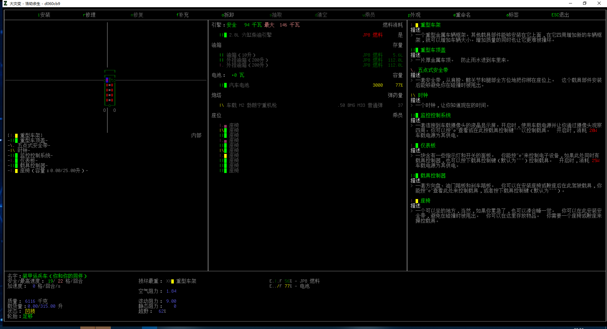

# 载具机制

载具是一种比步行更具效率的移动方式，考虑到游戏内的载具有着极为自由强大的改装系统，载具在一定程度上还可以担当移动仓库、医疗站、工作站甚至于移动基地、装甲战车等诸多角色；当然也可以是以上皆有的全能综合平台；

然而考虑到车体本身体积与移动、设备工作时可能存在的噪音，在市区等丧尸集聚场地，一时的驾驶失误也会导致载具变成一座钢制棺材，如果你的车体没有应对此类情况的改装或未配备武器……那还挺绝望的，所以说，道路千万条，安全第一条，行车不规范，艾特两行泪；

总之，我们先忘记那些远大的梦想、古巨圾什么的好东西，从基础开始；

### 如何找到载具

基本上城市里到处都有因事故、突发情况等各种各样原因而在大灾变当天不幸撞上各种东西的载具，一些车库、地点、道路上会有尚且完整的车辆，但并不绝对；

绝大部分载具实际上已经损毁严重，除了车体上那些零零散散的部件外基本失去了价值，但只要保持见到大体完整的车辆就上去检查一下的习惯，您仍然可以在各种地方找到可用的载具；

### 怎么样才算是「可用的载具」

要知道载具是否可用，也就是能不能动，你需要按「e」检查载具来查看车体基本情况，首先你必须确保几个基础事项：

1.  车内的「电池」内有剩余电量，油箱还有油量（自行车除外）
2.  轮胎数量须为「足够」；
3.  引擎、座椅、载具控制器能够正常工作；

以上基本都没问题，则你走到载具控制器方格，按下「\^」就能开走了，不过有些车内可能很不幸的没有插钥匙，这种情况下需要一把螺丝刀及相对冗长的时间以短接载具，短接一次后就不需要再短接了：

### 载具推荐
开局可以去奶牛场或城市里找自行车. 自行车速度快, 声音小, 不消耗耐力, 人力驱动, 前中期必备载具.

如果能找到, 也可以用轮椅, 轮椅相比自行车体积更小, 夜里在充满丧尸的城里飙车时更不容易撞车gg.

车的话可以选用轻工厂的货车, 大量的货仓可以提供非常多存储空间.

TODO: 装甲车我没怎么改装过, 需要补充.

### 载具的一些基本概念

姑且来说你不用太在意这边的内容，但如果你对一些数据存在疑问……我姑且觉得我能提供一些帮助；

**名称**：载具名，可以自由修改，观察载具时会直接显示载具名称，因而通常用于辨识野生载具有啥东西；

**安全速度/最高速度**：安全速度是驾驶时不会出现故障或损坏的标定速度；最高速度是你载具所能抵达的最大速度，超出安全速度驾驶有可能导致引擎损坏；

**加速度**：每轮最多能增加多少速度，会受一些地形等因素影响；

**质量**：车体的总重量，承载货物或者储存罐里的液体等都会影响车体总重，车体总重除了关乎于你能不能徒手推车之外，还会影响阻力数值……我们之后再谈这个；

**载货量**：车体内所有可储物的储物空间总和，基本可以视为能带多少东西系，至于物品重量则全盘加在「质量」上；

**轮胎**：轮胎是否「足够」的概念，就是说车体重心（一般来说也是中心）最起码要在轮胎范围之内；只有当轮胎处于「足够」状态时，载具才能移动（飞机除外）；

比较简洁一点的形容就是说，你用笔沿着轮胎画一个矩形或者三角形或者直线，如果这个形状能够支撑车体，则轮胎视为「足够」；

更简洁一点的话……一般来说如果你的车体较大，则最好用三轮支撑或四轮支撑，如果是自行车这种竖长车体，则只需两个轮胎，如果是独轮车，一个轮子就撑得住；

大概就是这样，具体依然可能会有点奇奇怪怪的变化，具体取决于你到底想造个多离谱的车；

**阻力**：理论上影响车体的可控性，如加速度、刹车速度等各项数据，虽然通常来说越低越好，但你的车最终总会走向臃肿……所以也不用太强求；

**越野**：低于100%的越野会在「路面」之外的各种地形受到减益，增加载具的重量会降低越野；更多或者更大的轮子可以增加越野，推荐大轮子；

**噪音**：通常而言，各类引擎噪音程度是：汽油、柴油 \> 脚蹬 \> 电力引擎；只要引擎发动就会产生噪音，汽油及柴油引擎还会额外产生烟雾；噪音大小与烟雾程度取决于引擎性能及载具速度，多引擎产生的烟雾更多更强，但噪音水平只取决于最吵的那个；消音器可以降低60%的噪音水平及烟雾强度，并且让所有排热、排气从消音器所在位置排放，多个消音器不叠加，但如果消音器不幸受损，载具会自动更换成完好的消音器；

脚蹬、电力引擎都十分安静；相对而言汽油柴油则是性能越好就越吵闹；

**损坏**：如同武器损坏会降低攻击力，车体部件损坏也会降低工作效率；如电池、油箱损坏会发生泄漏，引擎偶尔会罢工或者难以启动，发电设备效率下降等等；所以坏了就修没什么问题。

**车体、车顶**：如果车体整体处于密封状态（即为有车身、车顶），则提供一定的环境保护并保护你不被淋湿；

**船体/能否浮起**：给车加上船壳，显示为可以浮起时就能在水上行驶；

**畜力动力**：马拉车一类的载具，一般没必要也不好用。
