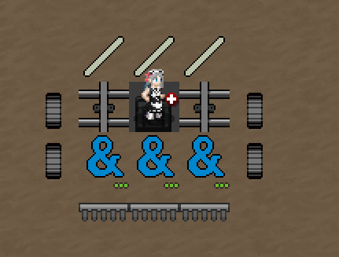
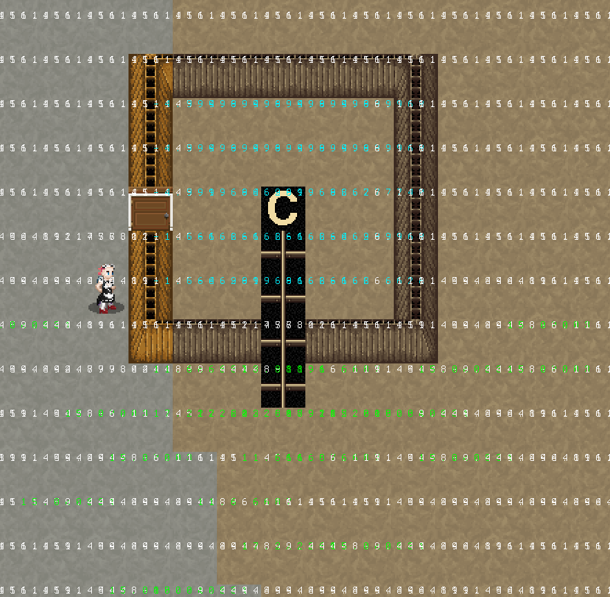
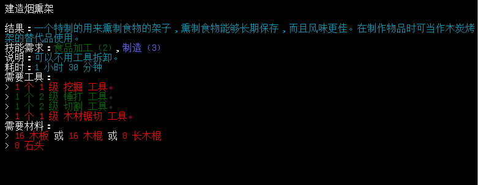

# 食物获取与储存

- [食物获取与储存](#食物获取与储存)
  - [饮食机制](#饮食机制)
  - [钓鱼机制](#钓鱼机制)
  - [种植机制](#种植机制)
  - [养殖建议](#养殖建议)
  - [屠宰指南](#屠宰指南)
  - [如何延长食物保质期](#如何延长食物保质期)

## 饮食机制

#### 口渴与饥饿

口渴度和饥饿度代表了角色目前的生理需求，二者分为多个阶段，并在达到顶峰时触发「饿死」 或「渴死」事件； 口渴度仅能通过饮水来下降，而饥饿度无论是饮水还是进食都会下降。虽然你可以通过大量饮水来「吃饱」，但若不摄入正常食物以获取热量来满足每日卡路里需求，你的角色体重就会开始下降，并最终导致一些不良后果。

**通常情况下口渴度和饥饿度每五分钟增加一次**，变异或CBM可以改变这个速率或通过其他方法抵消自然增长，一些食物、食源性疾病或是环境温度也会影响口渴和饥饿。

-   食用盐水、高度数酒、部分干硬食物会增加口渴度；
-   在高温条件下，角色会因出汗而加快口渴速率；
-   食用一些腐烂食物、生水等明显不适合食用的食物将导致食物中毒，食物中毒将会诱发呕吐，呕吐将会并提高口渴度和饥饿度，原因不言自明；

#### 卡路里

*「卡路里是一种热量单位，被广泛使用在营养计量和健身手册上，热量除了给人在从事运动，日常工作和生活所需要的能量外，同样也提供人体生命活动所需要的能量。」*

卡路里会影响你的体重，过高则会长胖，过低则会消瘦；每日卡路里的消耗水平取决于当日运动量，若拥有智能手机（一般开局都会送一部），则在进食界面可以看到当日和昨日摄入的热量数值；拥有健身手环时，可以激活查看当日和昨日消耗及摄入的卡路里数值；

具体来说如果你一整天都在读书、看报、煮饭等不会过度消耗体力的行动，你当日卡路里消耗通常不会超过3000卡。如果你一整天都在砍树、修车、搬重物，则当日卡路里消耗量就会明显增多，你也会需要摄入更多热量来补充卡路里以防止体重下降；相对的，如果你每日暴饮暴食，过量摄取食物而不进行大量体力劳动，你也会因为卡路里过高而致使肥胖，这也会导致一些不良后果。

## 钓鱼机制

钓鱼是一种极为有效但需要依托于地形、环境并需要花费一定时间的获取食物手段，具体收益、效率则取决于鱼的重量与钓鱼环境；

游戏内提供两种钓鱼方法，即为主动钓鱼的「钓鱼竿」和可以大量放置，并需要三小时时间才能收获的「捕鱼器」，两种钓鱼手法的收益都取决于你的生存技能及附近鱼群的规模，通常来说「捕鱼器」因其可以大量放置且收获时间极短，虽然需要鱼饵作为耗材，但总体是最具效率的钓鱼手段；

### 一、钓鱼的基本需求

首先你必须确保你钓鱼的地方有鱼，即为视线范围之内能够看到数量较多的鱼群，鱼类总数量越多则钓鱼效率越高，但相对而言钓上来的鱼也会越杂，不过这并不是什么大问题，只要效率高姑且怎么样都算正收益；

其次，最好有一定的生存技能作为支撑，0\~1的生存钓鱼效率稍微有些惨不忍睹，尽可能稍微高一点再去钓鱼比较好；

如果你钓鱼的地方没有鱼，但水域为「流动水」，你还是可以以极低效率进行钓鱼，通常会钓上来各种奇奇怪怪的东西，最好还是别试了；

### 二、钓鱼的收获

钓鱼的收获取决于鱼群种类与占比数量，比如一个鱼塘内有8只王鲑、3只大嘴鲈、3只白鲈，则你钓上来的大概率是王鲑，小概率是大嘴鲈与白鲈；

钓鱼钓上来的是鱼类的复制品，在钓上来一定数量之前并不会真正的杀死鱼类本体，但如果钓上来的数量过多，则该种鱼类会被「耗损」一条，并在「耗损」的位置处刷新少量的「鱼类样本」；

鱼类生物具体能屠宰出多少取决于鱼类的重量（实际上屠宰收益基本都取决于被屠宰生物的重量），钓多了大概也就知道哪些鱼类性价比高哪些较低了，虽说选择鱼塘也是一种本事……不过我一般还是比较推荐海钓或河钓；

### 三、后续加工

鱼类可以放置于烟熏架上制作熏鱼或通过腌制制作咸鱼，罐装也是个不错的路子；你也可以通过烹饪制作各种美味的鱼类食品，如鱼汤、鱼刺身、鱼寿司等，少量肉食类配方也可以用鱼肉替代，不过并不算太多；

## 种植机制

种植是颇为有效但极其耗费时间的一种获取食物的手段，有一些作物还可以用于制作药物或用于酿酒、制作成瘾品等，总体来说用处颇多……就是非常耗时而且很多需要后续加工才能变成美味佳肴；

#### 一、种植的基本需求

**首先你需要有一些种子**，种子可以在民居、园艺用品店、农场或是五金店等区域直接获取，你也可以在各种农家菜园里收获现成的作物并将其一部分制作为种子；如果您实在找不到种子的话也可以采集灌木丛来获取野菜、收集草莓、蓝莓来制作成种子。

**其次你需要有适合耕种的土壤**，实际上只需要激活铲子，使用「翻开土壤」即可获得可种植的土地，如果你想在一些没有土的地方种植，花费一些资源制作「种植箱」，或采用一些特殊手法创造适合种植的环境。

**最后你需要有一个适合种植的环境**，不要相信那些冬季不能种植、地下没有阳光一类的鬼话，这游戏的影响种植唯一条件取决于你当前所在方格的温度，只要你所在格子温度大于10，无论什么季节气候你都可以种下作物；只要作物种下且不被其他什么东西摧毁，他就能不受任何影响的自然生长，无论气候、温度、阳光如何，它早已无人可挡。

#### 二、化石为泥之术

如果你实在迫切需要一些土地，自己想想办法用宠物柜一类的物品在马卡斯注视下抓一只真菌体，把它们放到你希望能变成泥土的地方，勒令真菌体把土地变成「真菌殖床」，事后再将真菌体连同整片真菌殖床烧毁，余下裸露而出的自然就是干干净净的土地了，翻开土壤种就行了，这个法子也适用于各种你想要建筑一些东西但拆不掉地板的情况；

建设铁丝网大门，拆除铁丝网大门同样可以达成上述效果，如果你实在讨厌真菌或者干脆关了真菌的话；

#### 三、全作物种植收获、维生素、用途评价手册

传统意义上来说生长分为四个阶段：「播种、发芽、成熟、可收获」，整个成长周期则取决于你种植了怎样的作物及你设置的季节长度，以及最为关键的「施肥」与否。当你处于作物周围时，它们可能会因为各种原因导致贴图无法刷新，你可以时不时进出一下地下室或者跑出去一圈再回来再检阅植物的状态；

其他内容详阅表格，约9000字文本量；

▼PC端请双击点开原图或下表观看，手机端建议阅览表格文件；

[种植手册](https://docs.qq.com/sheet/DRFhCS29DWmRUYXpa) ← 如观看不便可点此直接进入表格文件；

#### 四、肥料的影响

所有的肥料效果一致，肥料为作物生长增速幅度约为40%，肥料会降低约15%左右的产量，但相应的也会提高15%左右的种子产量。

#### 五、收获

当作物最终成熟的时候，他会有一个可收获的提示，你也可以从贴图效果中看出其成熟模样，你只需要按E收获。它会根据你的生存技能来决定你的收益，当然，如果你有收割机就不用担心那么多破事，收获量实际是随机值，上限取决于施肥与否。

值得注意的是，一旦收获作物，作物就会开始计算腐烂时间，不收获的话作物会始终保持新鲜直至收获，如果到这时候你还是有点缺乏保鲜手段，把他们留在地里面也算一种保鲜手段；

#### 六、后续加工—酿造与研磨

酿造需要自行在制作菜单中制造各种各样的原汁或未发酵醋，再到建筑菜单中的发酵桶进行发酵，通常需要颇为漫长的时间；酿造的主要目的就是醋或者酒，有需求的话就酿一点吧，我是挺喜欢的；

研磨，可以将大麦、小麦、燕麦、烤栗子、干米、熟橡实等磨成面粉或无麸质面粉，你既可以手动也可以借助碾磨机自动，手动需要有研磨用的工具及大量时间来低效率磨面粉；通过建筑菜单制作的碾磨机则更加方便使用，就是有点难造；

#### 七、收割种植一体机

「 / 」收割机，「 & 」犁具，「 8 」播种机，两侧放车轮，中间放各类车体组件；车体原则上可以无限延长，也可以自由改装成其他模样，这里只是提供一个简单地思路；

## 养殖建议

既然已经有了种植作为素食来源，我们自然也需要养殖提供一些肉食来源；养殖算是游戏内颇为有效但也需要一定时间成本的肉食获取手段（虽然严格来说初期效率还不如你开辆车出去打猎），除却养殖各种各样的有趣动物之外，你也可以养殖一些离谱的生物用以获取一些资源……就是这些玩意到底算不算养殖还要另说；

一些生物驯服后可以帮助你战斗或是背东西，你其实也可以骑一些动物来获得一点速度上的优势，只是真的别期待他们的战斗力……他们别死后变成丧尸来咬你就不错了；

大部分可养殖生物并不强制要求你驯服，不过在你养殖大业初期，驯服是最有效的让他们跟你进笼子、地下室、围栏以方便管理的方式；

CDDA的动物不需要吃东西，并且在一定程度上是无性繁殖；

#### 一、选择养殖动物；

**猫狗：猫狗缺乏养殖价值，**虽然路边随处可见猫猫狗狗一类的小动物，但他们的战斗力并不值得期待，养起来也挺麻烦的，带一只放家里没事撸撸毛可以有效增加心情，但我们还是需要点更有效率的东西；

**鸟类：鸡鸭有少量养殖价值，火鸡最具性价比，但别养鸟；**还记得河边的鸭鸭和随处可见的小鸡吗？鸟类的增殖速度在游戏内算是最快的一档，虽然大部分鸟类只出碎肉，但身为副产品的蛋可以用于各种各样的食物配方，产出的羽毛也有一定价值；就是一定要记得留点鸟蛋用于孵化；火鸡倒是能出大肉还出挺多，就是不太好抓；鸟类一般都用鸟食驯服，驯服后用木质笼子关起来带到你想带的地方就好；

**马：没有养殖价值；**农场偶尔会看到马，马没有什么养殖价值，整一只用来代步、背东西就行（如果你真的没车可用，或者你是徒步旅行者特性的使用者；）马也可以用来拉马车，不过你真的需要马车吗；

**奶牛：可以整几只，但没有养殖价值；**牛的生长周期非常、非常、非常、非常漫长，一次生长周期几乎要花费一整个游戏年，你想想一个游戏年你能干多少事情了……但牛本身可以每日提供大量生牛奶以用于扩宽食谱，增加大量可用配方，而且生牛奶真的挺靠谱；

**猪：基本是可养殖动物里收益最高的，问题是不好找；**猪估约半年生一次崽，据说生的还挺多，三十多天长成，一次屠宰大量供肉……唯一的问题是猪只能从小猪仔开始驯养，大猪不是那么好抓，野猪甚至有很高的攻击性；

**恐龙：这是mod产物，本文不涉及；**

**鱼：2022年8.25日实验版新增特性，未变异的鱼类可繁殖，采用和鸡一致的生成鱼卵，鱼卵腐化，生成鱼；**

#### 二、如何养殖动物；

**驯服时鸟类吃鸟食、猫狗吃对应的猫粮犬粮、其他的一律吃家畜饲料；但动物实际上并不需要吃饭，驯服只是方便你把它带回家；**

驯服之后，小体型动物可以用笼子、宠物包装起来，大体型动物最好用车载的「宠物柜」，用「短绳」、「长绳」牵进车里直接带走也不是不行；不驯服也可以装，只是他们会比较抗拒，要反复尝试多次；

为确保安全起见通常建议将动物养殖在室内环境或者地下环境，并且最好严格管控动物的可行动范围以避免不可预知的风险（比如火鸡这种会飞的飞出了笼子绝尘而去、鸡鸭跑出笼子接着满地图都有蛋；）

剩下的，反正你等他们生出幼崽，幼崽长大， 把长大的幼崽杀几个就行，养殖基本就是这么一回事；

#### 三、如何养殖怪物；

**所以我们最终走到了这一步？**

**养殖怪物一定需要车载的宠物柜以将其打包带走，你最起码拥有靠谱的长时间隐身手段、有辆比较灵活自如的车来让你干这种人神共愤的离谱事情；怪物永远都具有攻击性，所以具体养殖手法要结合实际情况选用；**

**蚁后：只要不是酸蚁就行**；蚁后的特殊技能可以在周围直接刷出巨蚁幼虫，再通过特殊技能将幼虫进化成巨蚁；巨蚁可以提供大量的甲壳以制作甲壳护甲（不算啥优秀的护甲）及大量的筋腱用以缝制衣物，酸蚁则额外提供硅化甲壳，制作的甲壳护甲更好一些并且提供比较可观的酸性防护；

**三尖树之心**：三尖树之心在不加控制的情况下，一小时可以生成近三百单位的三尖树，三尖树可以提供大量可食用的植物嫩茎；

如果你真的打算养这些个玩意，记得丢到地下室，关起来，关严实点，然后谨防自己在收获过程中成为他们的食物；

**汽油丧尸：也不知道哪个年代的老生常谈，如果让老美知道汽油丧尸可以无限生产汽油，当时就来发动内战攻打新英格兰（并不）**；

考虑到实验版本已经干掉了黄油机收集地面液体的机制，当前汽油丧尸仍需要在室外环境养殖于浴缸之上；并且保持一定的安全距离让其反复自然徘徊直至把油灌满浴缸，然后……你自己想办法开个隐身再给人家收回去，再收集你所需要的汽油；

## 屠宰指南

像是黑熊这种大型动物若想要完全屠宰，至少需要有2级绳索、2级悬吊、2级切割及1级木材切割，同时你还需要一个尽可能好的屠宰工具及较高的生存等级来获得尽可能多的收益；

**绳索、悬吊**：你需要一根长绳和一棵树，一些车体部件也能承担这个职责，如果你有屠宰架、挂肉勾，则绳索、悬吊问题可以直接解决。

**切割、木材切割**：屠宰工具一般自带切割，木材工具就木锯或钢锯；

**屠宰工具**：有条件的话制作屠宰套件即可，没条件就屠宰刀，到处都有；

**生存等级**：生存会影响屠宰收益并降低失误导致收益下降的概率；

**尸体完整度**：一般来说流血致死的无损伤尸体最好，但有划痕一类的也没太大问题，只要不损坏或者碎浆都好说。

**屠宰方法**：按「B」进入屠宰界面之后，你会发现自己拥有很多选择；

首先忽略掉低产量和无场地、物品需求的「快速屠宰」及便于运输的「改四分体」

如果只想要肉, 那么`尸体放血`后`完全屠宰`即可.

如果想要所有产出, 那么执行以下步骤(顺序随意, 不过完全屠宰要放到最后)：

**「尸体放血」：可以收获「血液」；**

血液富含热量，可以用来制造一些血液相关的食物、一些药品及诱变剂，如果不在乎心情减益的话也可以用来紧急补充热量，实在没需求放弃也可以，一般不会太缺；

血液保质期较短，需要迅速进行冷冻储存，如果没有冷藏条件的话可以直接忽略放血；

**其他屠宰过程中也会产生血液，但那些血液无法提取或储存，除非你在浴缸屠宰……你如果真的需要大量血液，那就找个浴缸再干活；**

**「尸体剥皮」：可收获「生毛皮」**

生毛皮需要一段复杂的工序及大量时间才能变成可用的毛皮，同时你很可能还需要寻找一些鞣制毛皮的指南书，具体步骤如下：

1.  生毛皮+盐（盐水、生理盐水）获得硬化毛皮；
2.  硬化毛皮可转为「硬皮」以制作「鞣制皮革」，也可以直接鞣制；
3.  鞣制需要「切割、烹饪、煮沸、敞口容器」、可用的炉灶，还需要水、脑子（或树皮、啤酒花、松枝等不太好大量入手的）、油脂及大量硬化毛皮或硬皮；
4.  鞣制中的毛皮或皮革制作完成之后随便放在什么地方，等待数日即可；
5.  鞣制完成后便可直接用于各类制作配方

**「清理内脏」：可收获「生肝」、「生肾」、「大胃囊」**

其实还有骨头、骨髓、筋腱，不过算是副产物：

肝肾均可用于食物配方，胃则可以用来处理一些特殊食材；

**「完全屠宰」：可收获「肉块」、「肥肉」、「碎肉」、「杂碎」、「肺片」、「脑」、「骨头」、「筋腱」**

骨头用处颇多，但最主要的还是熬制「骨胶」或「万能胶」，也可以将其磨粉变为「骨粉」来制作肥料等或熬成骨头汤等；

骨髓体积小，营养热量丰富，不过必须煮熟成烤骨髓才能食用；

肉类及肺片就不再赘述了，主要用于各类食物配方；

脑类的食物配方较少，除了食用外还能用来鞣制毛皮；

## 如何延长食物保质期

食物腐烂时间取决于环境温度，温度越高则腐烂速度越快，在冷冻温度下完全停止。一般情况下，延长食物储存方式分为「冷藏」、「脱水」、「罐装」、「腌制」、「加工」共五种。

#### 一、「冷藏」

冷藏本质是通过低温将食物变为冰凉或冷冻以延长或凝固其保质期，通常是操作难度最低且基本没太大需求的储存方式，不过其进阶就麻烦的多了；

一般只要能搞到一个车载冰柜就能完成冷藏，车载冰柜可以从冰淇淋车等载具中取得或花费较多资源自制，劣势在于部分食物冷冻后会损失口感，此外单个冰柜容量不是很大，对于喜欢大量囤积食物的玩家来说稍微有点悲伤。

##### 「地下冷库」

冷藏的进阶即为手工制造一个地下冷库，需求温度恒定的地下室及较高的制造、机械学水平以满足所有材料和建设需求。地下冷库彻底解决了单个冰柜容量不足的问题并最大化了储藏效率，硬要说问题就是……实际工程量很大。

**基本原理**：地下冷库的核心在于载具部件的「车载冷却器」。

车载冷却器启动时会向四周释放降低温度的「冷空气」，同时排放能够提高温度的「热空气」；

冷热空气会互相抵消，进而导致车载冷却器效果不稳定，冷库计划自然也会因此直接失败，不过你还可以通过「引擎消音器」，将排热位置转移到「引擎消音器」所在的部件位置上，由此就可以完成一个比较粗糙的冷库核心……呃，虽然你的确可以通过不断拉长车体来保证热空气不会飘到冷库之中，但整体结构会变得十分细长（估约至少八个长度才可能不会干扰冷库正常运作），而且冷空气也会向车体延伸的位置蔓延，冷库整体虽然能维持一个较小范围的平衡，但依然称不上完美；

所以我们来想一些其他办法；首先，冷热空气如同大多数气体一样，会被实体建筑所阻隔，也就是墙面、实体且能阻隔视线的家具、关闭的门窗等都可以阻止冷热空气传播，如果将冷空气保持在冷库内，而热空气排放到冷库外，同时中间能有个建筑将其内外分割，我们就能造出完美的冷库了；

在你问出，载具该怎么穿透墙壁这个问题之前，你有没有注意到你的车辆可以正常穿过开启的「木门」和「金属门」？

那答案就很明确了，不知出于什么原因……你可以在载具上面造一扇门，门在建造时中被视为「可通行」的建筑，因而可以在车体之上建造，然而你刚造出来的门是「不可通行的」已经关闭的门，也就是说它可以阻隔热气进入冷库并将冷气留于冷库，完全符合我们完美冷库的需求，而且可以在车体上建造也直接解决了载具无法穿透建筑的难题，那么我们立刻开始动手实践一下；

**实践环节**：如图所示，首先你需要在地下环境构筑一个两面开口，开口位置为门框（即为木门的第一阶段，不要直接造成木门了；）的密封空间，空间范围如图或者更小皆可，大一点可能会不太稳定；

然后你需要在这个空间内建设车体，以「C」为核心放置车载冷却器及其他必要设备，然后用车架一路从任意开口处延伸出去，在延伸出开口外一格后，在末尾建造「引擎消音器」；

接着，在「\*」面板中直接将门框建造成木门，然后，你就别动这个门了，一旦门被打开，则隔绝冷热空气的效果消失，而且门会因为载具阻挡无法再次关闭，只能拆掉再建。保险起见可以再给木门上面钉上木板以防不慎将门打开。之后你再到另一个门框位置将其修建为你自己通行用的木门即可；

最后，不管你怎么连电线、放电池、放电子控制器，反正把车载冷却器打开就算建设成功了，记得不用的时候门窗紧闭，此外外部散出的高热区可以用来种菜，毕竟地下室基本低于10摄氏度，这点温度还能利用一下的；

**重点是要把木门建在车架上，然后保持环境密封、门窗紧闭以阻隔冷空气散出，热空气进入；**

因车体部件没有阻止冷热空气的能力，所以不要用车门替代木门，如果你为了美观考虑把木门换金属门倒是没啥问题；

#### 二、「脱水」

相对于冷藏来说需要一定的技能基础，需要花费时间收集资源以完成整个脱水流程，脱水产出品较为固定且配方少，虽然效率很高，但对于重视食物多样性及喜欢做各种美食的玩家来说可能不太适合……还请不要拒绝任何一个延长食物保质期的手段。

脱水通常需要搭建烟熏架、炭窑，搭建材料需要你主动挖掘地面、砍伐树木来收集，两个都支棱起来之后，你需要将要脱水的食物放置于烟熏架，再根据数量放置一定量的碳以进行熏制。（碳可通过炭窑烧制木头取得，木头要你自己砍，碳也是非常有效的一种燃料，多烧点也没坏处）

肉类熏制后变为熏制品，再次熏制即可脱水，蔬菜水果则直接脱水。

熏肉也可以使用`瑞士军手cbm`.

常温情况下，熏制品保质期为三周，脱水品保质期为三季；

****

#### 三、「罐装」

**需求配方书和至少4级食品加工，有相应专长需求。**

罐装分水浴法和封装法，前者需要3L或半升玻璃罐、水浴锅、水，后者需要空罐或小锡罐、罐头封装机。

只要不将罐子开启，罐装保质期就是永久，食用后的罐子仍可用于下次罐装，罐装食品便于管理和携带，也可用于一些食品配方之中。

#### 四、「腌制」

**需求配方书和至少4级食品加工、真空封口机、无专长需求。**

需要塑料袋或真空包装袋，盐，和罐装其实差不多。

#### 五、「加工」

**需一定的食品加工等级**

**具体就是制作干肉饼、肉干，将乳制品加工为奶粉等配方，可以有效延长储存时间；**